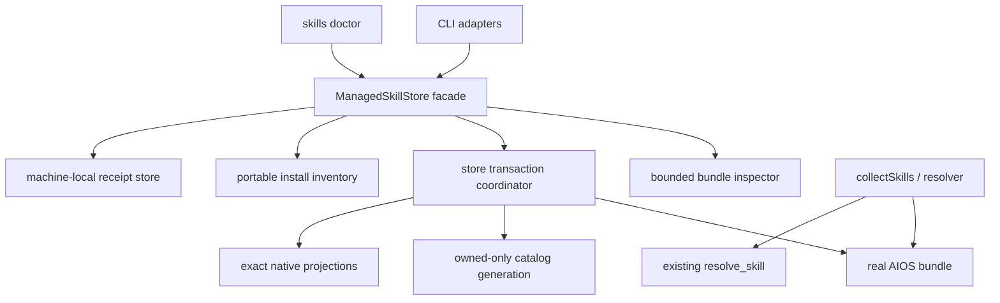

# ManagedSkillStore Design

## Purpose

ManagedSkillStore makes AIOS the canonical owner of explicitly adopted Agent Skills while keeping native discovery paths as derived projections. It is a deep module: callers choose an operation and provide consent proof; the module owns bounded inspection, transaction ordering, recovery, provenance, collision policy, catalogs, and deletion safety.

The design deliberately does not define remote acquisition, a marketplace, host support by inference, project-local skill ownership, or a new MCP mutation surface.

## Current-State Constraints

- `collectSkills(aiosPath)` already provides the correct ordinary catalog boundary: real immediate directories only, hidden/internal entries and top-level links skipped, bounded frontmatter reads, and shared CLI/MCP resolution.
- `writeSkillsIndex()` currently publishes `INDEX.md` and `RESOLVER.md` sequentially without a surrounding transaction.
- `skills-install.mjs` preserves unmanaged native entries by default, but its `overwrite` path can recursively replace foreign bytes.
- Raw and plugin install write bundle, registry, catalogs, and projections through multiple lifecycle paths. Plugin/raw removal trusts `_registry.json` and recursively deletes.
- `_registry.json` mixes installed names and plugin facts and is stale on the live machine; it is not used by routing and cannot be promoted to authority.
- Generic containment, owned-state, locking, atomic-leaf writing, migration journaling, and process-identity primitives already exist. ManagedSkillStore may reuse those primitives but does not import PR61 project-source domain modules.

## Public Interface

```js
const store = createManagedSkillStore({ aiosPath, homePath, hooks? });

await store.inspect();
await store.previewAdoption({ sourcePath, sourceKind? });
await store.applyAdoption({ operationId, planFingerprint, sourcePath });
await store.previewOfficialBatch();
await store.applyOfficialBatch({ operationId, planFingerprint });
await store.reconcile({ apply: false, operationId?, planFingerprint? });
await store.remove({ name, apply: false, operationId?, planFingerprint? });
```

Test-only fault hooks are capability-passed through the factory and are never enabled by environment variables or bundle content.

### `inspect()`

Returns a frozen, sorted inventory:

```json
{
  "format": "dotaios-managed-skill-inventory/v1",
  "owned": [],
  "discovered_unmanaged": [],
  "excluded_unsafe": [],
  "retained_recovery": [],
  "bounds": {}
}
```

- `owned` comes only from real immediate canonical directories with a real `SKILL.md`.
- `discovered_unmanaged` contains safe-shape top-level AIOS links and real directories in configured native roots. Inspection records link text/identity but does not follow a shelf link target.
- `excluded_unsafe` contains a bounded stable reason for malformed, linked-in-the-wrong-place, special, excessive, ambiguous, or otherwise unsafe evidence.
- `retained_recovery` reports strict machine-local records for successfully removed, non-routable archives that still need an explicit future garbage-collection contract. It never makes an archive owned or routable.
- The three lists are disjoint by physical coordinate and source kind.
- Native roots come from the existing target registry and explicit `homePath`, not a full-home search.
- Host lifecycle truth is reported by the existing skill-health model, not inferred by this inventory. Detection, configuration, projection, discovery, invocation, and production remain separate stages there.

### `previewAdoption()`

Validates one selected source and returns an immutable proof:

```json
{
  "format": "dotaios-managed-skill-adoption-proof/v1",
  "operation_id": "uuid",
  "plan_fingerprint": "sha256:...",
  "source": {
    "kind": "local-reviewed-directory|discovered-native-directory|discovered-canonical-link",
    "identity": {},
    "display": {},
    "portable_provenance": {}
  },
  "skill": {
    "name": "review",
    "description": "...",
    "bundle_digest": "sha256:...",
    "files": [],
    "scripts": [],
    "executables": []
  },
  "collisions": [],
  "projections": [],
  "catalogs": {},
  "effects": []
}
```

The operation ID is derived from the canonical proof payload rather than random preview state so identical zero-write previews are byte-deterministic. A caller cannot apply a partial proof; the public apply boundary accepts the exact source coordinate, operation ID, and fingerprint and independently reconstructs the proof. A reviewed plugin root may be an ordinary local source only when that root is itself exactly one valid Agent Skill bundle. DotAIOS copies the complete bundle, including opaque manifest bytes, but does not install plugin code. Multi-skill/plugin-package installation refuses before mutation and is deferred to a later aggregate package contract.

For a canonical shelf link, preview first binds the link leaf and its link text without traversal, then explicitly resolves that selected target, rejects a target inside a different managed coordinate or an unsafe/linked root, and inspects the target as the adoption source. Ordinary inspect/routing never performs this target read.

### `applyAdoption()`

Apply acquires the store lock, performs recovery, reconstructs preview from the supplied source coordinate, and compares operation ID and fingerprint before any write. The caller-supplied proof is authority only as a consent token; it is never trusted as filesystem evidence.

It returns one of:

- `adopted`: exact new owned bundle and projections committed;
- `already_adopted`: same canonical digest/provenance/projections already committed;
- stable refusal by throwing `ManagedSkillStoreError` with `code`, bounded `reason`, and no absolute path in default CLI output.

### `previewOfficialBatch()` and `applyOfficialBatch()`

Official-skill adoption is one batch over the package-owned per-file manifest. Preview classifies every declared root and file as the exact candidate, an accepted 2.0.9/2.0.10 predecessor, missing, the sole recognized generated overlay (`plan-today/prompt.md`), or a conflict. Apply may repair safe targets while leaving a conflicting target byte-for-byte untouched, but it publishes `_registry.json`, `INDEX.md`, and `RESOLVER.md` only after every official target verifies as the candidate.

The batch reuses the same store lock, journal, staging roots, guarded root swaps, verification, and rollback engine as the other ManagedSkillStore operations. It creates no official receipt and uses no folder-level bundle digest: official authority is the bundled file manifest plus the exact candidate version, and interrupted recovery carries the manifest-bound candidate bytes in the existing journal.

### `reconcile()`

Reconcile previews by default. It inventories owned real directories, bounded portable rows, catalogs, and exact native projections; then emits a fingerprinted plan containing only derivable repairs. Receipts remain adoption/removal authority and are not required for ordinary routing reconciliation. Managed provenance is rebuilt only from strict receipts whose current canonical digest and root identity still match; a drifted pair loses its managed row without affecting real-directory routing. Apply requires the exact plan tokens and uses the same transaction engine.

Reconcile can:

- regenerate portable inventory rows from proved owned records;
- regenerate both catalogs from real owned directories;
- create or repair an absent/exact managed projection;
- forward-complete or roll back an operation-owned interrupted transaction.

It cannot adopt unmanaged bytes, replace a real/foreign native entry, infer missing local provenance, delete a drifted bundle, or raise a host evidence tier.

### `remove()`

Remove previews by default and returns a proof in the same operation/fingerprint envelope. Apply revalidates the canonical manifest and identity, portable record, local receipt, exact projections, and saved source form.

The implementation first serializes all cooperative DotAIOS writers, revalidates the immediate canonical parent and exact bundle root, then performs a same-filesystem guarded rename of the whole proved root into an operation-owned recovery coordinate. Portable Node 20 cannot bind a prior `lstat` identity to a later path-based `rename`, so this is an observation-boundary guarantee rather than immunity to an uncooperative same-user swap. It immediately verifies the archived manifest before any cleanup. If an uncooperative writer caused the archive to differ or recreated the live coordinate, the transaction does not commit removal or overwrite either entry; it retains the recovery tree and journal as `needs_attention`. Any extra, changed, linked, hardlinked, or special leaf—or insufficient rename/identity evidence—has the same retained outcome. On a platform/filesystem without same-device rename and required identity facts, removal refuses before mutation. When a native source or shelf link was replaced, its operation-owned backup is restored only to an absent or exact managed destination.

## Internal Architecture



### Module ownership

- `managed-skill-store.mjs`: public facade, policy, proof construction, transaction orchestration, stable errors.
- bounded bundle concern: private streaming raw-name traversal, strict UTF-8 metadata reads, opaque asset reads, identity snapshots, manifests, digests, frontmatter/name validation, staged normalized copy.
- managed state concern: private bounded schemas and derivable-coordinate validation for portable inventory, local receipts, and transaction journal; no catalog policy.
- `skills.mjs`: continues to own real-directory collection, rendering, and resolver metadata. It exposes pure catalog-byte rendering so the store can stage exact derived bytes.
- `skills-install.mjs`: exact-target projection inspection/create/unlink primitives. It never decides adoption or deletion authority.
- CLI modules: parse/display only. They neither copy a bundle nor update registry/catalog/projection state directly.

If implementation remains clearer with fewer files, the three private store concerns may initially live in one module. They must remain private to the facade and retain the ownership split above.

## Identity and Digest Model

### Source identity

Each observed root and file binds:

- type;
- device and inode where available;
- size;
- nanosecond modification/change time where available;
- mode and normalized executable bit;
- link count;
- raw relative path bytes represented as validated UTF-8;
- deterministic `authority-text`, `script`, or `opaque-asset` classification and extension-only bounded content-type hint.

Every file is opened only after an `lstat` single-link regular-file check, read into a fixed bounded buffer loop, and rechecked against its handle/path identity. Directory enumeration is streaming and consumes one aggregate entry budget before retaining each row. The v1 authority-text allowlist is exactly the root `SKILL.md`; no v1 declaration can add another path. That file is decoded strictly as UTF-8. Every other regular file—including scripts, Markdown references, and binary assets—is hashed and copied as opaque bytes without decoding, import, sniffing, or execution. Script classification uses only an allowlisted extension (`.sh`, `.bash`, `.zsh`, `.fish`, `.py`, `.js`, `.mjs`, `.cjs`, `.ts`, `.rb`, `.pl`, `.ps1`, `.cmd`, `.bat`) or a proved executable bit. Content-type hints use a versioned extension table and never affect admission. The root is rechecked after the complete manifest and each opened file is rechecked through its handle and path. `__pycache__`, `.pyc`, and `.pyo` are deterministic preview refusals in v1; nothing is silently ignored.

### Manifest

Manifest order is unsigned UTF-8 byte order by normalized `/` relative path. Owned names, collisions, projections, and catalog rows use the same byte comparator and never `localeCompare()`. Each manifest row contains relative path, byte length, normalized executable bit, classification/content-type hint, and content SHA-256. The bundle digest hashes a canonical versioned encoding of the full ordered manifest plus validated skill identity metadata. Opaque invalid-UTF-8 asset bytes are valid and must round-trip exactly; invalid UTF-8 in the root `SKILL.md` refuses.

No modification time enters the portable bundle digest; timestamps enter source identity and stale-proof checks only. Copy preserves bytes and executable intent, not source ownership, timestamps, setuid/setgid/sticky bits, or group/world writability.

Official skills are the deliberate exception to the personal-adoption bundle digest above. Their package manifest lists every official root and leaf with canonical POSIX mode, packed SHA-256, deterministic candidate-version rendering, and the accepted predecessor SHA-256/mode pairs. Classification and repair remain per file; an unknown extra or unrecognized byte is a conflict, while the manifest-declared `plan-today/prompt.md` overlay is preserved by its bounded grammar. Dependent catalogs are derived only from a fully verified all-official candidate state.

### Name policy

- Directory basename and frontmatter `name` must match exactly.
- Name is 1–64 lowercase ASCII letters or digits separated by single hyphens.
- `SKILL.md` is exact case.
- Frontmatter must be a bounded first document with exactly one string `name` and one non-empty bounded string `description`; unknown fields remain allowed for Agent Skills compatibility but cannot affect adoption authority.
- Empty, duplicate, aliased, or non-string authority fields refuse. YAML block scalars are valid where the Agent Skills schema permits strings; the decoded `description` and `compatibility` character bounds still apply.

## Provenance and Receipts

### Portable inventory

`_registry.json` moves to a strict backward-readable v2 shape:

```json
{
  "format": "dotaios-skill-install-inventory/v2",
  "skills": ["review"],
  "managed": [{
    "name": "review",
    "bundle_digest": "sha256:...",
    "source_kind": "discovered-native-directory",
    "provenance": {
      "attribution": "native-lockfile",
      "source": "owainlewis/blueprint",
      "source_type": "github",
      "skill_path": "skills/review/SKILL.md",
      "revision": "bounded optional value"
    }
  }],
  "plugins": []
}
```

Portable rows contain no absolute path, username, device/inode, home-relative path, hostname, operation backup name, or timestamp whose only meaning is local. Existing legacy `skills`/`plugins` rows are read for migration but never authorize catalog membership or deletion.

Optional native lockfile provenance is parsed as untrusted bounded metadata and copied only from an allowlisted portable field vocabulary. Unknown provenance is recorded as `reviewed-local` or `native-unattributed`, not guessed.

### Machine-local receipts

`<home>/.dotaios/managed-skills/receipts/<name>.json` contains:

- exact canonical root identity and bundle manifest/digest;
- the exact portable provenance row used to rebuild `_registry.json` only while the receipt and current canonical digest/root identity still agree;
- source absolute coordinate and identity;
- replaced source kind and operation-owned backup coordinate;
- exact projection link text/target/identity;
- operation ID/fingerprint and committed journal generation;
- portable inventory/catalog identities at commit.

State directories and files are same-user, single-link, versioned, `0700`/`0600`, atomically published, and synced. Unknown versions, fields, ownership, links, or unsafe permissions fail closed.

`<home>/.dotaios/managed-skills/recovery/<operation-id>.json` separately inventories every successfully removed archive and its exact identity. Successful removal deletes the routable receipt only after derived authority is gone, publishes this recovery record, and then clears the transaction journal. The archive remains non-routable evidence; no registry, receipt, or recovery record grants routing or deletion authority.

## Collision Policy

Every physical destination is classified separately:

- `absent`: planned create;
- `exact-managed-projection`: keep/idempotent;
- `selected-native-source`: eligible exact backup-and-replace;
- `selected-canonical-link`: eligible exact replacement by real canonical bundle;
- `canonical-owned-identical`: idempotent only when its strict record/digest matches;
- `canonical-owned-different`, `real-unmanaged`, `foreign-link`, `broken-link`, `special`, `alias`, or `unsafe`: refuse.

Host labels annotate physical projections but do not merge collision authority. If Codex and Gemini reference the same physical `.agents/skills` root, one physical projection appears with two host consumers and separate evidence states.

## Transaction and Catalog Semantics

The transaction journal is a strict state machine:

```text
prepared -> bundle_staged -> optional shelf_source_backed_up
         -> canonical_published -> optional native_source_backed_up
         -> projections_published -> portable_published
         -> index_published -> resolver_published
         -> derived_published -> receipt_published -> committed
```

Every source move and projection detach records derivable coordinates, proved pre-state, and intent before mutation. Projection creation records intent and a complete parent identity chain first; if a process exits before the created link's identity is durably recorded, recovery retains `needs_attention` rather than guessing ownership. Journal files and supported parent directories are synced before the next effect. Recovery rejects malformed or out-of-root receipt/journal coordinates before any mutation.

Two fixed files cannot be replaced simultaneously with portable Node APIs. Therefore `catalogs_published` means:

1. bounded old bytes are journaled for exact restoration before publication;
2. each new leaf is written through a synced temporary file and atomically renamed under the exclusive store lock;
3. the registry and both catalog hashes are proof inputs, so drift changes the plan;
4. no success is exposed before all three leaves are published.

A crash between leaves leaves a journaled generation, not a successful result. The next store mutation recovers before planning. Ordinary routing does not consume either catalog file, so a transient interrupted generation cannot widen routable authority.

Every managed-skill lifecycle mutation acquires the store lock and recovers a pending generation before publication. Catalog renderers are pure byte functions. The retained `writeSkillsIndex()` compatibility publisher is limited to the all-new `init` scaffold transaction and tests; adoption, removal, activation, plugin compatibility, and reconcile cannot call it.

Before a staged bundle can be renamed canonical, every staged file is synced after final mode publication and every staged directory is synced bottom-up. Every newly created state, staging, backup, projection, and recovery directory is synced together with the parent that gained its directory entry. Directory sync is strict: a platform/filesystem that cannot prove it refuses before a destructive lifecycle commit instead of silently weakening crash recovery.

### Removal transaction

Removal uses its own journaled state sequence:

```text
remove_prepared -> projections_detached -> canonical_archived
                -> archive_verified -> source_restored
                -> portable_removed -> index_published
                -> resolver_published -> derived_published
                -> receipt_tombstoned -> remove_committed
                -> cleanup_started -> cleanup_completed
```

- Before `canonical_archived`, exact detached projections can be recreated from the unchanged canonical root.
- `canonical_archived` is the linearization point for cooperative DotAIOS writers. The operation immediately verifies the archive and checks the live coordinate.
- If archive verification differs, the live coordinate was recreated, or any identity is uncertain, the journal becomes `needs_attention`; neither tree is overwritten or cleaned and portable/catalog authority is not removed.
- After `archive_verified`, only exact journal-owned state can advance. A crash forward-completes the same fingerprint or restores the exact archive only when the live coordinate is absent and all later effects still match their recorded identities.
- Catalog and portable publication uses the same guarded generation rules as adoption. A failure never turns an uncertain archive into an unjournaled deletion.
- After receipt tombstone durability, v1 deliberately retains the verified whole-root archive and detached-link backups as non-routable recovery evidence. Portable Node cannot conditionally unlink a path by its proved inode, so physical garbage collection is deferred rather than risking deletion of raced bytes.
- Before the journal is cleared, v1 publishes a bounded local recovery record that binds the operation, proof fingerprint, archive digest/identity, detached projection backups, and restored source fact. `inspect()` surfaces that retained state without traversing or routing it.

## Replacement and Removal Safety

- Canonical publication is no-replace unless exact idempotence is proved.
- A selected native source is renamed, never recursively removed, to a unique journal-owned sibling backup on the same filesystem.
- Projection creation uses an exact link target and verifies the resulting leaf.
- Removal performs a full zero-write preflight, revalidates the immediate parent/root identity, and atomically moves the exact root into same-filesystem operation-owned recovery before any bundle cleanup.
- Version 1 does not physically clean a successfully removed archive. No `rm({recursive:true})` is permitted for canonical bundles, source backups, native directories, or unverifiable recovery roots.
- If portable Node cannot establish the required parent/root rename boundary, or a writer recreates the live coordinate, the recovery tree is retained and removal stays uncommitted/needs-attention rather than partially deleting or overwriting live bytes.
- Every path-based `rename`/`symlink` is an observation-boundary safety claim in portable Node, including canonical publication/removal, native-source replacement/restoration, and projection publication/detachment. The implementation records and revalidates parent chains and leaf identities around each effect, and all DotAIOS writers cooperate through the lock. It does not claim immunity to a transient same-user ancestor swap between observation and mutation; any observed mismatch retains `needs_attention` and can never authorize archive cleanup or replacement of a recreated live path.
- A projection target added after adoption can be reconciled; the committed reconcile transaction records that target as refusal-only local history. If the custom target is later removed from configuration, v1 refuses retirement instead of trusting that historical coordinate as deletion authority. ManagedInstallation must introduce a separate target-retirement proof before such a projection can be removed automatically. History can block deletion but can never authorize it.
- Custom `agents.json` is declared host-projection metadata, so the store accepts only a bounded, fatal-UTF-8, single-link regular file with bounded agent fields, targets, and total projection facts. Compatibility readers use the same strict custom-file and safe-relative-target policy; the bundled registry remains trusted package data and may be hardlinked by package managers.
- Transaction cleanup removes only manifest-proved staged leaves and empty directories; otherwise it preserves evidence for reconciliation.
- A drifted owned bundle remains real and therefore routable for compatibility, but proof-first removal refuses it. Reconcile never rewrites its bytes from provenance.

## Legacy Lifecycle Closure

- Raw `dotaios install` and `dotaios skill add` become preview-first adapters to adoption.
- Plugin-package storage/exposure is retired as a peer writer. A single-skill plugin root can enter ordinary adoption; multi-skill/plugin-package installation refuses before mutation.
- `dotaios skill list` delegates to `inspect()`; registry-only names disappear from installed/routable output and may appear as inventory drift.
- `dotaios skill remove` delegates to proof-first `remove()` for a skill. Plugin package removal must separately prove its package directory and may proceed only after its managed skills have exact removal proofs; registry claims alone are insufficient.
- Skill projection work in `activate` delegates to `reconcile()` and never receives broad overwrite authority. Bridge overwrite remains a separate non-skill concern.
- `connect google` no longer authors a skill or registry row. Bootstrap initialization is confined to the all-new scaffold transaction and cannot mutate an existing skill lifecycle coordinate.

### Exhaustive writer-closure map

| Current mutation path | v2 disposition |
|---|---|
| `applyTriggerVisibility()` / `skills sync-triggers --apply` | Retire canonical mutation in this PR; retain zero-write preview and manual-edit guidance. A manual user edit is canonical drift and removal then refuses until explicitly re-adopted. |
| `writeResolver()` / `writeSkillsIndex()` | Use pure deterministic renderers for store publication. Retain only the initial-scaffold compatibility caller; remove it from every live managed-skill lifecycle path. |
| Raw `installRawSkill()` and `dotaios skill add` | Delegate to preview/apply adoption; no direct copy, registry write, catalog write, or activation. |
| Plugin `installPlugin()` / `exposePluginSkills()` | Remove direct package/exposure/registry writers. Permit ordinary adoption only when the reviewed plugin root is exactly one valid Agent Skill bundle; refuse multi-skill/package install before mutation. |
| Registry-driven `skill remove` | Replace with store removal proof; plugin package cleanup occurs only within its aggregate proved removal/recovery plan. |
| `activate` global catalog/projection work | Acquire the store lock, recover, and call store reconcile. `--overwrite` can still govern bridge files but never skill directories. |
| `activate` project-local skill links | Remains separate project-local authority under existing project target safety; it never writes global AIOS bundles, global inventory, or global catalogs. |
| `init` built-in skill copy and registry seed | Remains part of the all-new AIOS scaffold transaction, before the folder is a live store. It seeds portable v2 inventory and exact catalogs but cannot adopt, replace, project, or remove an existing skill. |
| `connect google` generated skill/registry write | Retire generated-skill and registry mutation. Connection docs/events remain a separate domain; a future Google skill must enter through explicit ordinary adoption. |
| `interview` writes under installed skill prompts | Remains an explicit canonical content edit, not adoption authority. It cannot update inventory/projections or delete; if it drifts a receipt-bound bundle, later removal refuses until explicit re-adoption. |
| `search`, `brief`, `resolve_skill`, boot context, probes | Read-only. They cannot publish inventory, catalogs, receipts, or projections. |

No second registry writer or plugin exposure transaction remains. Initial scaffold creation and explicit canonical content authoring are separate authorities: neither can make unmanaged native bytes routable or grant removal authority, and neither is callable through MCP or bundle content.

### Plugin compatibility boundary

The legacy package/exposure transaction is removed because it was a second registry and canonical-skill writer. `dotaios install` validates a bounded, fatal-UTF-8, single-link regular local manifest for compatibility, but this slice proceeds only when the reviewed root is exactly one declared Agent Skill bundle; it delegates that root to `previewAdoption`/`applyAdoption` and makes no plugin-package copy. More than one declared skill, a separate nested package layout, or code-only plugin refuses before mutation. A future package feature must return to architecture review with one aggregate package-plus-skills proof rather than reintroducing sequential exposure.

## Host Truth

The store reports filesystem observations only:

- `detected`: a host/runtime executable or configured target is observed;
- `configured`: the DotAIOS integration configuration is structurally current;
- `projected`: exact native link exists;
- `discoverable`: only a host-native probe can establish discovery;
- `invoked`: only an actual bounded host invocation can establish invocation;
- `produced`: only a matching result receipt can establish produced evidence.

Adoption and reconcile can advance only owned/projected facts. Existing health wording such as `path-ready` is displayed as projection evidence, not host discovery or readiness.

## Error and Output Contract

Core errors have stable codes such as:

- `unsafe_source`, `bundle_bound_exceeded`, `invalid_skill_metadata`;
- `source_changed`, `proof_mismatch`, `collision`, `destination_changed`;
- `store_busy`, `unsafe_state`, `recovery_required`, `unproved_removal`.

Default CLI errors identify the logical skill/host/reason but omit absolute source, home, receipt, backup, and staging paths. JSON preview may display the explicitly supplied local source path for informed review; portable records and default post-apply output never persist or echo machine-specific paths unnecessarily.

## Verification Strategy

- Public-interface tests call only the facade and assert filesystem outcomes.
- Spawned CLI tests prove preview tokens are consumable, sync-hook classification, help, JSON/human output, and compatibility adapters.
- MCP tests prove the exact three tools and adopted routing without production MCP changes.
- Fault injection occurs at named transaction checkpoints and filesystem capability boundaries, not through bundle scripts or ambient environment.
- Whole-tree snapshots include type, link text, mode, bytes, and identity-sensitive state where relevant.
- Live user paths are inspected read-only; all apply/remove fixtures are disposable.

## Alternatives Rejected

- **Registry as authority:** stale or forged rows could route or delete bytes that AIOS does not own.
- **Native directories as canonical:** ownership and collisions would vary by host and break portable AIOS truth.
- **Follow links during ordinary routing:** unmanaged shelf candidates would become agent instructions without adoption.
- **Broad `activate --overwrite`:** effects exceed the reviewed skill proof and can remove foreign directories.
- **Copy only `SKILL.md`:** violates Agent Skills bundle semantics and loses reviewed supporting files.
- **Execute installer scripts:** turns adoption into code execution and is outside first-release authority.
- **Remote Git acquisition or marketplace:** adds network provenance and trust problems not required for local reviewed adoption.
- **One database/registry for skills, sessions, and installation:** collapses distinct canonical domains and creates a shallow god object.

## Review Questions

The independent architecture review must answer:

1. Is the facade genuinely the only skill lifecycle policy owner, including raw/plugin/bootstrap/connect/activate compatibility paths?
2. Can any registry, receipt, journal, or projection fact accidentally create routing or deletion authority?
3. Does every apply/remove/crash boundary preserve unproved bytes and offer deterministic recovery?
4. Is catalog atomicity stated accurately and sufficient given ordinary routing ignores catalogs?
5. Do the exact-proof, collision, host-evidence, PR61, and MCP boundaries match the approved product contract?
6. Are metadata-only strict UTF-8, opaque byte-preserved assets, deterministic derived-junk refusal, and bundle bounds implementable with the repository's Node 20 and cross-platform constraints?
7. Does the same-filesystem guarded root move give removal a sufficiently strong linearization point, and does every weak/raced case retain recoverable bytes without committing removal?
