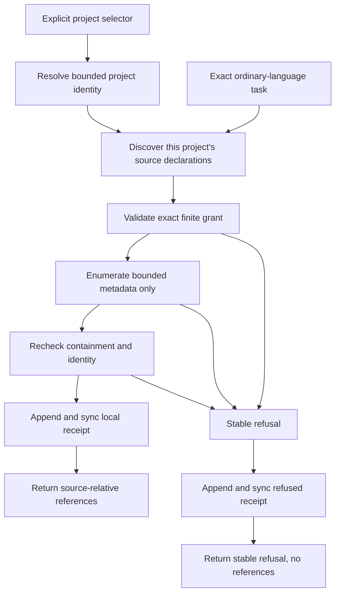
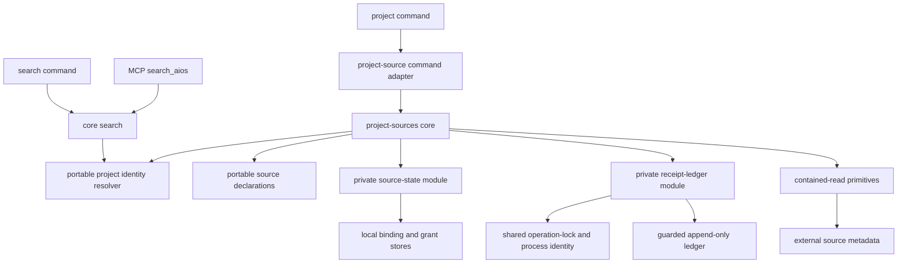
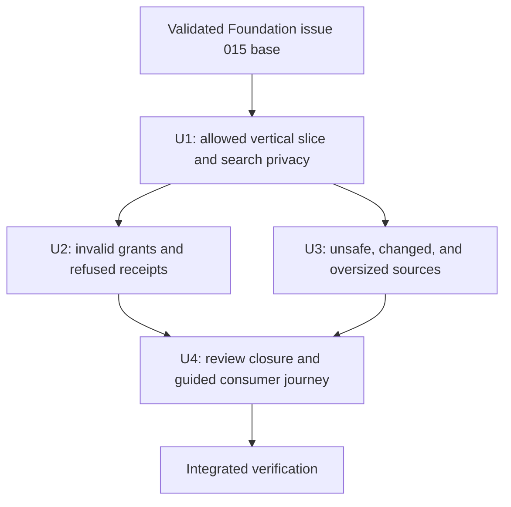

# Consumer Project Source Retrieval - Plan

## Goal Capsule

- **Objective:** Make the exact request “retrieve the campaign assets for that client.” return the complete bounded asset-reference collection for one explicitly selected project, with finite consent, complete provenance, and one machine-local access receipt.
- **Authority:** The approved Consumer Foundation requirements and the three ticket contracts own product behavior; this plan owns implementation sequencing and verification.
- **Execution profile:** Deep, privacy-sensitive Node.js CLI/MCP work delivered test-first as three ticket-shaped units plus one review-closure and consumer-journey unit on top of Foundation issue 015.
- **Stop conditions:** Stop if the implementation needs task-driven cross-project discovery, file-content reads, a write-capable MCP tool, a remote control plane, or a weaker consent/receipt contract.
- **Tail ownership:** Keep the Consumer branch local-only while Foundation integration PR #60 at exact validated commit `a7e0141` is open; after it merges, retarget onto updated `main`, rerun every gate, then open the separate Consumer product PR.

---

## Product Contract

### Summary

Extend the existing project domain with portable local-folder source declarations and separate machine-local bindings, finite grants, and receipts.
Resolve the project before source discovery, expose retrieval through an explicit CLI interaction, and repair CLI/MCP project search without widening the three-tool MCP boundary.

### Problem Frame

Consumers remember the client and the work, not the absolute folder that contains the material.
DotAIOS can search its portable project shelf, but its current `projects` search scope treats every project as one corpus and it has no consented path to an authoritative external asset folder.
The first Consumer Foundation slice must prove usefulness and privacy together without copying assets into AIOS or introducing a new memory authority.

### Actors

- A1. **Consumer:** Selects one project, previews source and grant effects, explicitly applies consent, and requests campaign assets in ordinary language.
- A2. **DotAIOS CLI:** Owns source registration, machine-local binding and grant state, retrieval, structured results, and access receipts.
- A3. **DotAIOS MCP adapter:** Remains read-only and exposes the repaired project-search boundary through the existing `search_aios` tool.
- A4. **Local filesystem:** Remains authoritative for asset bytes and supplies only bounded directory and regular-file metadata to this slice.

### Requirements

**Project sources and consent**

- R1. Every source operation takes an explicit canonical project slug or stable ID; ordinary task text never selects a client by scanning project, source, binding, or grant state.
- R2. A portable `local-folder` source contains exactly version, composite project/source identity, human label, type, purpose, and revision beneath its owning project, with no body or extra authority fields; at most 32 declarations are considered, and malformed, linked, special, or oversized declaration candidates fail closed. A source ID is 1-64 lowercase ASCII letters or digits separated by single hyphens and is validated before every path construction or state lookup.
- R3. The absolute root, grant, revocation state, and receipts remain in independent versioned machine-local stores whose resolved paths cannot overlap the portable AIOS or optional mirror.
- R4. Source add, bind, grant, and revoke preview by default, apply only with the displayed operation ID and plan fingerprint, and separate portable effects from machine-local effects in human and JSON output; every grant consent surface displays the human project and source, read scope, exact purpose, approval timing, and explicit expiry together before approval, and successful grant apply returns the stable grant ID required by revoke.
- R5. A grant is valid only when read scope, the source declaration's exact current purpose, approval time, explicit future expiry, binding generation, and root identity fingerprint are all present; authorization requires an explicit same-user operator apply and is never inferred from task text or MCP.
- R6. Source add holds one composite project/source coordinator lock, refuses roots that are equal to, contain, or are contained by the portable AIOS or resolved machine-local state root, publishes an operation-owned validated machine-local binding before the portable declaration, and permits exact retry to forward-complete only the same operation ID and fingerprint; a later preview for that coordinate may surface the pending operation's bounded recovery token but may never adopt or supersede it as a new operation.

**Resolution and provenance**

- R7. Retrieval accepts an exact 1-500-code-point task without control characters and selects sources only from the resolved project's bounded declarations using label and purpose text.
- R8. No match refuses; equal best relevance refuses before source ID ordering; filenames and file contents never participate in source selection.
- R9. Authorization is validated before the external root is opened, and a live grant authorizes one bounded source/binding/grant revision snapshot while later revocation or rebinding affects later operations and final source/binding drift refuses the current operation.
- R10. The local-folder adapter opens zero source-content bytes, returns no partial collection, and admits only unchanged, contained, single-link regular files after bounded metadata enumeration and identity rechecks.
- R11. Results preserve safe UTF-8 names without Unicode normalization or case folding, normalize separators to `/`, sort by UTF-8 bytes, and include project ID, source ID, source-relative path, regular-file type, decimal `size_bytes`, decimal `mtime_ns` freshness, UTC resolution time, and receipt ID for every item.
- R12. Retrieval results, errors, and receipts omit absolute roots, machine-local state paths, file contents, unrelated project facts, raw exceptions, and cross-project canaries; an explicit local source-add or bind preview may display the operator-supplied resolved root so consent is informed.

**Receipts and state integrity**

- R13. Every retrieval carrying a syntactically valid task reaches the core receipt boundary—even when the optional project selector is missing—and records an allowed or refused machine-local receipt with the exact bounded task, all known stable identities, grant snapshot when known, stable decision/reason, and returned references only when allowed; malformed selector or task syntax refuses before source discovery and writes no receipt.
- R14. Receipt construction allocates its ID and timestamp before final result admission, validates the complete JSONL line, durably establishes a per-ledger in-flight guard by syncing the guard file, atomically publishing it, and syncing the parent directory, serializes one owner-locked append, calls `FileHandle.sync()`, removes the guard, syncs the parent directory again, and only then exposes success.
- R15. Receipt lock, guard, append, write, sync, or guard-clear failure returns a stable path-free audit error and withholds references; an incomplete, uncertain, or in-flight ledger is preserved as poisoned evidence and blocks later retrieval without automatic retry or repair.
- R16. Binding, grant, lock, guard, and receipt state validates every owned path component, type, link count, owner, permissions, identity, and version before mutation; mutations use fixed lock order, unique owner nonces, exact-owner release, compare-and-swap revisions, restrictive permissions, atomic replacement, and strict refusal of unknown future versions.

**Project-search privacy and agent parity**

- R17. Core search accepts a canonical project selector separately from session filters; project-only scope requires it, and all-scope search without it omits the project corpus while its canonical scope envelope reports that omission.
- R18. A request-scoped, capability-passed resolver validates the selector as a lookup key, requires a stable project ID, reads only bounded catalog identity frontmatter, and completes selection before candidate construction; only `projects/<resolved-slug>` may then enter search or source discovery.
- R19. CLI and MCP accept the same 1-200-code-point project selector contract, reject separators, absolute paths, dot segments, NUL/control input, malformed Unicode, and invalid slug/ID forms before path construction, resolve slug and stable ID identically, and return bounded path-free errors for missing, malformed, unknown, or ambiguous selectors.
- R20. MCP retains exactly `read_working_context`, `search_aios`, and `resolve_skill`; only `search_aios` gains the selector, and external-source retrieval remains an explicit receipt-producing CLI operation.

**Bounds and proof**

- R21. One resolution traverses at most 16 levels, observes at most 4,096 directory entries, admits at most 256 regular files, accepts at most 1,024 UTF-8 bytes per relative path, emits at most 32,000 serialized characters, writes at most 32,000 receipt bytes, keeps the ledger at or below 64 MiB, and fails rather than truncates when a completeness or ledger bound is exceeded.
- R22. Retrieval never mutates source bytes or portable AIOS bytes; its only operation-owned write boundary is the machine-local receipt-publication subsystem—the ledger, in-flight guard, and owned lock sidecars—while source add alone may publish portable metadata after explicit apply.
- R23. The same production-shaped fixture proves the exact campaign-assets journey, cross-project privacy, project-search parity, grant and rebind refusal, filesystem and local-state safety, deterministic bounds, complete provenance, and receipt completeness across core, spawned CLI, and MCP stdio seams.
- R24. The primary consumer journey offers `project source connect <project> <folder> --source-id <id> --label <label> --purpose <purpose> --expires-at <UTC>`. It previews the complete source and grant consent by default, and `--yes` explicitly applies the same revalidated values without asking the consumer to transcribe operation IDs or fingerprints; the lower-level commands remain available for scripts and recovery.
- R25. Project-source help is reachable at the parent, group, and subcommand boundaries, lists add, bind, grant, revoke, retrieve, and guided connect, and documents the `--project` versus `--session-project` search migration before release.
- R26. Same-user concurrent retrievals serialize receipt publication so each successful resolution appends its own receipt; ordinary live-lock contention does not become audit corruption, while a poisoned, foreign, or bounded-timeout state still fails closed.

### Key Flows

- F1. Source registration and finite consent
  - **Trigger:** A1 identifies a project, source meaning, and local folder.
  - **Actors:** A1, A2, A4.
  - **Steps:** A2 previews portable and local effects, freezes exact values and expiry, revalidates on apply, publishes the local binding, then publishes the portable declaration; grant apply writes only the finite local authorization.
  - **Outcome:** One project owns one usable source whose meaning is portable and whose path and consent are local.
  - **Covers:** R1-R6, R16, R22.
- F2. Allowed campaign-assets retrieval
  - **Trigger:** A1 asks “retrieve the campaign assets for that client.” with the selected project and a live matching grant.
  - **Actors:** A1, A2, A4.
  - **Steps:** A2 resolves the project, ranks only its source declarations, snapshots authorization, enumerates and rechecks bounded metadata, builds provenance, appends and syncs the receipt, then exposes references.
  - **Outcome:** A1 receives every in-bound fixture asset reference and no unrelated project fact or file content.
  - **Covers:** R1, R7-R16, R21-R23.
- F3. Refused retrieval
  - **Trigger:** A syntactically valid task reaches the core while project, source, binding, grant, purpose, scope, expiry, revocation, containment, provenance, or bounds are invalid; malformed selector/task syntax stops before this flow.
  - **Actors:** A1, A2, A4.
  - **Steps:** A2 stops at the earliest safe boundary, constructs a stable refusal from known identities only, appends and syncs one refused receipt, and returns no references.
  - **Outcome:** The refusal is auditable without opening unauthorized source content or leaking machine and cross-project details.
  - **Covers:** R1, R5, R8-R16, R21-R23.
- F4. Project-scoped search
  - **Trigger:** A1 or A3 searches the portable project corpus with an explicit project selector.
  - **Actors:** A1, A2, A3.
  - **Steps:** Core resolves bounded catalog identity, constructs a corpus from only the selected project, preserves current lexical ranking and response budgets, and returns the canonical scope with results.
  - **Outcome:** CLI and MCP expose the same project privacy boundary and the other-client canary never becomes a candidate.
  - **Covers:** R17-R20, R23.

### Acceptance Examples

- AE1. Exact tracer bullet succeeds
  - **Covers:** R1-R16, R21-R23.
  - **Given:** Project `acme-campaign` owns source `campaign-assets`, its disposable external folder contains the expected ordinary and awkward supported names, and a matching unexpired grant exists.
  - **When:** Spawned CLI retrieval receives “retrieve the campaign assets for that client.”.
  - **Then:** It returns the complete deterministic reference set with complete provenance, appends and syncs one allowed receipt containing the exact task and file list, opens zero content bytes, and changes neither source nor portable AIOS bytes.
- AE2. Cross-project canary stays outside authority
  - **Covers:** R1, R7-R12, R17-R23.
  - **Given:** `other-client` has overlapping campaign terms, source metadata, a sibling binding, and a unique canary.
  - **When:** Retrieval and project search run for `acme-campaign` by slug and stable ID.
  - **Then:** Only bounded catalog identity headers may be inspected before resolution; no other-project body, source declaration, binding, directory entry, candidate, count, name, path, or canary enters ranking, output, error, or receipt.
- AE3. Preview and apply preserve operator authorization
  - **Covers:** R2-R6, R16, R22.
  - **Given:** A1 previews source add, bind, and grant with an operation ID, plan fingerprint, and absolute UTC expiry.
  - **When:** No explicit apply is present, task text or MCP attempts approval, a fingerprint is replayed, expiry passes, or portable/local state drifts before exact apply.
  - **Then:** Preview writes nothing; unauthorized or stale apply refuses; a successful same-user operator apply consumes the exact plan and publishes only the owned records with displayed values.
- AE4. Invalid authorization refuses before source inspection
  - **Covers:** R5, R9, R13-R16, R23.
  - **Given:** Purpose is missing or mismatched, expiry has passed, scope is wrong, grant is revoked, source purpose changed, or the source is rebound after grant approval.
  - **When:** Retrieval runs.
  - **Then:** The external root is never opened, no references are returned, and exactly one bounded refused receipt records the stable reason.
- AE5. Unsafe or changed source fails closed
  - **Covers:** R10-R12, R13-R15, R21-R23.
  - **Given:** The source is OS-access-denied or contains a linked root or entry, multi-link file, special file, unsupported name, escaping path, replaced identity, or exceeded bound, or a local state, lock, guard, or ledger target is pre-planted as a link, special file, wrong-owner file, or unsafe-permission file.
  - **When:** Retrieval reaches the applicable observation boundary.
  - **Then:** It returns no partial references, opens zero content bytes, exposes no path or canary, and appends one bounded refusal unless the receipt store itself fails.
- AE6. Receipt failure withholds trust
  - **Covers:** R13-R16.
  - **Given:** Receipt ownership, in-flight guard publication, append, write, sync, or guard clear fails, or the existing ledger has an incomplete final line, uncleared guard, or exceeded total-size bound.
  - **When:** An otherwise allowed or refused operation reaches receipt publication.
  - **Then:** No trusted success or references are exposed, the ledger is not repaired or truncated, and later attempts fail with the stable audit error.
- AE7. Project-search interfaces agree
  - **Covers:** R17-R20, R23.
  - **Given:** The shared fixture is available through core search, spawned CLI search, and MCP stdio.
  - **When:** Search uses project scope with slug, stable ID, no selector, ambiguity, and all scope without a selector.
  - **Then:** Slug and ID return the same selected corpus; project scope without a selector refuses; all scope without a selector omits projects and reports that omission in the canonical scope; malformed and ambiguous selectors fail path-safely; MCP still lists exactly three tools.

### Success Criteria

- Expected registered-file recall is 100% within fixture bounds.
- Returned-item provenance completeness is 100%.
- Allowed and refused receipt completeness is 100% for syntactically valid attempts, including missing-project attempts forwarded to the core; malformed selector/task syntax writes no receipt, and receipt-store failure remains the proven evidence exception.
- Cross-project candidate/source/binding observations and canary occurrences are zero after bounded identity resolution.
- Source-content bytes opened, source-byte mutation, and portable-AIOS mutation during retrieval are zero.
- Focused tests, full unit tests, smoke, CLI import, syntax, packed-content, and diff checks pass from the ticket-owned branch.

### Scope Boundaries

**Deferred to follow-up work**

- A receipt-producing or write-capable MCP retrieval tool with its own approval contract.
- Receipt browsing, health summaries, explicit poisoned-ledger recovery, and retention policy; recovery may seal and link generations but may never rewrite, truncate, normalize, or discard historical ledger bytes.
- Stronger native `openat`/`openat2` containment or macOS `F_FULLFSYNC` guarantees.
- Source types beyond `local-folder` and cross-device binding, grant, or receipt synchronization.

**Outside this product's identity**

- Hosted memory, remote control planes, vector or graph databases, semantic file-content search, and connector marketplaces.
- Copying, ingesting, embedding, uploading, editing, renaming, deleting, or writing external source files.
- Whole-computer discovery for moved sources, implicit or permanent grants, and agent self-approval.
- Global default working-context recall changes and unrelated Foundation or installation-safety work.

---

## Planning Contract

### Key Technical Decisions

- KTD1. **Keep the three ticket boundaries intact.** U1 delivers the usable vertical slice, U2 extends authorization/refusal integrity, and U3 completes hostile filesystem and limit behavior. (session-settled: user-directed — chosen over collapsing or reopening the tickets: clean Consumer sequencing must preserve the approved slice.)
- KTD2. **Expose one deep project-source facade with private persistence mechanisms.** `packages/core/src/project-sources.mjs` owns workflow policy and a small public API; `packages/core/src/project-source-state.mjs` and `packages/core/src/receipt-ledger.mjs` own local persistence while reusing `operation-lock.mjs`, `process-identity.mjs`, project identity, and containment from their existing owners.
- KTD3. **Add one capability-passed identity-only resolver.** `resolvePortableProjectIdentity` in `packages/core/src/projects.mjs` uses the caller's request-scoped evidence reader and budget to inspect bounded README frontmatter only; it never calls `listProjects` or `matchProjectRecord`, requires a stable ID, and is imported by search and sources without importing either caller.
- KTD4. **Use one file per source coordinate in independent local stores.** Portable declarations live at `projects/<slug>/sources/<source-id>.md`; beneath the active command's resolved `--home`, version-1 binding and grant records live in `.dotaios/project-sources/bindings/<coordinate-hash>.json` and `.dotaios/project-sources/grants/<coordinate-hash>.json`, so reading or updating one selected coordinate neither observes nor races another project's authority. Evidence lives at `.dotaios/project-sources/access-receipts.jsonl` with `access-receipts.inflight.json` and owned lock sidecars; the default resolves to `~/.dotaios/project-sources`, directories use `0700`, and files use `0600`.
- KTD5. **Freeze command grammar and preview values.** The advanced CLI provides `project source add <project> <folder> --source-id <source-id> --label <label> --purpose <purpose>`, `bind <project> <source-id> <folder>`, `grant <project> <source-id> --purpose <purpose> --expires-at <UTC>`, `revoke <project> <source-id> --grant-id <id>`, and `retrieve [project] --task <text>`; the guided consumer CLI adds `connect <project> <folder> --source-id <source-id> --label <label> --purpose <purpose> --expires-at <UTC> [--yes]`. The optional retrieval position exists only so a missing project reaches the core and receives its required refused receipt. Advanced mutating previews emit `operation_id` and `plan_fingerprint`, and apply requires both plus `--apply`; grant apply also emits `grant_id`. Guided connect previews both effects and all consent fields by default, while `--yes` is the explicit confirmation that re-plans and applies those same command values without proof-token transcription. If source publication completed but grant publication did not, exact rerun accepts only a declaration, binding root, and DotAIOS-owned binding generation that match the requested values, then resumes at grant; it never grants a mismatched or unowned declaration. A completed matching source and live matching grant returns an idempotent connected result. The advanced fingerprint covers operation, source ID, label, purpose, canonical source bytes/revision, binding generation and `{type,dev,ino}` root identity, grant revision-or-absence, scope, and expiry; apply rechecks them under the composite lock, requires expiry after apply time, publishes the operation-owned binding first and portable source last, and never adopts equal values from another operation.
- KTD6. **Make retrieval one safety-critical operation with explicit linearization.** Resolve project and source, recheck source/binding generation and `{type,dev,ino}` root identity, validate and snapshot the exact grant revision, release the state lock, enumerate metadata, recheck source/binding identity, build final references, append and sync the receipt, then expose output; root-identity drift returns the stable reconnect-required refusal, OS denial returns a distinct access-denied refusal, lower-level external reads are not public agent primitives, and receipt acquisition never nests under a state lock.
- KTD7. **Extend the Foundation containment seam without creating a reader peer.** Add only the directory/root snapshot and raw-name support required by `project-sources.mjs`; manual non-recursive `opendir`, buffer-name validation, BigInt metadata, `lstat`, final-component no-follow where supported, and before/after identity checks preserve the Node 20.0 floor.
- KTD8. **Claim observation-boundary containment.** Node core has no portable `openat`/`openat2` directory-relative API and Windows lacks the same no-follow flags, so the contract detects static links and tested replacements and withholds mismatched results without claiming kernel-level immunity to an unobservable swap-away-and-restore.
- KTD9. **Treat receipts as a guarded append-only state machine, not memory.** One home-global ledger is required so pre-resolution refusals can be recorded without a project identity; that deliberately creates one audit failure domain beneath the selected `--home`. Under the ledger owner lock, validate the bounded final tail and size, exclusively create and sync the exact in-flight guard, atomically publish it and sync the parent directory, append and sync the prevalidated ledger line, remove the guard and sync the parent directory, then expose output; an unsupported or uncertain step preserves or reinstalls poison evidence before ownership is released and blocks retrieval across restart. This slice exposes no repair path, and no future recovery may truncate, rewrite, normalize, or silently discard ledger bytes; an unverifiable generation is preserved and sealed before a linked successor can start.
- KTD10. **Separate project selection from session attribution.** `searchAios` receives `projectSelector` independently from `sessionFilters`; CLI/MCP `--project`/`project` selects the project corpus, CLI `--session-project` preserves arbitrary session-tag filtering, and neither value can select or widen the other's authority.
- KTD11. **Keep source matching lexical and consent-neutral.** Run the existing `matchQuery` contract against the concatenated label and purpose, treat `matched: false` as no match, compare its phrase/all-terms/partial tier and score only, detect equal best relevance before deterministic ID ordering, and never use filenames, content, grants, or bindings to break ambiguity.
- KTD12. **Keep MCP read-only and state the CLI trust boundary.** MCP only adds the project selector to `search_aios`; every source lifecycle/retrieval interaction offers structured JSON without prose parsing, but only the same-user shell principal can authorize `--apply`. Task text and MCP cannot apply, while a shell-capable agent has the operator's authority and cannot be distinguished cryptographically from a human in this slice.
- KTD13. **Keep landing local until Foundation integration is clean.** Ticket-shaped local commits may be created after TDD, review, and verification, but the branch is not pushed or opened as a PR while Foundation integration PR #60 is open. After exact validated commit `a7e0141` merges, retarget onto updated `main`, rerun focused and full gates, then open the Consumer PR. (session-settled: user-directed — chosen over opening a Consumer PR from the inert `112d1b4` baseline: Foundation must land first.)
- KTD14. **Repair correctness before simplifying the journey.** First close the independently reproduced consent, state-placement, declaration-schema, declaration-bound, neighbouring-project, help, and receipt-contention failures against the existing U1-U3 interfaces. Then add one guided `project source connect` adapter that composes the proven add/bind/grant primitives and preserves their recovery semantics; do not create a second authority or remote-source abstraction.
- KTD15. **Resolve a selected project without letting an unrelated legacy shelf block it.** Both slug and stable-ID selectors perform a bounded identity-only scan to detect slug/stable-ID namespace collisions. The selected identity remains strict; structurally unselectable legacy neighbors are ignored without reading their bodies, while observed identity changes fail closed. After unique resolution, only the selected project's body, source declarations, bindings, and grants may enter the request.
- KTD16. **Wait on valid receipt ownership, refuse invalid ownership.** Receipt publication uses one bounded same-user contention policy over the strict owned-state lock. A valid live owner is retried within a fixed local bound; poisoned, malformed, foreign, or expired ownership remains an audit failure, and no operation exposes references before its own append is synced.

### High-Level Technical Design

The diagram is a boundary map, not a required call graph.
`project-sources.mjs` is the single workflow-policy owner; persistence modules remain private, and containment, project identity, locks, and process identity remain reusable lower-level capabilities with one-way imports.

### System-Wide Impact

- **Portable authority:** Project source Markdown joins the canonical project shelf without changing the AIOS schema; older clients may ignore it.
- **Machine-local authority:** Bindings, grants, revocations, locks, in-flight/poisoned-ledger state, and sensitive exact-task receipts never enter portable memory or mirror sync.
- **Search semantics:** `--project` becomes the canonical project selector at CLI/MCP search boundaries; `--session-project` preserves independent session attribution filtering.
- **Sync hook:** Only applied portable source-add work may trigger the mirror hook; previews, bind, grant, revoke, retrieve, and receipts are classified local/read-only for sync.
- **Agent parity:** Agents can inspect JSON previews and results, but approval remains an explicit same-user operator apply action and external retrieval remains unavailable to MCP-only clients.
- **Failure propagation:** Core emits stable typed failures; CLI and MCP map them to bounded path-free envelopes without raw OS errors or absolute paths.
- **Packaging:** New core/CLI modules, tests, fixture helpers, and docs must appear in packed-content verification without adding dependencies.

### Risks and Dependencies

- **Foundation prerequisite:** Current HEAD includes issue 015 at exact commit `beb76f80ef2c01bbe996eb1eaceeb85f9ac45359`; clean integration commit `a7e0141` is under review in PR #60, and Consumer landing waits for its merge.
- **Filesystem races:** Node's path-based APIs cannot exclude every hostile concurrent rename; KTD8 limits the claim and U3 proves supported observation boundaries.
- **Receipt uncertainty:** Partial writes and sync failures can poison the home-global append-only ledger; KTD9 withholds success and preserves evidence instead of inventing repair semantics, so every project under that `--home` remains blocked until the deferred generation-sealing recovery exists.
- **Consent boundary:** The CLI has no trusted user-presence channel; explicit apply is authority exercised by the same-user shell principal, so shell-capable agents must be treated as holding that principal's authority.
- **State pre-planting:** A malicious local process can pre-create links, special files, wrong-owner targets, or unsafe locks; R16 requires fail-closed inspection before every mutation.
- **Cross-platform fixtures:** FIFO, socket, invalid-byte names, no-follow flags, ownership/permission guarantees, and directory sync are platform-dependent; an unavailable required safety or durability primitive fails closed, while U3 records fixture-only unsupported skips without counting them as passing evidence.
- **Identity privacy:** Stable-ID resolution may inspect bounded identity headers across the project catalog; tests distinguish this from prohibited body/source/binding candidate reads and prove zero leakage.
- **Implementation size:** U1 crosses core, CLI, MCP, filesystem, and docs; its highest spawned journey must stay red until the complete vertical slice exists, while narrower tests guide each internal seam.

### Assumptions

- The existing lexical ranking functions are adequate for source label and purpose matching because the approved fixture registers the folder as the collection.
- A successful portable Node `FileHandle.sync()` is the receipt durability claim; unconditional power-loss persistence and native drive-cache flushes are deferred.
- The approved local state root is the active command's resolved `--home` boundary, not a path inside AIOS.
- Receipt failure is the defined exception to receipt completeness because the operation cannot both prove and repair its own failed evidence write.
- The same-user shell principal is trusted to authorize `--apply`; this slice does not claim a cryptographic human-presence boundary against an agent that already controls that shell.

### Sources and Research

- `docs/foundation-program/wayfinder/issues/015-contain-remaining-mcp-readers.md`
- `docs/foundation-program/evidence-ledger.md`
- `packages/core/src/projects.mjs`
- `packages/core/src/search.mjs`
- `packages/core/src/contained-read.mjs`
- `packages/core/src/evidence-reader.mjs`
- `packages/cli/src/commands/project.mjs`
- `packages/cli/src/commands/search.mjs`
- `packages/cli/src/lib/sync-hook.mjs`
- `packages/mcp/src/server.mjs`
- [Node.js 20 file-system API](https://nodejs.org/download/release/latest-v20.x/docs/api/fs.html)
- [POSIX `open` and `openat`](https://pubs.opengroup.org/onlinepubs/9799919799.orig/functions/open.html)
- [Linux `openat2`](https://man7.org/linux/man-pages/man2/openat2.2.html)
- [Apple APFS filename behavior](https://developer.apple.com/library/archive/documentation/FileManagement/Conceptual/APFS_Guide/FAQ/FAQ.html)
- [Apple `fsync(2)` durability boundary](https://developer.apple.com/library/archive/documentation/System/Conceptual/ManPages_iPhoneOS/man2/fsync.2.html)

### Sequencing

---

## Implementation Units

### U1. Retrieve one project's campaign assets with finite consent

- **Goal:** Deliver the complete allowed tracer-bullet journey plus project-search privacy in one ticket-shaped local commit.
- **Requirements:** R1-R23; F1, F2, F4; AE1-AE3, AE7. U1 establishes the baseline behavior for every requirement; U2 and U3 then expand the invalid-authorization and hostile-filesystem matrices without changing the vertical slice.
- **Dependencies:** Exact Foundation issue 015 commit `beb76f8` is present in the branch.
- **Files:** `packages/core/src/project-sources.mjs`, `packages/core/src/project-source-state.mjs`, `packages/core/src/receipt-ledger.mjs`, `packages/core/src/projects.mjs`, `packages/core/src/search.mjs`, `packages/core/src/contained-read.mjs`, `packages/core/src/operation-lock.mjs`, `packages/cli/src/commands/project-source.mjs`, `packages/cli/src/commands/project.mjs`, `packages/cli/src/commands/search.mjs`, `packages/cli/src/lib/sync-hook.mjs`, `packages/mcp/src/server.mjs`, `tests/fixtures/project-source-retrieval.mjs`, `tests/core/project-sources.test.mjs`, `tests/core/receipt-ledger.test.mjs`, `tests/core/search-safety.test.mjs`, `tests/cli/project-source.test.mjs`, `tests/cli/search-safety.test.mjs`, `tests/cli/sync_hook.test.mjs`, `tests/mcp/server.test.mjs`, `scripts/smoke.mjs`, `docs/projects.md`, `docs/mcp.md`, `docs/architecture.md`, `docs/security.md`.
- **Approach:** Start with the shared fixture and one spawned CLI red test for the exact task. Add the capability-passed project resolver and separate corpus/session selectors. Add the public source facade over private state and ledger modules. Drive operation-owned binding-first publication, revision-bound finite grants, metadata-only retrieval, and the guarded synced receipt through the highest journey, which stays red until all boundaries compose.
- **Test scenarios:** Preview performs zero writes; source IDs reject separators, dot segments, controls, malformed Unicode, and invalid forms before path/state access; add/bind refuse AIOS or state-root overlap; stale or foreign apply proofs refuse while the exact operation ID and fingerprint idempotently forward-complete after either publication-sync uncertainty; crash barriers around binding and portable publication recover only operation-owned state while a later preview can surface only the same pending recovery token; 1- and 500-code-point tasks succeed while empty, 501-code-point, and control-bearing tasks stop before source discovery with no receipt; slug and stable ID resolve identically; selector traversal never reaches path construction; source label/purpose selects `campaign-assets`; zero-match and equal-best sources refuse before binding/root observation and write one bounded receipt; supported names round-trip in UTF-8 byte order; every result has complete provenance; other-project body/source/binding reads and canaries remain zero; source content reads and source/portable mutations remain zero; one guarded receipt is synced before output and append/sync failure withholds references; `--project` and `--session-project` remain independent; CLI/MCP search parity and three-tool allowlist remain intact.
- **Verification:** Focused source, search, CLI, sync-hook, and MCP tests pass; the spawned journey returns every expected fixture reference and one matching receipt; smoke, CLI import, syntax, packed-content, and diff checks pass before review.

### U2. Refuse invalid project-source grants and receipt every decision

- **Goal:** Extend the same journey so incomplete, mismatched, expired, wrong-scope, purpose-drifted, and revoked authorization refuses before the external root and records one stable local decision.
- **Requirements:** R1, R4-R9, R12-R16, R21-R23; F1, F3; AE3, AE4, AE6.
- **Dependencies:** U1.
- **Files:** `packages/core/src/project-sources.mjs`, `packages/core/src/project-source-state.mjs`, `packages/core/src/receipt-ledger.mjs`, `packages/core/src/operation-lock.mjs`, `packages/cli/src/commands/project-source.mjs`, `tests/core/project-sources.test.mjs`, `tests/core/receipt-ledger.test.mjs`, `tests/cli/project-source.test.mjs`, `tests/fixtures/project-source-retrieval.mjs`, `docs/projects.md`, `docs/security.md`.
- **Approach:** Drive missing fields, exact-purpose mismatch, expiry, wrong composite scope, revocation, rebinding, source-purpose drift, and unknown local-state versions through public behavior. Bind grants to monotonic source/binding/grant revisions and the root fingerprint. Snapshot authorization under the source lock, release it before receipt ownership, and preserve prior receipts during revoke and concurrency. Keep poison recovery outside the CLI while defining the non-rewrite invariant now.
- **Test scenarios:** Missing purpose cannot apply; mismatched purpose, passed expiry, wrong project/source/operation, revoked grant, changed source purpose, and rebind-after-grant refuse before root inspection; stale grant apply cannot resurrect a revoke; mixed revisions never authorize; missing project/source/binding/grant record only known IDs; concurrent writers lose no state; linked, special, wrong-owner, permissive, replaced-lock, PID-reuse, and unknown-version state refuses without rewrite; guard-file sync, guard publication, parent-directory sync, append, ledger sync, guard removal, second parent-directory sync, poisoned-tail, and 64 MiB boundary failures withhold trusted output across restart.
- **Verification:** Focused grant, concurrency, spawned CLI, and receipt tests pass with exactly one bounded refused receipt for every receiptable refusal and zero external-root opens for authorization failures; U1 remains green.

### U3. Fail closed on unsafe, changed, or oversized project sources

- **Goal:** Complete the journey for hostile and degraded filesystem conditions without partial output, path leakage, content reads, or false containment claims.
- **Requirements:** R10-R16, R21-R23; F3; AE5, AE6.
- **Dependencies:** U1.
- **Files:** `packages/core/src/project-sources.mjs`, `packages/core/src/contained-read.mjs`, `tests/core/project-source-safety.test.mjs`, `tests/core/project-sources.test.mjs`, `tests/cli/project-source.test.mjs`, `tests/fixtures/project-source-retrieval.mjs`, `docs/projects.md`, `docs/security.md`, `docs/architecture.md`.
- **Approach:** Add each adversarial case as a red public-behavior test before extending the contained metadata walker. Use explicit Node 20-compatible recursion, raw-name validation where supported, BigInt identities, no-follow final opens where available, link-count/type/device checks, and before/after snapshots. Apply every limit before receipt publication and replace an oversized allowed result with a bounded refusal.
- **Test scenarios:** Missing/moved/non-directory/linked/changed/OS-access-denied root; nested escaping link or junction; hardlink; FIFO, socket, and device where supported; sibling expansion; controlled directory/file replacement; invalid UTF-8 and control/traversal names; NFC/NFD preservation; depth 17, entry 4,097, file 257, relative path 1,025 bytes, output 32,001 characters, and receipt 32,001 bytes; each independent bound reports the first violated stage and refuses rather than truncates; all return no partial references, no raw path/canary, zero content bytes, and one refusal unless the receipt store is the failing boundary.
- **Verification:** The complete safety matrix passes with explicit platform skips, before/after hashes prove the machine-local receipt-publication subsystem is the only operation-owned write boundary, the observation-boundary limitation is documented, and U1 remains green as required by Ticket 03's exact dependency contract.

### U4. Close independent review findings and expose the guided consumer journey

- **Goal:** Preserve the proven privacy tracer bullet while making consent truthful, legacy shelves non-blocking, concurrent receipts reliable, and the primary source connection understandable to a consultant rather than a tools administrator.
- **Requirements:** R2-R4, R13-R16, R18-R19, R23-R26; F1-F4; AE1-AE7.
- **Dependencies:** U1-U3 are implemented locally and independently reviewed; Foundation PR #60 may remain open while this unit stays local.
- **Files:** `packages/core/src/project-sources.mjs`, `packages/core/src/projects.mjs`, `packages/core/src/project-source-state.mjs`, `packages/core/src/receipt-ledger.mjs`, `packages/core/src/operation-lock.mjs`, `packages/cli/src/commands/project-source.mjs`, `packages/cli/src/commands/project.mjs`, `tests/core/project-sources.test.mjs`, `tests/core/receipt-ledger.test.mjs`, `tests/core/search-safety.test.mjs`, `tests/cli/project-source.test.mjs`, `tests/cli/search-safety.test.mjs`, `tests/cli/sync_hook.test.mjs`, `docs/projects.md`, `docs/getting-started.md`, `CHANGELOG.md`.
- **Approach:** Add a failing public regression for each reproduced review finding before changing implementation. Enforce exact source-declaration shape and the 32-declaration bound, reject any machine-local state root that resolves inside portable AIOS, have both direct slug and stable-ID selectors scan bounded identity-only catalog headers for namespace collisions without reading neighboring project bodies or sources, wait only on valid live receipt owners, and route nested help before parent help interception. Make the human grant preview carry the same consent fields as JSON. Add one guided source-connect command that reuses the existing planners and apply functions, prints one complete consent summary, requires one explicit confirmation, and forward-completes an interrupted exact operation without copying source content or weakening the lower-level preview/apply contract. Keep error and schema invariants local to the project-source Module; extract shared codecs or a strict-lock adapter only when the change reduces duplication without widening this unit.
- **Test scenarios:** A human grant preview shows project, source label and ID, read scope, exact purpose, approval timing, and UTC expiry; a resolved machine-local project-source state root equal to, inside, or containing the portable AIOS refuses before local or portable writes, while the normal `~/aios` plus `~/.dotaios/project-sources` sibling layout succeeds; source documents with an extra authority field, credentials, grant, absolute root, body, linked or special `.md` entry, oversized content, or declaration 33 refuse; a valid selected project succeeds beside legacy, body-only, missing-ID, and malformed neighbouring project records without reading their bodies; group and subcommand help expose all six interactions; 16 concurrent allowed/refused retrievals produce 16 durable receipts or a specific bounded contention result without false corruption; poisoned/foreign locks remain fail-closed; `connect` previews the complete combined consent by default, `--yes` revalidates and applies the same values without copy-paste fingerprints, rerun resumes after source-only completion, mismatched or unowned existing source state refuses, and a fully matching connection is idempotent; legacy `search --project` migration text is present in help, docs, and changelog; U1-U3 and the three-tool MCP allowlist remain green.
- **Verification:** The expanded focused source/search/CLI/sync suite passes; a spawned zero-to-retrieval consultant fixture proves the guided journey, full consent, complete references, one receipt, and zero cross-project/source-content access; full suite, smoke, syntax, CLI import, packed-content, and diff checks pass before review.

---

## Verification Contract

| Gate | Applies to | Command | Done signal |
|---|---|---|---|
| Focused vertical slice | U1 | `node --test tests/core/project-sources.test.mjs tests/core/receipt-ledger.test.mjs tests/core/search-safety.test.mjs tests/cli/project-source.test.mjs tests/cli/search-safety.test.mjs tests/cli/sync_hook.test.mjs tests/mcp/server.test.mjs` | Exact task, scoped search, provenance, receipt, and parity scenarios pass. |
| Focused authorization | U2 | `node --test tests/core/project-sources.test.mjs tests/core/receipt-ledger.test.mjs tests/cli/project-source.test.mjs` | Every invalid grant/refusal stops before source inspection and records the expected stable decision. |
| Focused filesystem safety | U3 | `node --test tests/core/project-source-safety.test.mjs tests/core/project-sources.test.mjs tests/cli/project-source.test.mjs` | Every supported hostile fixture fails closed with no partial output or leak. |
| Review closure and guided journey | U4 | `node --test tests/core/project-sources.test.mjs tests/core/receipt-ledger.test.mjs tests/core/search-safety.test.mjs tests/cli/project-source.test.mjs tests/cli/search-safety.test.mjs tests/cli/sync_hook.test.mjs` | Every reproduced review regression is closed and the one-confirmation source-connect journey succeeds without manual proof-token transcription. |
| Full unit suite | U1-U4 | `npm test` | No unexpected failure and only documented intentional skips. |
| Shipped CLI smoke | U1-U4 | `npm run smoke` | Public CLI paths, including the source journey, behave from a packaged-style invocation. |
| CLI import/help | U1-U4 | `npm run check` | The shipped CLI imports and renders help successfully. |
| Syntax | U1-U4 | `npm run syntax-check` | Every shipped source file parses under the supported runtime. |
| Packed content | U1-U4 | `npm pack --dry-run` | New runtime modules and public docs are present; test-only fixtures do not leak unexpectedly. |
| Patch hygiene | U1-U4 | `git diff --check` | No whitespace errors or unrelated worktree paths. |
| Review | U1-U4 | `ce-code-review` plus the repository's two-axis `code-review` | No unresolved P0/P1 findings; scope and standards findings are dispositioned before any ticket commit. |
| Local landing | U1-U4 | exact-path staging inspection | Each reviewed ticket commit contains only ticket-owned paths; no push or PR occurs. |

---

## Definition of Done

### Global

- The exact task “retrieve the campaign assets for that client.” succeeds through the spawned CLI fixture with 100% expected file recall, 100% provenance, one synced allowed receipt, zero source-content reads, zero source/portable mutation, and zero other-project candidate/source/binding observations.
- A consultant can connect the selected project's local folder and finite read grant through one guided consent interaction whose preview names the project, source, scope, purpose, approval timing, and expiry; the consumer never has to copy UUID or SHA-256 proof tokens.
- CLI and MCP project search enforce one canonical selector before project corpus construction and keep the existing MCP allowlist unchanged.
- All allowed and refused paths expose stable bounded behavior without absolute roots, raw exceptions, cross-project facts, content, or canaries.
- The documented Node containment and receipt durability claims match what the implementation and platform fixtures actually prove.
- Every process-interruption recovery state is either no portable source or the exact portable source with its operation-owned binding; no stale apply can resurrect revoked or rebound authority.
- Receipt uncertainty survives restart through the in-flight guard, and neither this slice nor future recovery may rewrite, truncate, normalize, or silently discard historical ledger bytes.
- Every Verification Contract gate passes after the final diff, all actionable review findings are resolved, abandoned experimental code is removed, and the worktree contains only planned Consumer changes.
- Ticket-shaped local commits may exist, but the branch remains unpushed and has no PR until Foundation PR #60 merges, the Consumer branch is retargeted onto updated `main`, and the gates pass again from that exact tree.

### Per unit

- **U1:** The allowed vertical slice, source preview/apply lifecycle, scoped search privacy, agent-readable JSON, complete provenance, and synced allowed receipt pass together in one production-shaped journey.
- **U2:** Every invalid or revoked grant state refuses before the external root, persists exactly one receiptable refusal, and remains correct under concurrent local-state writers.
- **U3:** Every supported unsafe, replaced, malformed, or exceeded-bound source fails with no partial references or path leakage, and platform limitations are explicit rather than counted as success.
- **U4:** Every independently reproduced P1 review finding is closed, concurrent receipt publication is reliable, neighbouring legacy projects cannot deny the selected journey, all consent and help surfaces are truthful, and the guided consultant journey passes from a spawned CLI process.
