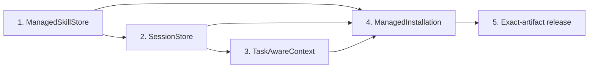

# Consumer Foundation v2 - Five-Slice Delivery Plan

## Goal Capsule

- **Objective:** Move DotAIOS from a useful local folder with several competing lifecycle writers to five explicit ownership modules that can adopt skills, preserve session evidence, compose task-bounded context, manage installation, and certify one exact release artifact without inventing cloud authority.
- **Delivery order:** ManagedSkillStore, SessionStore, TaskAwareContext, ManagedInstallation/onboarding, exact-artifact release.
- **Current PR:** Implement only ManagedSkillStore. Later slices are durable roadmap commitments and dependency boundaries, not authorization to change their production modules in this PR.
- **Authority:** Real AIOS skill directories, canonical session Markdown, user-authored project/source files, and the exact packed release artifact own their respective truth. Catalogs, registries, indexes, projections, context packets, health summaries, and receipts remain derived evidence.
- **Stop conditions:** Stop a slice if it would require a vector database, hosted store, marketplace, cloud sync, remote Git acquisition, implicit approval, full-home discovery, a write-capable MCP tool, weaker deletion proof, or a support claim above produced evidence.
- **Landing:** Each slice lands as a separate reviewed PR. The current PR starts from exact `origin/main` commit `c86d1f94ff88df7ac27580dace80817edd91b65e`, must receive exact-commit iMac validation and green CI, and must not be merged by this workflow.

---

## Product Contract

### Summary

Consumer Foundation v2 makes local ownership inspectable and reversible before it expands convenience. The first slice makes AIOS—not `~/.agents/skills`, `~/.claude/skills`, a plugin registry, or a host catalog—the canonical owner of explicitly adopted Agent Skills. Native paths become exact projections of that owned store. The remaining slices apply the same canonical-versus-derived discipline to session memory, task context, installation, and release evidence.

### Settled Decisions

- AIOS real skill directories are canonical; `INDEX.md`, `RESOLVER.md`, `_registry.json`, and native links are derived.
- Ordinary routing scans only real immediate `<aios>/skills/<name>/SKILL.md` directories and never follows canonical-shelf links.
- Unmanaged discoveries are not routable until explicit exact-proof adoption succeeds.
- Agent Skills defines the bundle and progressive-disclosure format, not a universal discovery path, collision policy, or cross-host support claim.
- Host states remain detected, configured, projected or discoverable, invoked, and produced. Path presence alone is never called working.
- Project/source authority from PR61 and the exact MCP allowlist remain unchanged.

### Actors

- **Consumer/operator:** Reviews previews, explicitly applies exact plans, and can reconcile or remove only proved owned artifacts.
- **ManagedSkillStore:** Owns skill inventory, adoption proof, apply, reconciliation, recovery, and removal policy behind one small core interface.
- **DotAIOS CLI:** Presents structured previews and results; it never treats task text or an agent request as approval.
- **Agent hosts:** Consume native projections according to their own independently evidenced discovery rules.
- **Filesystem:** Holds canonical bundles, derived projections, portable inventory, and separate machine-local receipts and recovery state.

## Roadmap Slice 1: ManagedSkillStore

### Requirements

#### Authority and inventory

- **MS1.** An owned skill is a real immediate directory at `<aios>/skills/<name>` with a real `SKILL.md`; top-level links, linked `SKILL.md` files, hidden/internal entries, and native directories are not owned catalog entries.
- **MS2.** Ordinary CLI/MCP routing continues through the shared bounded real-directory scanner. It neither follows nor routes canonical-shelf links, native directories, registry rows, plugin declarations, or excluded candidates.
- **MS3.** `ManagedSkillStore.inspect()` returns three disjoint bounded classes: `owned`, `discovered_unmanaged`, and `excluded_unsafe`. It scans only the exact AIOS skills root and configured native skill roots, never the whole home.
- **MS4.** Inspection identifies a top-level AIOS shelf link as a migration candidate without reading through it. Only an explicit preview for that selected candidate may bind and inspect its target. Nested links always refuse.
- **MS5.** `_registry.json` is portable install inventory only. It may enrich a real owned entry with bounded provenance but cannot create routing authority, authorize replacement, or authorize deletion.

#### Zero-write proof

- **MS6.** `previewAdoption(input)` is zero-write and accepts only an explicitly selected reviewed local directory, discovered native real directory, or discovered top-level AIOS shelf link.
- **MS7.** Preview binds an operation ID, source kind, source root identity, sorted bounded regular-file manifest, per-file and aggregate digest, normalized executable bit, bundle digest, strict frontmatter and name, script/executable inventory, bounded portable provenance, canonical collision, every physical native collision, exact affected hosts/projections, current catalog identities, intended result, and plan fingerprint.
- **MS8.** A first-release bundle contains only unchanged, single-link regular files with valid UTF-8 relative names. The version-1 authority-text allowlist contains exactly the root `SKILL.md`; it is strict UTF-8. Every other admitted regular file, including scripts, Markdown references, and binary assets, is opaque byte-preserved content hashed without decoding. No v1 field declares additional text metadata. The tree has at most 16 levels, 4,096 observed entries, 512 admitted files, 1 MiB per file, 16 MiB aggregate bytes, and 1,024 UTF-8 bytes per relative path.
- **MS9.** Preview refuses a linked or special root, nested link, hardlinked or special file, traversal or invalid raw name, unsafe name/frontmatter mismatch, missing/invalid `name` or `description`, excessive tree, invalid metadata encoding, unsafe mode, destination alias, or unresolved collision without writing any byte. Derived-junk handling is explicit and deterministic: this release refuses `__pycache__` directories and `.pyc`/`.pyo` entries rather than silently omitting them.
- **MS10.** Preview inventories `authority-text`, `script`, and `opaque-asset` classifications plus an extension-only content-type hint and executable bits. Script classification is deterministic from an allowlisted filename extension or executable bit; it grants no execution authority. Preview never sniffs, decodes, imports, or executes an opaque file. The copied result preserves exact admitted bytes and normalizes ordinary files to `0644` and proved executable files to `0755`.
- **MS11.** Canonical or native collisions such as `plan` and `review` are explicit proof facts. Existing real directories, foreign links, broken links, or differently targeted managed links refuse unless the exact selected native directory or AIOS shelf link is the proved replacement source.

#### Exact apply and recovery

- **MS12.** `applyAdoption(proof)` accepts only the displayed operation ID and plan fingerprint, acquires the single store lock, re-plans every proof field under that lock, and refuses stale, replayed-with-drift, foreign, raced, or widened effects before mutation.
- **MS13.** Apply stages and re-verifies the complete bundle on the same filesystem, publishes a real AIOS-owned directory, records portable provenance without absolute machine paths, records machine paths and identities only in a separate local receipt, and narrowly refreshes the inventory, `INDEX.md`, `RESOLVER.md`, and exact projections from the proved plan.
- **MS14.** A reviewed arbitrary local source remains untouched. A proved native real source is replaced only after its exact current manifest is revalidated; a proved AIOS shelf link is replaced only when its exact link identity and target still match the proof.
- **MS15.** The canonical bundle is published before a proved native source is moved to an operation-owned backup and replaced by its AIOS projection. Existing indirect Claude links through `~/.agents/skills` must continue resolving without mutation.
- **MS16.** `INDEX.md` and `RESOLVER.md` are generated only from real owned directories and published as one guarded recoverable generation: each leaf replacement is atomic, no partial success is reported, and interrupted generations are deterministically rolled back or forward-completed before later mutation. Simultaneous visibility of two fixed filenames is not claimed.
- **MS17.** Every post-publication uncertainty retains the transaction journal and any operation-owned backup. Recovery uses exact identities and manifests; it never guesses ownership or silently discards evidence. Successful removal separately publishes a strict local recovery record before clearing the journal, so retained non-routable archives and projection backups remain inventoried.
- **MS18.** An identical adoption is idempotent and returns the existing owned result without recopying or replacing unrelated projections. The same proof cannot authorize changed bytes or a different plan.

#### Reconcile and remove

- **MS19.** `reconcile()` derives portable inventory, catalogs, and native projections from real owned directories plus strict receipts. It preserves unmanaged real entries and foreign links and never invokes broad `activate --overwrite` behavior.
- **MS20.** `remove()` first previews and fingerprints an exact removal plan, then under the store lock revalidates the canonical manifest, portable record, local receipt, projection targets, and any operation-owned backup.
- **MS21.** Removal may move only exact proved projections into operation-owned sibling recovery and may detach a canonical bundle only by an immediate-parent-revalidated, same-filesystem guarded rename of the exact proved root into operation-owned recovery. All DotAIOS writers are cooperative under the same store lock; portable Node 20 does not claim immunity to an uncooperative same-user ancestor swap between observation and any path-based `rename`/`symlink`, including native replacement and projection changes. Apply re-verifies the archived manifest. Version 1 retains the verified archive and detached-link backups instead of physically unlinking paths without conditional-inode support, and inventories successful retained recovery separately before journal cleanup. A mismatched archive, concurrent recreation, insufficient parent/root evidence, cross-device condition, or unsupported platform does not commit removal or overwrite a live entry; it preserves the recovery tree and journal as `needs_attention`. It never recursively deletes an unproved root, follows a link, trusts a registry row, or removes a drifted/foreign entry.
- **MS22.** When adoption replaced a native real source or AIOS shelf link, removal restores the exact saved source form only when its backup/receipt remains proved and the destination is absent or the exact managed projection. Arbitrary local reviewed sources were never changed and require no restore.
- **MS23.** Interrupted apply/remove, rollback failure, stale receipt, missing registry, forged registry, canonical drift, projection drift, repeated reconcile, repeated remove, and exact retry have deterministic bounded outcomes that preserve all unproved bytes.
- **MS23a.** Projection targets added after adoption can enter a fresh reconcile/remove proof, and committed reconcile records their refusal-only local history. Removing a custom target from configuration does not let a historical receipt/history coordinate authorize unlink: v1 conservatively refuses until the later ManagedInstallation slice supplies an explicit target-retirement proof. History can block removal but never authorize it.

#### Routing, host truth, and boundaries

- **MS24.** A successfully adopted bundle resolves through existing core, CLI, and MCP `resolve_skill` paths because it is now a real owned directory; no mutation MCP tool is added.
- **MS25.** MCP continues to list exactly `read_working_context`, `search_aios`, and `resolve_skill`. Project-local skills and PR61 project/source state remain separate authority domains.
- **MS26.** With at least 100 owned skills plus unmanaged and unsafe candidates, catalogs remain deterministic and bounded, contain only owned metadata, and omit all full-body canaries.
- **MS27.** `dotaios brief --compact`, working-context reads, boot context, ordinary list, and ordinary resolve do not inject full skill bodies. Full bodies remain lazy, explicit reads only.
- **MS28.** Inventory and health keep detected, configured, projected, discoverable, invoked, and produced facts distinct. This PR may prove local configuration or projection and may report invocation as not run; it cannot claim cloud/browser availability or cross-host support from a shared path.
- **MS29.** Adoption is local-only. This PR adds no vector database, hosted store, marketplace, cloud sync, remote Git acquisition, plugin download, or network requirement.
- **MS30.** The live AIOS and native paths are read-only acceptance inputs. Every mutation acceptance case runs against a disposable fixture.
- **MS31.** Every live DotAIOS-owned canonical-skill, inventory, catalog, and global-projection writer either delegates to ManagedSkillStore, becomes a pure renderer/exact primitive used only by it, is retired to preview/manual-edit guidance, or is explicitly separate project-local authority. The sole compatibility exception is the all-new `init` scaffold catalog publisher before the folder becomes a live store; it cannot adopt, replace, project, or remove an existing skill.
- **MS32.** This slice retires plugin-package copying as a peer skill writer. A reviewed local plugin root that is itself exactly one valid Agent Skill bundle may be adopted through the ordinary proof; plugin code is not installed. Multi-skill/plugin-package installation refuses before mutation and remains deferred to a later aggregate package contract. Partial plugin success is impossible in this PR.

### Acceptance Examples

- **MS-AE1 — Canonical shelf migration candidate:** A fixture reproduces five top-level AIOS links named `bill-cto-operating-loop`, `brian-am-operating-loop`, `fleet-context-pack`, `jamie-cfo-operating-loop`, and `jeff-ceo-operating-loop`. Ordinary catalog and resolve remain available and never follow them; inventory reports them as discovered-unmanaged. Explicit preview/adoption of one selected disposable link replaces only that proved link with a real AIOS-owned complete bundle.
- **MS-AE2 — Blueprint native migration:** A fixture reproduces real `~/.agents/skills/{architecture,architecture-review,design,improve,plan,review,task-to-pr,test}` directories, lockfile provenance, and Claude links to them. Preview exposes `plan`/`review` and all physical collision facts. Applying exact proofs adopts all eight into AIOS, replaces only each proved global real source with an AIOS projection, preserves working indirect Claude links, and makes all eight routable through core, spawned CLI, and MCP.
- **MS-AE3 — Unsafe and opaque bundle matrix:** Nested links, linked roots, FIFOs/sockets/devices, multi-link files, traversal/invalid names, invalid UTF-8 root `SKILL.md`, invalid/mismatched frontmatter, derived junk, changed identity, exceeded file/depth/path/byte bounds, and hostile modes refuse with a stable bounded reason and byte-identical before/after trees. An opaque invalid-UTF-8 binary asset adopts with exact bytes, digest, executable/type inventory, and provenance preserved.
- **MS-AE4 — Stale/collision/race matrix:** Source mutation, destination creation, foreign-link replacement, catalog drift, proof mutation, concurrent apply, and source swap at every observation checkpoint refuse unchanged or recover only operation-owned staged state.
- **MS-AE5 — Crash/rollback matrix:** Injected failure before and after every canonical, portable-inventory, catalog, source-backup, projection, receipt, and cleanup publication produces an old, new, or explicitly recoverable state. Reconcile reaches one deterministic exact outcome and preserves all canaries.
- **MS-AE6 — Repeat/remove matrix:** Exact repeated adoption is a no-op; drifted canonical or projection bytes block removal; exact removal restores proved replaced source forms, leaves arbitrary local sources untouched, and cannot recursively delete extra or changed bytes.
- **MS-AE7 — Bounded catalog and lazy context:** A composed disposable fixture set with 120 owned skills plus linked/unmanaged/unsafe candidates generates owned-only bounded `INDEX.md` and `RESOLVER.md`, resolves the expected skills, and keeps body canaries out of compact brief, working context, boot context, inventory, and ordinary resolve.
- **MS-AE8 — Host and MCP truth:** Health output never upgrades path presence to invoked or produced; the MCP tool list remains the exact three-tool allowlist; unknown mutation tool calls refuse.

### Success Criteria

- Preview and every refused operation make zero fixture changes.
- Applied canonical bytes and normalized executable modes match the exact proof manifest at 100%.
- Owned-only routing/catalog recall is 100%; unmanaged/unsafe routing count is zero.
- Removal deletes zero unproved bytes across the mutation, race, crash, collision, rollback, repeat, and drift matrices.
- No child process from a bundle is executed during inspect, preview, apply, reconcile, or remove.
- Focused core/CLI/MCP tests, full tests, smoke, syntax/check, packed-content, package dry-run, diff checks, independent reviews, exact-commit iMac validation, and CI all pass.

## Roadmap Slice 2: SessionStore

### Outcome

Make session Markdown canonical evidence and its JSONL index a validated rebuildable derivative behind one `SessionStore` that owns capture, search, delete, and reconcile.

### Contract

- Serialize same-source capture from observation through publication; every crash boundary has deterministic idempotent recovery.
- Reject malformed, duplicate, conflicting, absolute, traversal, linked, special, changed, or outside index paths before reads or deletes.
- Reconcile orphan Markdown and stale rows without silently deleting user evidence.
- Delete only an exact proved session artifact and never let an index row authorize a broader unlink.
- Prove concurrent growth, crash, orphan rebuild, stale index, duplicate source, traversal, link/hardlink/special/swap, and deletion-refusal matrices with tree snapshots and exact-commit validation.

### Dependency

This slice depends on the canonical-versus-derived authority decision and may reuse generic owned-state, containment, locking, and journal patterns. It must not import ManagedSkillStore or place session state in the skill inventory.

## Roadmap Slice 3: TaskAwareContext

### Outcome

Compose the smallest deterministic project-bounded evidence packet for an explicit ephemeral task without making retrieval output or indexes into memory authority.

### Contract

- Accept a 1–500-character task explicitly; never infer or persist it as durable user memory.
- Resolve one explicit project before body evidence selection; use the PR61 project/source privacy boundary without expanding external-source authority.
- Rank only bounded selected-project evidence with deterministic lexical policy, source and line provenance, admission/omission accounting, and a 512–32,000-character output budget.
- Keep other-project bodies, frontmatter path canaries, full skill bodies, and unrelated session evidence outside the candidate set.
- Preserve CLI/MCP parity through the existing read-only working-context contract and exact three-tool allowlist.
- Require a produced Codex/iMac receipt before making the corresponding host continuity claim.

### Dependency

TaskAwareContext depends directly on an authoritative SessionStore for safe session evidence, the existing PR61 project-selection boundary for project authority, and the canonical bounded working-context composer for admission. ManagedSkillStore is an ordering prerequisite only for a stable Consumer foundation; TaskAwareContext must not depend on skill installation metadata, ManagedInstallation, or exact-artifact release.

## Roadmap Slice 4: ManagedInstallation and Onboarding

### Outcome

Provide one non-expert human-run preview/confirm/setup/doctor/disconnect/remove journey backed by one `ManagedInstallation` inventory and the ownership seams delivered by earlier slices.

### Contract

- Preview names every global, profile, project, bridge, state, and projection artifact that may change; apply cannot exceed the reviewed plan.
- Setup composes existing owner modules rather than rewriting skill/session/context registries.
- Doctor reports detected, configured, projected/discoverable, invoked, and produced evidence separately; only current produced evidence can claim ready.
- Disconnect/removal preserves user-authored bytes, refuses ambiguous ownership, and is repeatable across clean, interrupted, drifted, collision, and recovery fixtures.
- Public guides converge on the same human-run journey; assistant help may explain but cannot bypass explicit approvals.
- A fresh non-expert/iMac receipt proves the exact journey.

### Dependency

ManagedInstallation depends on ManagedSkillStore ownership/reconcile/remove, SessionStore state authority, the bounded TaskAwareContext access contract, and the portable-agent/onboarding decisions. It consumes those seams; it does not absorb their internal state.

## Roadmap Slice 5: Exact-Artifact Release

### Outcome

Produce one immutable tarball once, hash it, and certify that exact artifact through clean and drifted install/update/reinstall/disconnect/remove/restore lifecycles before a separate explicit publication action.

### Contract

- Bind receipt v2 to DotAIOS version, candidate Git SHA, tarball integrity, dependency-lock identity, Node/OS/architecture, client version, configured surface hash, skill identity, and evidence tier.
- Install and exercise the exact tarball—not source files—in disposable clean homes for setup, doctor, skills doctor, MCP, migration, exact-version update/reinstall, drift recovery, disconnect/removal, and clean restore.
- Validate every packed Markdown link and public-package allowlist entry.
- Refuse dirty or mismatched SHA, tagged version, uncut changelog, incomplete/stale/cross-artifact receipt, unsupported platform, failed CI, or missing lifecycle fact.
- Require fresh produced-result receipts for every claimed host/OS tier.
- Keep publication separate, explicit, and atomic; certification never publishes.

### Dependency

This final slice depends on replication alignment, ManagedInstallation, artifact-bound host receipts, and every preceding Consumer v2 ownership seam. It is the only slice allowed to make an exact packed-artifact lifecycle verdict.

---

## Planning Contract for the Current PR

### Deep Module

Add one core `ManagedSkillStore` facade with exactly these lifecycle operations:

```text
inspect(options?)
previewAdoption(input)
applyAdoption(proof)
reconcile(options?)
remove(proof)
```

The facade hides raw traversal, provenance schemas, receipts, journal layout, staging, catalog publication, and projection replacement. CLI commands and legacy skill lifecycle adapters cross this seam; they do not independently write `_registry.json`, owned bundles, catalogs, or skill projections.

### CLI Contract

```text
dotaios skills inventory [--path <aios>] [--home <home>] [--json]
dotaios skills adopt <source> [--source-kind <kind>] [--path <aios>] [--home <home>] [--json]
dotaios skills adopt <source> --apply <operation-id> --fingerprint <sha256> [...]
dotaios skills reconcile [--path <aios>] [--home <home>] [--json]
dotaios skills remove <name> [--path <aios>] [--home <home>] [--json]
dotaios skills remove <name> --apply <operation-id> --fingerprint <sha256> [...]
```

Preview is the default for adoption and removal. Compatibility entry points (`dotaios install`, `dotaios skill add/remove`, and activation-driven projection work) must delegate to the store or explicitly remain non-mutating for skill bundles; no legacy recursive or broad-overwrite path may bypass exact proof.

### State Layout

- Canonical bundle: `<aios>/skills/<name>/...` as real normalized files/directories.
- Portable inventory: `<aios>/skills/_registry.json`, versioned, strict, path-portable, and derivative.
- Transaction staging/journal: hidden same-filesystem store workspace beneath `<aios>/skills`, excluded from routing and bounded inventory.
- Machine-local receipt/recovery/history: `<home>/.dotaios/managed-skills/...`, strict same-user state with absolute source paths, saved native replacements, retained recovery inventory, and refusal-only reconciled-target history only here. History never authorizes unlink.
- Catalogs: `<aios>/skills/INDEX.md` and `<aios>/skills/RESOLVER.md`, derived from the same real-directory scan used by routing.

### Transaction Order

1. Acquire the single store lock and recover or refuse any prior transaction.
2. Recreate the adoption/removal plan and compare the exact operation/fingerprint.
3. Stage and revalidate bundle/state/catalog bytes; sync owned staging state.
4. Journal the intended generation and exact rollback/forward-completion facts.
5. Publish canonical bundle, portable record, and guarded catalog generation.
6. Move only a proved native source or shelf link into the operation-owned backup; create and verify the exact projection.
7. Publish and sync the machine-local receipt.
8. Mark committed, clean only exact operation-owned staging, and release the lock.

If a later step fails, retain enough proved state to restore the old state or forward-complete the same fingerprint. Never erase ambiguous evidence.

### System-Wide Impact

- `packages/core/src/managed-skill-store.mjs` becomes the sole adoption lifecycle policy owner.
- `packages/core/src/skills.mjs` remains the ordinary routing/catalog reader and gains no unmanaged authority.
- `packages/core/src/skills-install.mjs` supplies exact projection primitives only; broad skill-directory overwrite is removed from adoption paths.
- CLI `skills`, `skill`, `install`, and activation adapters delegate rather than maintain peer writers.
- `skill-health.mjs` may consume inventory classifications but must keep evidence tiers truthful.
- Production MCP code should not gain a new tool; tests prove exact allowlist and adoption visibility through `resolve_skill`.
- PR61 project/source modules remain untouched except generic helpers may be reused without importing their domain modules.

### Implementation Units

#### U1. Store seam and bounded inventory

- Add red core tests for disjoint owned/discovered-unmanaged/excluded-unsafe classification, top-level shelf no-follow behavior, native candidate discovery, unsafe exclusions, and bounded roots.
- Implement the facade and read-only classifier without changing routing authority.
- Add spawned CLI inventory coverage and sync-hook zero-write checks.

#### U2. Exact adoption proof and bundle staging

- Add red tests for manifest/digest/frontmatter/provenance/scripts/executables, every refusal class, zero-write preview, and stale proof.
- Implement strict bundle inspection, fingerprinting, normalized staged copy, portable record, and local receipt schemas.
- Prove no bundle script executes and arbitrary local sources remain byte-identical.

#### U3. Journaled apply, projections, and migration fixtures

- Add red crash/race/collision/rollback/repeat tests at every publication checkpoint.
- Implement single-lock recovery, canonical publication, guarded catalog refresh, exact native replacement, and idempotence.
- Prove the five shelf-candidate and eight Blueprint-native disposable journeys, indirect Claude projection preservation, `plan`/`review` warnings, and core/CLI/MCP route parity.

#### U4. Reconcile/remove and legacy writer closure

- Add red drift/recovery/removal tests proving no recursive deletion of unproved bytes.
- Implement preview/apply removal and exact reconcile.
- Route raw skill lifecycle and activation projection mutation through the store; retire plugin-package skill exposure, registry-only deletion, and adoption overwrite authority.

#### U5. Scale, truth, documentation, and closure

- Add 120-skill catalog/lazy-body, host-stage, MCP-allowlist, help, smoke, and package regressions.
- Simplify settled code while preserving the deep facade.
- Run independent standards, product-contract/spec, adversarial safety, and agent-native reviews; fix all P0/P1 and every in-scope P2.
- Run focused and full gates, commit only reviewed scoped files, push, open a ready PR, request exact-commit iMac validation, wait for CI, and do not merge.

### TDD and Fault Matrix

Every implementation unit starts with a production-seam red test, records the expected failure, implements the smallest green behavior, refactors only under green, and reruns focused tests after each patch.

| Matrix | Required variations |
|---|---|
| Mutation | source root/file/frontmatter/mode/name/catalog/projection changes before and during apply |
| Race | two identical adopters, competing fingerprints, destination creation, source swap, remove versus reconcile |
| Crash | before/after journal, stage, canonical, registry, each catalog leaf, backup, projection, receipt, commit, cleanup |
| Collision | canonical real/link/foreign/broken, every native real/link/foreign/broken, basename/frontmatter aliases, `plan`/`review` |
| Rollback | old-only, new-only, partial publication, failed rollback, failed forward recovery, poisoned journal |
| Repeat | preview replay, exact apply replay, adopted input, reconcile twice, remove twice, recovery twice |
| Remove | exact guarded root move, cooperative writer serialization, uncooperative parent/root swap, recreated live path, cross-device/unsupported refusal, drifted recovery tree, extra file, missing receipt, forged/stale registry, changed link target, saved-source restore |

### Verification Gates

Run from the feature worktree and record exact command, exit code, and summary:

1. Focused `node --test` suites for ManagedSkillStore, CLI, skills routing/install/health, sync hook, and MCP.
2. Mutation/race/crash/collision/rollback/repeat/remove matrices.
3. `npm run syntax-check`.
4. `npm run check`.
5. `npm test`.
6. `npm run smoke`.
7. CLI import/help and production-shaped disposable adoption smoke.
8. `npm pack --dry-run` and packed-content inspection.
9. `git diff --check`, scoped status, diff-stat, and final base diff review.
10. Independent standards/spec/adversarial/agent-native review with P0–P3 disposition.
11. Exact-commit iMac validation against the pushed SHA.
12. GitHub CI to completion; ready PR stays unmerged.

### Risks and Mitigations

- **Two fixed catalog paths are not jointly rename-atomic:** Use one lock, staged exact bytes, individually atomic leaves, a journaled generation, no partial success, and deterministic pre-mutation recovery. Do not claim simultaneous observer visibility.
- **Plugin lifecycle could remain a peer writer:** Route every skill-bundle mutation through ManagedSkillStore in this PR; plugin package storage may remain separate but exposed canonical skills cannot bypass the store.
- **Native replacement could strand source bytes:** Canonical-first publication, operation-owned backup, synced local receipt, exact forward recovery, and deletion refusal preserve evidence.
- **Portable Node path mutation cannot be descriptor-relative:** Parent/leaf chains are observed and revalidated around every path-based rename/symlink, all DotAIOS writers share the lock, transient same-user ancestor swaps are not claimed safe, and uncertain effects retain `needs_attention`.
- **Retired custom projection targets need fresh authority:** Do not trust an old receipt coordinate after configuration removal; v1 refuses, and ManagedInstallation owns the future target-retirement proof.
- **Opaque assets need safe classification:** Decode only the root `SKILL.md`, hash/copy all other regular files as bytes, inventory type/executable facts, and explicitly refuse derived junk rather than accidentally omitting it.
- **Shared `~/.agents` paths could create false host claims:** Record physical projection facts separately from host-native discovery and never infer one host from another.
- **Host registry input could expand proofs before bundle limits apply:** Read custom `agents.json` only as bounded, fatal-UTF-8, single-link regular metadata; bound agent fields, unique targets, and the owned-skills-by-target fact product before loops.
- **Live user paths contain valuable migration inputs:** All automated apply/remove tests use disposable fixtures; live paths remain read-only.
- **Implementation breadth could leak into onboarding/release:** Limit production changes to skill ownership/lifecycle seams, their direct CLI adapters, health truth, docs, and tests.

<!-- ce-section: work-relationships -->
## How This Work Fits Together



- ManagedSkillStore establishes the first canonical/derived lifecycle seam and removes unsafe skill writers.
- SessionStore applies the same ownership discipline to session evidence but remains a separate domain module.
- TaskAwareContext depends directly on SessionStore, PR61 project selection, and bounded working-context composition.
- ManagedInstallation composes the preceding seams into one truthful human journey.
- Exact-artifact release certifies that complete journey against one immutable tarball and matching host receipts.

## Sources and Current Evidence

- `CONTEXT.md`
- `docs/architecture.md`
- `docs/adr/0001-versioned-aios-folder-migrations.md`
- `docs/adr/0003-keep-canonical-memory-separate-from-derived-views.md`
- `docs/foundation-program/continuation-handoff.md`
- `docs/foundation-program/evidence-ledger.md`
- `docs/foundation-program/research/2026-08-09-host-contracts.md`
- `docs/foundation-program/wayfinder/issues/002-define-memory-domains-authority.md`
- `docs/foundation-program/wayfinder/issues/005-define-portable-agent-contract.md`
- `docs/foundation-program/wayfinder/issues/016-make-session-store-authoritative.md`
- `docs/foundation-program/wayfinder/issues/018-unify-installation-and-health.md`
- `docs/foundation-program/wayfinder/issues/019-bind-host-receipts-to-release-artifacts.md`
- `docs/foundation-program/wayfinder/issues/020-certify-exact-artifact-lifecycle.md`
- `docs/plans/2026-08-10-003-feat-consumer-project-source-retrieval-plan.md`
- Agent Skills overview: <https://agentskills.io/home>
- Agent Skills client integration guide: <https://agentskills.io/client-implementation/adding-skills-support>

Live paths were inspected read-only. At planning time they contained 54 AIOS-owned real skill directories, five linked AIOS shelf candidates, and eight Blueprint real directories in `~/.agents/skills` with Claude links and lockfile provenance. Those facts shape disposable fixtures; they do not authorize mutation of the live paths.
