# Consultant Pack Private Delivery and Sparse Site - Plan

## Goal Capsule

Ship DotAIOS as the primary product and the Consultant Pack as its first private, paid extension. A buyer purchases through Gumroad, downloads an editioned signed archive, opens the DotAIOS folder they already own, and pastes one prompt so their local agent can validate, install, activate, and verify the pack. The public site explains this in less than half its current copy while selling the result: every supported agent receives the same selected context, standards, and consultant workflows.

Target workspaces:

- **Public repository:** the DotAIOS CLI, website, registry contracts, public verification logic, and tests in this repository.
- **Private AIOS product workspace:** pack source, build inputs, evaluation fixtures, provenance ledger, Gumroad files, buyer onboarding, and release records under `projects/dotaios-product/` in the private AIOS repository.

Authority order:

1. The product decisions in this plan and the user's current direction.
2. Repository truth gates, tests, and public/private boundaries.
3. Official Gumroad, Node.js, Codex, Claude Code, and Agent Skills documentation.
4. Current market and benchmark evidence.

Stop conditions:

- Do not expose paid skill source, private archives, license keys, signing keys, private download URLs, or evaluation fixtures in the public repository, npm package, site bundle, logs, ownership receipts, or certification receipts. The buyer-only Gumroad purchase receipt and Library remain the authorized access and recovery surfaces.
- Do not expose public checkout until a Gumroad test purchase and three to five paid founding buyers pass receipt, download recovery, local install, at least one supported host, first workflow, removal, and refund support. Operator certification must separately pass both supported hosts.
- Do not ship the security-sensitive importer on Node.js 20, which reached end of life on April 30, 2026. Raise the public runtime floor to a supported Node.js release before launch.
- Do not ship, recommend, or invoke third-party material until its exact revision, license, notices, provenance, permissions, and evaluation status pass review.
- Do not claim support for an agent host or operating system until that combination has a pack-specific lifecycle, discovery, invocation, and output receipt.
- Do not silently overwrite user-modified files, unrelated skills, or a prior working installation.

Tail work after implementation: review the public diff, run the complete verification contract, commit explicit public paths, push the existing `codex/consultant-pack-finder-site` branch, and open or update a PR. Keep private product and Gumroad artifacts out of that PR.

---

## Product Contract

### Positioning and page hierarchy

- **R1:** DotAIOS remains the main website and primary product. Career and profession packs are a secondary extension surface, not the page's organizing idea.
- **R2:** The first visible English path must contain at most 350 words and at least 50 percent fewer words than the measured 745-word baseline. Italian must preserve the same hierarchy and comparable density.
- **R3:** Hero support copy is at most 20 words. Section headlines are at most eight words. Supporting paragraphs are at most 25 words. Use no em dashes or en dashes in shipped copy.
- **R4:** Sell agent enablement in plain language: shared context, selected workflows, consistent standards, and better work from the agents the buyer already uses.
- **R5:** Sell the curation method, exclusions, testing, and judgment. Do not market a quantity of prompts, files, skills, or words.
- **R6:** Keep proof, compatibility detail, methodology, and legal clarification available but subordinate through compact disclosures or dedicated secondary views.
- **R7:** The primary CTA reflects readiness. Before the launch gate it is a non-collecting link to the pack's proof and prerequisites. Only a verified `available` product may link to Gumroad checkout.

### Offer and first pack

- **R8:** Launch one narrow Consultant Pack at EUR 35 one time. Commercial edition `2026.1` remains usable locally. Versions `2026.1.x` may provide critical security, legal, or correctness fixes as separately versioned files in the buyer's Gumroad Library while the edition is supported; feature editions are separate purchases. Public host compatibility is certified as of the dated release, not forever. A later EUR 4 monthly update product remains optional and out of scope for v1.
- **R9:** The offer is textable: three selected consultant workflows, installed once, tested on Codex and Claude Code.
- **R10:** The three marketed outcomes are:
  1. turn a meeting into decisions, actions, follow-up, and a proposed client-project update;
  2. keep each client and project in usable context across sessions;
  3. turn a client request into a proposal or working deliverable with a human approval checkpoint.
- **R11:** Freeze the evaluation rubric before authoring skills. The `meeting-to-action` workflow is the first vertical proof and must pass a Gumroad test handoff and paid founding-buyer pilot before the other two workflows or general lifecycle work expands. Public checkout remains closed unless all marketed outcomes pass; a failed outcome is removed from the offer and repriced before launch rather than claimed without evidence.
- **R12:** The required v1 bill of materials is DotAIOS-authored: `client-workspace`, `meeting-to-action`, and `request-to-proposal`; their shared client schema; outcome templates and synthetic samples; ownership and certification receipts; doctor and smoke tests; Codex and Claude Code adapters; manifest, lockfile, licenses, and notices.
- **R13:** Supporting tools are optional integrations, never marketed bonuses. Microsoft MarkItDown remains a researched later recipe, not installed, invoked, or required by v1. V1 accepts pasted text and local Markdown inputs.
- **R14:** Connector guidance for Gmail, Drive, Notion, or meeting transcripts is deferred until each upstream integration passes host, license, privacy, permission, and support review. No connector is redistributed or required for a core outcome.
- **R15:** V1 excludes broad productivity libraries, meeting bots, native audio capture, autonomous sending or publishing, CRM, RAG or vector databases, invoicing, OAuth setup, workflow platforms, agent frameworks, educational MCP reference servers, background agents, and unsupported host adapters.
- **R16:** Preserve the buyer's agency: agents may prepare files and proposed updates, but consequential external sends and durable client-record changes require explicit human approval.

### Private artifact and Gumroad delivery

- **R17:** Each paid pack artifact is one private, immutable, full-version Gumroad download, such as `consultant-pack-2026.1.0.bundle.zip` or `consultant-pack-2026.1.0-pilot.1.bundle.zip`. Every `2026.1.x` fix is a new retained Gumroad file and digest, never an overwrite. It is not a public GitHub package and is not included in the public npm tarball.
- **R18:** Treat the outer ZIP as an untrusted transport envelope containing exactly two fixed ASCII entry names: `payload.zip` and `payload.sig.json`. The sidecar is strict JSON with an allowlisted schema and a detached Ed25519 signature over a domain-separated RFC 8785 canonical payload that excludes only the signature field. It separately binds the DotAIOS product ID, Gumroad product ID, pack edition, pack version, release sequence, required public CLI version, inner-ZIP SHA-256, internal-manifest SHA-256, signing key ID, and schema. Reject duplicate keys, unknown fields, BOM or trailing bytes, non-integer numbers, Unicode identifiers, malformed base64url, algorithm confusion, and non-canonical encodings. The inner ZIP contains the paid plugin manifest, canonical Agent Skill folders, recovery quick start, licenses, notices, provenance metadata, and per-file hashes.
- **R19:** Gumroad gates the download and handles checkout, receipt, Library recovery, tax, refunds, and disputes. Disable license keys for v1. Pack install, status, removal, receipts, prompts, logs, and support remain key-free.
- **R20:** Before payment, disclose that the pack requires the free DotAIOS foundation, Node.js 22 or newer, a current DotAIOS CLI, macOS, and Codex or Claude Code. After purchase, the buyer keeps the bundle outside the synced AIOS repository, opens the existing AIOS folder, and uses the public CLI-owned install flow: inspect the local bundle path, verify it, review the bound dry run, approve installation, verify each detected selected host, and run the meeting workflow. A short Gumroad prompt may invoke that public flow but is never a trust root. One supported local host is sufficient for buyer success.
- **R21:** In v1, a newer same-edition version is installed by supplying a newly downloaded signed bundle to `dotaios pack install`; no command discovers remote updates. A full refund or revoked purchase may stop future Gumroad access but never silently deletes or disables installed local files.
- **R22:** Publish the exact minimal installer prompt in public DotAIOS documentation and make the installed CLI the only authority for verification and mutation. Gumroad product or receipt copy is an untrusted convenience wrapper and must not use `npx`, shell interpolation, network access, archive reading before CLI verification, or bypass instructions. The verified inner ZIP may carry the same prompt as an offline recovery copy.
- **R23:** Gumroad email updates are not a launch dependency. The receipt, Library, versioned files, local status output, and support page are sufficient on day one.

### Agent-native install lifecycle

- **R24:** Raise the supported runtime floor from Node.js 20 to Node.js 22 or newer across package engines, CI, release automation, and setup documentation. Prefer Node.js 24 in development and release CI while retaining a Node.js 22 compatibility lane.
- **R25:** The canonical install target is the buyer's AIOS plugin and skills structure. Transaction staging and replacement backups live on the destination filesystem so final renames can be atomic, including for a custom AIOS path. Mode-restricted journals, receipts, and inactive quarantine metadata live under `~/.dotaios/packs/`, outside the synced AIOS repository. Existing activation bridges are reused through pack-scoped reconciliation.
- **R26:** Add one `dotaios pack` namespace with buyer-facing `inspect`, `install`, `status`, and `remove` subcommands. `dotaios pack install <bundle>` is preview-only and emits a plan ID; `dotaios pack install <bundle> --apply <plan-id>` performs the bound mutation. Every command supports stable `--json`. Recovery and rollback are internal transaction behavior. Private release tooling owns certification. Defer public `update`, `certify`, and `rollback` commands until a real update product requires them.
- **R27:** Use pinned `yauzl-promise@4.0.0` with lazy entry handling. The outer bundle is at most 32 MiB and contains exactly two regular files; the sidecar is at most 64 KiB. The inner ZIP has at most 512 entries, each at most 4 MiB, at most 64 MiB total expanded content, and at most a 100:1 per-entry or aggregate ratio. Reject encrypted entries, unsupported compression, absolute or escaping paths, backslashes, control characters, symlinks, special files, executable bits, undeclared files, and duplicate, case-folded, or Unicode-normalized collisions.
- **R28:** The dry run emits a plan ID bound to bundle digest, current trusted manifest and receipt, destination hashes, declared permissions, and activation targets. Apply reacquires one AIOS-global install lock keyed to the canonical AIOS root and revalidates all state. Legacy install and pack install share one extracted lifecycle boundary for journaled commit, recovery, and index rebuild; signed paid manifests remain rejected by plain `dotaios install` and enter only through verified `dotaios pack` routes.
- **R29:** The ownership capsule retains the exact verified sidecar and canonical manifest bytes plus a receipt recording product, edition, version, digests, approved root IDs, relative installed paths and hashes, provenance, approved permissions, activation targets, and per-host state. Before replacement or removal, reverify the retained sidecar and manifest against the embedded catalog and keyring and fail closed on any mismatch. Receipts are evidence, not mutation authority: legal targets are rederived from that verified manifest and the fixed host registry, then parents are ownership-checked and re-lstatted immediately before rename or unlink. Capsules contain no buyer identity, license key, private URL, client path, or client content.
- **R30:** Same-edition reinstall and removal compare current hashes to the trusted manifest and receipt. Any modified managed file blocks the whole operation by default. `preserve-modified` moves the complete owned root into an inactive quarantine; a separate approved backup-and-replace path is reversible. Removal deletes only matching owned files. Shared indexes are regenerated from canonical sources and never treated as receipt-owned payloads.
- **R31:** Central release certification passes both Codex and Claude Code on macOS before either becomes a public claim. A buyer verifies every detected selected supported host and may succeed with only one. Pack reconciliation accepts only receipt-owned skill IDs, preserves unrelated skills, and reports `exposed surface` separately from `certified host`, including `installed`, `configured`, `discovered`, `invoked`, and `produced`. Browser chat receives a manual, uncertified context brief only. Windows and Linux remain unclaimed for the paid pack until their own lifecycle receipts pass.

### Trust, support, and public contracts

- **R32:** Every shipped, recommended, or invoked third-party dependency has a pinned upstream revision, preserved license and notice, modification record, permission and vulnerability review, and an evaluation result. Rejected research remains in the private curation report and does not become a release-compliance burden.
- **R33:** Public offer data contains only buyer-safe promise, price, availability, evidence, and compatibility fields. Private delivery fields and paid contents remain forbidden.
- **R34:** Add a buyer-safe `gumroad-local-archive` registry delivery mode. The public registry exposes only `draft`, `available`, `suspended`, and `retired`; private-test, paid-pilot, and certified states remain in the private release ledger. An available entry requires the Gumroad product ID and allowlisted HTTPS checkout URL but forbids a private install source. Suspended and retired entries are non-buyable. Only `market install` for an available entry prints checkout and local `dotaios pack install` guidance; all other states remain link-free. The site derives its CTA from this validated registry rather than duplicating the URL.
- **R35:** Product terms define permanent local use of the purchased edition, same-edition fix policy, separate future editions, dated compatibility, Gumroad recovery limits, refunds, privacy, support window, buyer-owned device scope, and redistribution prohibition.
- **R36:** Client records are stored locally by default under a documented private workspace outside public or synced Git paths. The pack supplies version-control exclusions, retention guidance, and per-client deletion. The creator receives no buyer client data. Purchase copy must also state that Codex or Claude may process content the buyer supplies under the chosen provider's policies; do not imply local inference.
- **R37:** Treat meeting transcripts, client requests, and imported documents as untrusted quoted data, never as instruction authority. Each workflow starts from one explicit client root, never enumerates its parent or another client, and requests no network, shell, external-send, or unrelated-filesystem tools. Certification uses host-specific least-privilege profiles where supported, records attempted tool calls, and rejects traversal, cross-client reads, remote exfiltration, or autonomous sends. Buyer copy states that final enforcement also depends on permissions the buyer grants the host. Logs and support bundles exclude client text and identifying paths.
- **R38:** The private release ledger moves through `draft -> private-test -> paid-pilot -> certified`, after which the public registry may move `draft -> available -> suspended|retired`. Gumroad must be functional before public availability. A checkout health failure immediately returns public offer and registry state to `suspended` and removes the CTA without affecting installed buyers.

### Actors and critical flows

- **Buyer:** checks prerequisites, purchases, downloads, installs, approves permissions, runs workflows, reinstalls a signed same-edition fix when supplied, removes the pack, and seeks recovery or support.
- **Local agent:** runs preflight, inspects the signed bundle, asks for approvals, invokes the public CLI, explains failures, and guides first use without receiving a payment credential.
- **Product operator:** curates sources, signs editions, uploads Gumroad files, runs test purchases, publishes evidence, handles refunds and support, and opens checkout only after proof.
- **Gumroad:** handles payment, receipt, hosted-file access, tax, refund and dispute state, and buyer Library access.

Critical journeys:

1. **Readiness to purchase:** sparse DotAIOS page to prerequisites and proof; unavailable states remain non-collecting until the paid-pilot and certification gates pass.
2. **Purchase to first value:** Gumroad receipt to one bundle to the public CLI-owned prompt, preflight, verification, bound dry run, safe install, one detected host, and meeting outcome.
3. **Same-edition fix:** download a newer signed `2026.1.x` bundle, run `pack install`, preserve modifications, reconcile host activation, and keep the previous version until success.
4. **Removal:** preview owned files, block on modifications, remove matching managed adapters and skills, refresh indexes, and retain an audit record.
5. **Recovery:** recover purchase through Gumroad, re-download the purchased edition, resume a journaled operation, reinstall with the same checks, or use the named support path.
6. **Refund or dispute:** Gumroad governs future hosted-file access without remotely deleting local work.

### Acceptance examples

- **A1:** A planned offer renders no checkout link and fails a contract test if private delivery metadata enters `offer.json`.
- **A2:** A valid buyer with Codex only or Claude Code only installs one signed bundle into an existing AIOS and receives a secret-free ownership receipt and a successful selected-host result. The operator's release evidence separately covers both hosts.
- **A3:** A tampered signature, mismatched hash, wrong product, wrong edition, traversal path, symlink, or duplicate entry is rejected before any destination write.
- **A4:** A failed canonical commit leaves the prior version usable. If interruption occurs during later shared-index or host reconciliation stages, the next lifecycle command recovers or rolls back before further mutation and reports the incomplete surface truthfully.
- **A5:** Reinstalling the same version is idempotent. Installing a newer same-edition version or removing after a user edit stops safely and names the conflict.
- **A6:** An unsupported agent host receives a truthful limitation, not a successful compatibility receipt.
- **A7:** A refunded buyer keeps already installed local files. Gumroad governs later hosted-file access, while local lifecycle commands neither require nor expose a key.
- **A8:** English and Italian pages preserve the same information order, copy budget, CTA state, and public claims.
- **A9:** A replaced or malicious Gumroad prompt, a tampered receipt, or a plain `dotaios install` attempt cannot bypass signature verification, the bound plan, or the paid-manifest route.

---

## Planning Contract

### Key technical decisions

- **KTD1 - Public/private boundary** (`session-settled: user-directed; rejected publishing paid skills in public GitHub or npm`): keep the paid pack and its build inputs in the private AIOS product workspace; keep only generic installer capabilities, public contracts, and verification in the public repository.
- **KTD2 - Lean Gumroad delivery:** use one Gumroad-hosted release bundle plus local install for v1. Reassess custom delivery only after a 30-day post-launch review shows material download-recovery failure, support burden, or redistribution; do not build it automatically.
- **KTD3 - Canonical AIOS installation:** model the pack as a paid DotAIOS plugin and install one canonical copy into AIOS. Reuse host definitions and a filtered reconciliation API for only pack-owned skills; report shared exposure separately from certified host support.
- **KTD4 - Separate access and integrity:** Gumroad file access is the purchase gate, never a trust root. A strictly bounded untrusted transport ZIP carries an inner ZIP and detached Ed25519 sidecar. The public CLI validates strict encoding, authenticates a domain-separated canonical envelope and the inner ZIP bytes, then parses the private archive. License keys are disabled.
- **KTD5 - Supported runtime floor:** migrate from end-of-life Node.js 20 to Node.js 22 or newer before introducing the archive importer. Test Node.js 22 and 24; prefer 24 for release work.
- **KTD6 - Shared lifecycle boundary:** extract one core preview, commit, recovery, and ownership boundary used by legacy and pack install. Use a canonical-AIOS-root lock, destination-filesystem staging, fixed-root relative receipts, regenerated shared indexes, and pack-scoped host reconciliation. Keep trust routing separate so plain install cannot accept a signed paid manifest.
- **KTD7 - Compact outcome system** (`session-settled: user-directed; rejected a generic skill or prompt mega-bundle`): market three consultant outcomes and keep each task's active skill set compact. Third-party tools remain deferred integrations even when permissively licensed.
- **KTD8 - Code-owned sparse copy** (`session-settled: user-directed; rejected making the profession-pack marketplace the main site`): retain code-owned bilingual product copy and automated copy contracts. Sanity may provide approved folder count and footer data, not override the offer hierarchy or truth gates.
- **KTD9 - Proof-gated checkout:** ship the sparse unavailable-state site early, build and sign the vertical pack, bind its digest into the generic importer, publish that importer under a non-`latest` pilot tag, run a three-to-five-person paid founding pilot, complete the edition, certify both hosts, promote the same verified CLI lineage, and only then switch the registry and site to `available`.
- **KTD10 - Minimal v1 CLI:** expose only `dotaios pack inspect|install|status|remove`. Same-edition replacement reuses `install`; recovery remains internal; certification remains private release tooling.

### Sequencing rationale

1. Run Unit 6 early to ship the sparse bilingual main-site correction with a non-collecting unavailable state and no checkout.
2. Run Unit 1 to freeze only the contracts and runtime required for one secure vertical slice.
3. Run Unit 2 to extract the shared lifecycle boundary and add the minimal pack namespace using public golden vectors.
4. Run Unit 3 to freeze the meeting rubric, build and sign `meeting-to-action`, bind its digest into the catalog, and publish the pilot importer under a non-`latest` tag.
5. Run Unit 4 as a private paid founding-buyer pilot with three to five target consultants.
6. If the pilot passes, run Unit 7 to add `client-workspace` and `request-to-proposal` and freeze the full edition.
7. Run Unit 5 to certify macOS, Codex, Claude Code, the three workflows, recovery, and Gumroad support flows.
8. Run Unit 8 to promote the certified pilot CLI, activate the verified checkout state, and ship the final public change.

### High-level technical design

```mermaid
flowchart LR
  B["Private builder"] --> S["Isolated signer"]
  S --> G["Gumroad access gate"]
  G --> U["Untrusted local bundle"]
  U --> V["Public contract, catalog, and keyring verification"]
  V --> P["Bound approval plan"]
  P --> C["Journaled AIOS commit"]
  C --> I["Shared-index rebuild"]
  I --> H["Pack-scoped host reconciliation"]
  H --> R["Ownership receipt"]
```



### Explicitly deferred

- License keys, remote authenticated archive download, entitlement webhooks, cloud accounts, team seats, background update checks, public update/certify/rollback commands, hosted analytics, a full pack marketplace, affiliate automation, and agent hosts beyond Codex and Claude Code.
- Paid-pack support claims for Windows or Linux, MarkItDown installation, connector recipes, and same-edition feature updates until their own evidence and support economics pass review.
- Any offer whose core promise depends on a third-party SaaS connection, browser automation, OAuth credential, autonomous external action, or content whose redistribution rights are uncertain.

---

## Implementation Units

### Unit 6 - Ship the sparse unavailable-state site

**Outcome:** DotAIOS is unmistakably the main product now; the Consultant Pack is one concise, unavailable extension until paid proof and certification exist.

**Public repository paths:**

- Modify `website/src/App.jsx`, `website/src/content.js`, `website/src/styles.css`, and the relevant components under `website/src/components/`.
- Modify `website/src/offer.js`, `website/public/offer.json`, `website/public/registry.json`, `website/index.html`, `website/public/sitemap.xml`, and `website/public/robots.txt` while preserving a non-buyable state.
- Extend `tests/site/claims.test.mjs`, `tests/site/offer-contract.test.mjs`, `tests/site/locale-discovery.test.mjs`, `tests/site/sanity-copy.test.mjs`, and focused accessibility tests.

**Tasks:**

- [ ] Use one DotAIOS hero, one small Finder proof, one Consultant Pack chapter, one prerequisite disclosure, and one non-collecting readiness CTA.
- [ ] Remove feature grids, decorative numbering, repeated compatibility detail, and paragraph-heavy explanations from the primary path.
- [ ] Enforce at most 350 English words, comparable Italian density, 20-word hero support, eight-word section headlines, and 25-word supporting paragraphs.
- [ ] State the value as selected, tested consultant outcomes that improve the agents the buyer already uses. Keep implementation mechanics behind disclosure.
- [ ] Meet WCAG 2.2 AA with semantic landmarks and headings, locale-correct document language, named and stateful locale and disclosure controls, logical keyboard and mobile reading order, 44-pixel touch targets, visible focus, reduced motion, and no overflow.
- [ ] Run the humanizer pass on English and Italian without weakening claims. Keep checkout absent and the registry entry non-available.

**Unit verification:** automated copy, claim, offer, and accessibility contracts pass; desktop and mobile English and Italian browser QA pass; no private fields or checkout appear in the build.

### Unit 1 - Freeze product, delivery, and runtime contracts

**Outcome:** public and private schemas, identifiers, runtime support, registry delivery, and signing trust are fixed before importer code or paid content depends on them.

**Public repository paths:**

- Modify `packages/core/src/manifest.mjs` for paid-plugin identity, edition, version, release sequence, declared permissions, compatible hosts, and per-file hashes. Keep archive signature metadata outside this manifest and keep manifest parsing pure.
- Modify `packages/core/src/market-registry.mjs` for `gumroad-local-archive` delivery.
- Add `packages/core/src/artifact-contract.mjs`, `packages/core/src/artifact-keyring.mjs`, `packages/core/src/certified-release-catalog.mjs`, and `packages/core/src/ownership-receipt.mjs` contracts.
- Modify `package.json`, `packages/cli/package.json`, `packages/mcp/package.json`, `.github/workflows/ci.yml`, `.github/workflows/release-freshness.yml`, `README.md`, `CHANGELOG.md`, and `docs/friend-setup.md` for Node.js 22 or newer.
- Add schema and contract tests under `tests/core/` and `tests/cli/`.

**Private AIOS workspace paths:**

- Add `projects/dotaios-product/consultant-pack/PRODUCT.md` and versioned public/private schema fixtures under `projects/dotaios-product/consultant-pack/schemas/`.
- Create the unpublished Gumroad draft product and record its real product ID only in the private product ledger before any sidecar is signed.

**Tasks:**

- [ ] Assign separate stable DotAIOS and actual Gumroad product IDs, plugin ID, pack edition `2026.1`, pack semantic version, public CLI version, manifest schema, sidecar schema, receipt schema, and signing key ID.
- [ ] Define the public listing independently from the private manifest and add negative tests for paid file lists, source paths, install URLs, bundle URLs, keys, or buyer data.
- [ ] Define the exact sidecar field allowlist, duplicate-key rejection, domain separator, RFC 8785 canonical bytes, golden valid and invalid vectors, receipt migrations, public and private release states, declared permissions, and macOS and host claim vocabulary. The pinned private builder consumes this public contract.
- [ ] Define an embedded immutable keyring and certified-release catalog that binds product, pack edition, pack version, release sequence, key ID, required public CLI version, and payload digest. Unknown and revoked keys always reject; active keys may authorize cataloged releases; retired keys verify only explicitly cataloged historical releases and cannot authorize a higher release sequence. States change only through provenance-backed CLI releases. Document that stale offline CLIs cannot learn a later revocation and therefore require checkout suspension, a patched CLI, key rotation, re-signing, and a raised required CLI during an incident.
- [ ] Raise engines to Node.js 22, test Node.js 22 and 24, and publish a migration note that names the last Node.js 20-compatible DotAIOS release and a safe upgrade path.
- [ ] Preserve only buyer-safe product ID and allowlisted HTTPS checkout fields for an available `gumroad-local-archive` entry; forbid a private install source.

**Unit verification:** schema fixtures, runtime lanes, planned and available registry states, signing-key states, and public/private negative contracts pass; the npm dry run contains no paid source or private fixtures.

### Unit 2 - Build the minimal secure pack importer

**Outcome:** the public CLI safely inspects, installs, reports, and removes one local signed pack bundle through a shared lifecycle boundary without weakening the legacy license-gated installer.

**Public repository paths:**

- Add `packages/core/src/artifact-verifier.mjs`, `packages/core/src/archive-policy.mjs`, `packages/core/src/pack-lifecycle.mjs`, and `packages/core/src/pack-transaction.mjs`; keep `pack.mjs` limited to command parsing and rendering.
- Add `packages/core/src/host-reconciliation.mjs` and `packages/cli/src/commands/pack.mjs`; modify `packages/core/src/skills-install.mjs`, `packages/core/src/skill-targets.mjs`, `packages/cli/src/commands/install.mjs`, `packages/cli/src/commands/activate.mjs`, `packages/cli/src/commands/market.mjs`, and `packages/cli/src/index.mjs` without changing current top-level command meanings.
- Add focused core and CLI tests for registry mode, bundles, signatures, receipts, staging, recovery, activation reconciliation, and command results.

**Tasks:**

- [ ] Pin `yauzl-promise@4.0.0`; implement the exact bundle limits and hostile-entry policy from R27.
- [ ] Parse only the two fixed-name bounded outer entries, authenticate strict canonical sidecar bytes and the inner ZIP before opening the inner archive, then validate its manifest and per-file hashes. Add negative vectors for semantic re-encoding, duplicate-key substitution, field smuggling, wrong protocol context, malformed signatures, and fixed-name swaps.
- [ ] Enforce the embedded catalog and keyring before parsing paid content. Plain `dotaios install` continues to reject any paid manifest; only a verified `dotaios pack` route may enter the shared lifecycle boundary.
- [ ] Generate a dry-run plan ID from artifact and destination state. Apply only that plan ID after reacquiring the AIOS-global lock and rechecking current state.
- [ ] Extract lifecycle behavior from the existing installer into the shared core boundary. Keep canonical AIOS commit, shared-index regeneration, and idempotent pack-scoped host activation as separate journaled stages.
- [ ] Stage and back up on the destination filesystem. Store mode-restricted journals, receipts, and inactive quarantine metadata under `~/.dotaios/packs/`; never place mutable pack metadata inside the synced AIOS.
- [ ] Retain the exact verified sidecar and canonical manifest bytes in the ownership capsule. Before replacement or removal, reverify both against the embedded catalog and keyring, then derive legal targets from that manifest and the fixed host registry. Store root IDs and relative paths only; reject mismatched capsules, symlinked or ownership-unsafe parents, hardlink ambiguity, receipt substitution, root retargeting, and pre-mutation path swaps.
- [ ] Add a filtered activation API over the existing host registry that accepts only pack-owned skill IDs, maps shared targets back to detected hosts, preserves unrelated skills, and reports installed, configured, discoverable, and certified states separately.
- [ ] Implement stable text and JSON results for `pack inspect|install|status|remove`, excluding these read-only operations from unrelated sync side effects.
- [ ] Forbid a private source in public registry data. Only an `available` entry makes `market install` print the verified checkout and local pack-install instructions; draft, suspended, and retired entries print truthful status and prerequisites without a purchase link.

**Unit verification:** malicious bundle, sidecar, archive, receipt, collision, interruption, stale and live lock, cross-product concurrency, legacy-versus-pack concurrency, partial activation, reinstall, removal, recovery, paid-manifest route, and secret-leak tests pass against public golden vectors. The previous canonical installation survives every failed canonical commit; interrupted later stages recover before new mutation. Same-edition replacement, modified-file quarantine, downgrade, and key-rotation hardening remain Unit 7 work after pilot evidence.

### Unit 3 - Prove meeting-to-action vertically

**Outcome:** one original private workflow proves the pack format, Gumroad handoff, local install, and first consultant result before the platform or pack expands.

**Private AIOS workspace paths:**

- Create `projects/dotaios-product/consultant-pack/editions/2026.1/skills/meeting-to-action/`.
- Add pack-root `EVALUATIONS.md`, `PROVENANCE.md`, `THIRD_PARTY_NOTICES.md`, `README.md`, `CHANGELOG.md`, machine-readable ledgers, fixtures, tests, and `scripts/build.mjs`, `scripts/sign.mjs`, and `scripts/verify-edition.mjs`.

**Public repository paths:**

- Bind the exact signed pilot payload digest and release sequence into `packages/core/src/certified-release-catalog.mjs`, then publish the public root `dotaios` npm package on its normal version lineage as `1.28.0-pilot.N` under a non-`latest` pilot tag. The private pack remains `2026.1.0-pilot.N`; do not reuse pack versions as CLI versions.

**Tasks:**

- [ ] Freeze the meeting rubric before writing the skill: 12 synthetic cases covering clean, messy, bilingual, missing-field, and prompt-injection inputs; required output schema; critical-failure list; no-skill baseline; explicit and automatic trigger tests; evaluator; and checkout-failing threshold.
- [ ] Require zero cross-client leakage, unauthorized writes, external sends, or ignored approval gates; at least 10 of 12 cases must satisfy the full output rubric on each supported host and improve at least 20 percentage points over the no-skill baseline.
- [ ] Produce decisions, owner and due-date actions, proposed client-project update, and follow-up draft, with explicit uncertainty and approval before durable client changes.
- [ ] Treat transcript content as untrusted quoted data and restrict file access to the named synthetic client workspace.
- [ ] Build the deterministic inner ZIP and signed sidecar, then wrap exactly those two files in the single Gumroad buyer bundle. Keep the private signing key in an isolated signing environment outside public source, npm, Gumroad files, and normal development machines.
- [ ] Copy the exact public minimal prompt into Gumroad. It checks runtime, installed CLI, AIOS, disk, write access, and supported host, then passes only the local bundle path to the public CLI. Test replaced and malicious Gumroad copy as untrusted input.
- [ ] Publish with pinned trusted publishing and npm provenance only after the signed pilot digest is cataloged. Keep public checkout closed and verify npm serves the exact pilot CLI. Pilot onboarding has one explicit public prerequisite: install and verify pinned `dotaios@1.28.0-pilot.N` before starting the offline Gumroad prompt. Founding buyers are entitled to final `1.28.0` CLI and `2026.1.0` pack releases.

**Unit verification:** the frozen evaluation passes on Codex and Claude Code on the selected macOS test machines; deterministic rebuild and signature checks pass; npm serves the cataloged CLI under the non-`latest` pilot tag; and the bundle contains no signing secret, buyer data, absolute path, raw research corpus, or unlicensed material.

### Unit 4 - Run the Gumroad founding-buyer pilot

**Outcome:** real payment and first value are proven before the remaining workflows and lifecycle hardening are built.

**Private AIOS workspace paths:**

- Add `projects/dotaios-product/consultant-pack/gumroad/product-copy.md`, `receipt-copy.md`, `support.md`, `refund-policy.md`, `test-purchase-checklist.md`, `pilot-checklist.md`, and `release-checklist.md`.
- Keep buyer bundles in an ignored private release directory and record their digests in the release ledger.

**Tasks:**

- [ ] Finish the unlisted EUR 35 Gumroad one-time draft from Unit 1 with license keys disabled. Upload one buyer bundle and put the public bilingual convenience prompt, pinned pilot CLI prerequisite, exact current outcome, final-release entitlement, refund terms, and recovery path in Gumroad content and receipt copy.
- [ ] Run Gumroad's official test purchase for receipt, download, Library, recovery, cancellation, failure, full refund, and partial refund behavior. Never purchase from the creator account with a real card.
- [ ] Invite three to five target independent consultants to pay the planned price and complete the meeting workflow without repository access or command memorization.
- [ ] Gate expansion on at least 80 percent completing first value without live intervention, median time to first value at or below 15 minutes, median value rating at least 4 of 5, and zero data-loss, cross-client disclosure, or unauthorized-action incidents.
- [ ] Record purchase objections, prerequisite failures, support touches, refund reasons, and continuation intent with buyer identity redacted from product evidence.

**Unit verification:** the official test path and at least three paid pilot buyers complete or produce a documented gate failure. A failed gate returns the release to `private-test`, keeps public checkout closed, and drives a bounded revision of Units 2 or 3.

### Unit 7 - Complete the three-workflow edition

**Outcome:** the paid edition contains exactly three original workflows and the lifecycle behavior public launch requires, with no redistributed third-party stack.

**Private AIOS workspace paths:**

- Add canonical skill directories `skills/client-workspace/` and `skills/request-to-proposal/` beside `skills/meeting-to-action/`.
- Add shared client schema, templates, synthetic samples, doctor and smoke tests, host adapters, manifest, lockfile, licenses, notices, and release ledger under edition `2026.1`.

**Public repository paths:**

- Harden `dotaios pack install|status|remove`, ownership receipts, modified-file handling, and activation recovery using pilot evidence. Do not add public update, certify, or rollback commands.

**Tasks:**

- [ ] Store client work under a documented local private workspace, exclude it from Git by default, require explicit opt-in before any private sync, and supply retention and per-client deletion guidance. Disclose that the selected agent provider may process user-supplied content under its own policies.
- [ ] Make all workflows treat imported text as data, start from one explicit client root, never enumerate its parent or other clients, surface suspicious instructions, and request no network, shell, external-send, or unrelated-filesystem tools. Supply certified host-specific least-privilege profiles where supported, disclose that buyer-granted host permissions remain authoritative, and require approval before external sends or durable client-record changes.
- [ ] Freeze 12-case rubrics for `client-workspace` and `request-to-proposal` before authoring them; apply the same zero-critical-failure, 10-of-12, and 20-point-baseline thresholds used by the meeting proof.
- [ ] Keep MarkItDown, connectors, workflow platforms, CRMs, RAG stacks, meeting bots, and autonomous external actions outside v1.
- [ ] Make same-version reinstall idempotent; make same-edition replacement and removal block on changed owned files. Move preserved complete owned roots to inactive quarantine and support a separate reversible backup-and-replace path.
- [ ] Implement downgrade rejection, signing-key rotation and revocation behavior, installed unknown-digest warnings, and the checkout-suspension incident path before certification.
- [ ] Complete third-party notices for shipped files only and preserve the broader selected-or-rejected research in the private curation ledger.

**Unit verification:** all three frozen evaluations pass on both supported hosts; the full deterministic bundle and signature verify; install, replacement, removal, partial activation, and recovery preserve unrelated and modified files.

### Unit 5 - Certify and freeze the release

**Outcome:** dated private and public evidence proves the exact macOS, host, edition, lifecycle, and workflow claims before availability changes.

**Public repository paths:**

- Add pack-safe receipt validation tests under `tests/cli/` and redacted public compatibility summaries under `docs/probes/` without paid inputs or outputs.

**Private AIOS workspace paths:**

- Add raw and redacted evidence under `projects/dotaios-product/consultant-pack/evidence/2026.1/` and complete the release state ledger.

**Tasks:**

- [ ] Certify macOS on each claimed architecture, Node.js 22 and 24, and current DotAIOS CLI. Windows and Linux remain explicitly unsupported for the paid pack.
- [ ] On Codex and Claude Code, separately record installed edition hash, host and model version, explicit invocation, automatic selection, required output schema, rubric result, and observation date for all three workflows.
- [ ] Test a Codex-only buyer, Claude-Code-only buyer, both-host buyer, browser-only buyer, unsupported platform, previous CLI, Node.js 20 preflight, denied permission, corrected input, collision, interruption, reinstall, same-edition replacement, modified file, removal, and recovery.
- [ ] Treat provider-backed certification as opt-in because it may use network access, provider credentials, and paid tokens.
- [ ] Verify revoked and retired signing keys, minimum-safe-CLI behavior, prompt injection, receipt tampering, public evidence redaction, Gumroad recovery, and refund support.
- [ ] Certify downgrade rejection, same-edition replacement, modified-root quarantine, signing-key rotation and revocation, installed unknown-digest warning, and checkout-suspension incident behavior implemented in Unit 7.
- [ ] Publish only edition, version, supported platform, host, workflow state, last-tested date, and redacted rubric result.

**Unit verification:** every public claim maps to a passing dated receipt. Unsupported or partial results remain private and keep the release below `certified`.

### Unit 8 - Publish and activate the offer

**Outcome:** the pilot importer is promoted only after a coordinated release changes Gumroad, registry, offer data, and the sparse site to `available`.

**Public repository paths:**

- Update `website/src/offer.js`, `website/public/offer.json`, `website/public/registry.json`, site copy, tests, and redacted evidence only with certified values.
- Update public release notes and publish automation for the importer release.

**Tasks:**

- [ ] Promote the exact certified public CLI lineage from `1.28.0-pilot.N` to `1.28.0` and `latest` using pinned trusted publishing and npm provenance. Publish the separately versioned private pack as `2026.1.0`; verify npm serves the catalog and keyring-bearing CLI before changing offer state.
- [ ] Keep the private release ledger at `certified`; move the public registry from `draft` to `available`, make Gumroad public, and set the public registry product ID and allowlisted HTTPS Gumroad checkout URL. Never expose a private install URL or bundle filename.
- [ ] Assert the checkout URL host and Gumroad product ID in contract tests and verify the live destination before deploy.
- [ ] Replace only unavailable-state copy, certified evidence, and CTA behavior; retain the sparse hierarchy and word budgets from Unit 6.
- [ ] Add a one-step suspension runbook that removes the public CTA and changes offer and registry state to `suspended` if checkout or delivery fails.
- [ ] Record privacy-safe pack CTA clicks and Gumroad handoff failures for the 30-day Gumroad delivery review without collecting client content.

**Unit verification:** public tests and browser QA pass, the live CTA reaches the correct Gumroad product, the published CLI can complete the clean buyer flow, suspension is rehearsed, and no private material appears in git, npm, site assets, source maps, or public probes.

---

## Verification Contract

### Public automated checks

Run from the public repository root:

```bash
npm test
npm run syntax-check
npm run smoke
npm run site:build
npm run site:verify
npm pack --dry-run
git diff --check
```

Add focused test coverage for:

- public/private offer-contract violations;
- paid manifest, sidecar, receipt, and release-state schemas;
- Ed25519 valid, invalid, tampered, unknown, active, retired, revoked, rotated, downgrade, minimum-CLI, certified-release-catalog, and stale-offline-revocation cases;
- malicious and oversized outer bundles and inner archives, exact fixed-name two-file envelope, strict canonical JSON, duplicate JSON keys, unknown fields, field smuggling, wrong domain, malformed base64url, semantic re-encoding, traversal, absolute paths, backslashes, symlinks, special files, encrypted or unsupported compression, duplicate case-folded or Unicode-normalized paths, undeclared files, and partial extraction;
- key-free and offline pack lifecycle behavior and secret redaction from text, JSON, errors, debug output, analytics, source maps, and public evidence;
- bound dry run, state recheck, AIOS-global lock, stale and live lock recovery, cross-product and legacy-pack concurrency, root-ID receipt validation, symlink swap, hardlink, receipt substitution, conflict detection, canonical commit, regenerated shared indexes, interruption, internal rollback, idempotent reinstall, same-edition replacement, inactive modified-root quarantine, safe removal, and pack-scoped host activation;
- Codex and Claude Code activation and separate installed, discovered, explicitly invoked, automatically selected, and produced states;
- public `draft`, `available`, `suspended`, and `retired` registry behavior plus private release-ledger transitions, including checkout allowlisting, one CTA source, and EUR price rendering;
- English and Italian word budgets, semantic headings, WCAG 2.2 AA interactions, CTA states, and claim consistency.

### Private edition checks

Run from `projects/dotaios-product/consultant-pack/` in the private AIOS workspace:

```bash
node --test tests/**/*.test.mjs
node scripts/build.mjs --edition 2026.1
node scripts/verify-edition.mjs --edition 2026.1
```

The private verification must fail for missing or conflicting licenses, unexpected shipped files, non-deterministic manifests, mutable rubrics, unreviewed executable content, incomplete evaluations, prohibited tool attempts, prompt-injection critical failures, cross-client reads, identifying client paths in evidence, test secrets, and signing-key material in the output.

### Manual product and browser checks

- Complete one Gumroad test purchase, three to five paid founding-buyer flows, and one Library recovery or re-download path.
- Exercise successful, cancelled, failed, full-refund, and partial-refund states where Gumroad's test facilities permit; record dispute behavior as support policy unless a safe official test path exists.
- Install from a clean AIOS and an existing AIOS with synthetic collisions.
- Verify the three frozen workflow rubrics with synthetic consultant data on Codex and Claude Code on every claimed macOS architecture.
- Inspect desktop and mobile English and Italian pages for hierarchy, landmarks, document language, focus, keyboard operation, control states, touch targets, reading order, reduced motion, overflow, contrast, console errors, and correct checkout.
- Inspect the built site, public git diff, and `npm pack --dry-run` output for private pack names, file lists, download URLs, license keys, private paths, signing material, and paid source.

### Observability and recovery

- Every pack command emits a stable operation ID, plan ID where applicable, stage, result, edition and version, artifact-verification state, affected managed root IDs and relative paths, exposed surfaces, per-host status, and remediation.
- Debug mode remains secret-safe and opt-in.
- The previous ownership receipt and managed backup remain available until the new same-edition version and selected-host activation pass verification.
- Failure documentation identifies whether the problem is payment access, archive integrity, permissions, collision, activation, host discovery, workflow output, or website handoff.

---

## Definition of Done

- [ ] DotAIOS is unmistakably the main product; the Consultant Pack is one secondary, profession-specific extension.
- [ ] The primary English page is at most 350 words and at least 50 percent shorter than the baseline; Italian matches its structure and density.
- [ ] Public copy is humanized, specific, sparse, free of em and en dashes, and centered on agent performance, curation, and the three consultant outcomes.
- [ ] The paid pack source, private build inputs, archives, keys, signing key, private evaluation fixtures, and download URLs are absent from public git, npm, and site artifacts.
- [ ] The EUR 35 purchased-edition terms, later-edition boundary, support, recovery, refund, privacy, and license scope are accurate and visible at purchase.
- [ ] The private edition has complete pinned provenance, licenses, notices, permission review, deterministic hashes, a valid Ed25519 signature, and no unreviewed executable dependency.
- [ ] A buyer can complete purchase to first meeting outcome by downloading one buyer bundle, opening the existing AIOS folder, and using the public CLI-owned prompt copied into Gumroad.
- [ ] Installation works offline after download and the entire v1 pack lifecycle is license-key-free.
- [ ] Inspect, install, same-edition replacement, status, removal, interruption, and internal recovery preserve unrelated and user-modified files and produce secret-free ownership receipts.
- [ ] Three to five paid founding buyers meet the pilot gate before the pack expands and public checkout opens.
- [ ] Pack-specific receipts separately prove install, discovery, explicit invocation, automatic selection, and required output on Codex and Claude Code for every public claim.
- [ ] macOS is the only paid-pack platform claim until another operating system receives its own lifecycle and outcome receipts.
- [ ] A refund or revoked purchase follows Gumroad's current future-access behavior without deleting or disabling installed local content, and no CLI claims to know remote entitlement.
- [ ] Public package engines, CI, release automation, and setup docs require supported Node.js 22 or newer, with passing Node.js 22 and 24 lanes.
- [ ] The generic importer is published under a non-`latest` pilot tag before paid testing, then the certified lineage is promoted before the registry or site becomes `available`.
- [ ] Checkout remains closed until the paid pilot, purchase, install, first use, same-edition replacement, removal, recovery, refund-support, and operator-certification gates pass.
- [ ] WCAG 2.2 AA, English and Italian copy budgets, and the non-collecting unavailable state pass before the early site ships.
- [ ] All public and private automated checks pass, browser QA passes, `git diff --check` is clean, and the public npm tarball contains no private material.
- [ ] The public changes are committed with explicit paths, pushed on `codex/consultant-pack-finder-site`, and handed off in a PR without private product artifacts.

---

## Appendix: Evidence and sources

- Gumroad license keys verify purchase state but do not protect downloadable files: https://gumroad.com/help/article/76-license-keys
- Gumroad supports hosted digital files, product versions, and test purchases: https://gumroad.com/help/article/149-adding-a-product
- Gumroad's official purchase-testing path: https://gumroad.com/help/article/62-testing-a-purchase
- Buyers use receipts and the Gumroad Library for downloads, keys, and recovery: https://gumroad.com/help/article/199-how-do-i-access-my-purchase
- Gumroad handles sales tax as merchant of record: https://gumroad.com/help/article/121-sales-tax-on-gumroad
- Gumroad refund behavior requires careful, non-absolute product terms: https://gumroad.com/help/article/51-what-is-gumroads-refund-policy.html
- Codex Agent Skills paths and distribution behavior: https://developers.openai.com/codex/skills
- Claude Code skill discovery and paths: https://code.claude.com/docs/en/slash-commands
- Portable Agent Skills structure and metadata: https://agentskills.io/specification
- SkillsBench evidence favors compact, selected skills and shows some tasks regress with skills: https://www.skillsbench.ai/blogs/introducing-skillsbench
- Anthropic recommends trigger tests, skill-versus-no-skill comparisons, and regression evaluation: https://claude.com/blog/improving-skill-creator-test-measure-and-refine-agent-skills
- Node.js 20 is end of life and supported runtime lines are documented here: https://nodejs.org/en/about/eol
- The pinned lazy ZIP reader and its safety-oriented entry model: https://github.com/overlookmotel/yauzl-promise
- Current proof-led commercial pattern: https://anonymousfunctionlab.gumroad.com/l/agent-guardrails-pack
- Current portable buy-once pattern: https://skillpacks.dev/
- Hormozi source on faster, easier, and lower-risk value: https://www.youtube.com/watch?v=7qY7gBMWOB4&t=0s
- Hormozi source on a textable offer and removing hard-to-explain bonuses: https://www.youtube.com/watch?v=75EMOyB1DKg&t=90s
