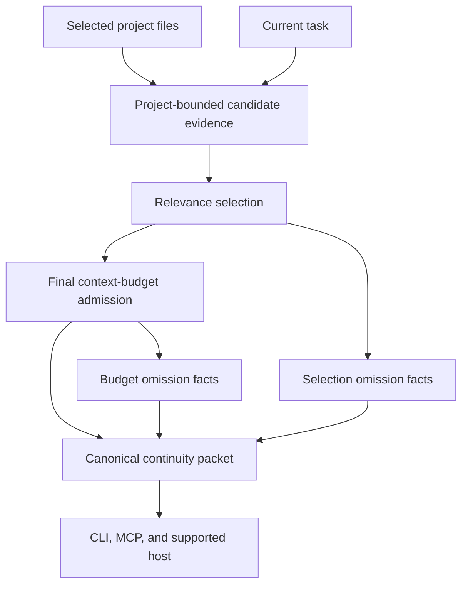

# Foundation Continuity Evidence - Plan

## Goal Capsule

- **Objective:** Let a fresh agent recover the smallest task-relevant project evidence with visible provenance so the user can continue without retelling the project history.
- **Product authority:** This plan owns the first Foundation reliability slice for an individual knowledge worker on one local DotAIOS folder.
- **Open blockers:** The user must approve the first-slice task-input, project-corpus, privacy, and Codex proof contract before this artifact can become implementation-ready.

---

## Product Contract

### Summary

DotAIOS will compose a bounded continuity packet from the selected project and the user's current task.
The packet will carry the most relevant project evidence, its source, and honest omission information through every supported access path.

### Problem Frame

The primary user works through disconnected agent chats and repeatedly explains the same project history.
DotAIOS already stores readable project material and can retrieve a buried decision lexically, but the normal startup packet can discard that evidence before the final budget is applied.
The user then sees a plausible but incomplete continuity packet with no indication that task-relevant material was missed.

### Key Decisions

- **Task-aware evidence is the first product proof.** The existing lexical baseline retrieves the representative decision, while the current startup composition does not. Governs R2, R3, R4, R11.
- **Availability, not generated prose, is the core verdict.** The acceptance fixture proves the correct source reached the agent inside the contract; it does not ask another model to grade an answer. Governs R11.
- **Plain files remain canonical.** Every ranking aid or diagnostic is derived, rebuildable, and read-only with respect to user knowledge. Governs R7, R8.
- **Support claims require receipts.** A configured file is not evidence that a host discovered or used the continuity packet. Governs R9, R12.
- **Personal replication is a separate reliability track.** Device divergence and restore are release concerns, but they are not allowed to substitute for the daily continuity proof in this plan.

### Actors

- A1. **Knowledge worker:** Selects a project, states the current task in ordinary language, and expects to continue without knowing retrieval mechanics.
- A2. **Agent host:** Requests or receives the canonical continuity packet and exposes the evidence to the working agent.
- A3. **DotAIOS Foundation:** Selects project-bounded evidence, admits it within budget, records omissions, and preserves provenance without mutating canonical knowledge.

### Requirements

**User continuity**

- R1. The user can obtain continuity by identifying a project and stating the current task in ordinary language, without assigning memory categories or editing a retrieval query.
- R2. The first slice considers body prose only from the selected catalog record at `projects/<slug>/README.md`; it does not traverse external checkouts, managed workspaces, attached folders, symlinks, or another project directory.
- R3. The default task-aware packet selects exactly one top-ranked evidence snippet, with stable source-and-line ordering as the final tie-break, and excludes unrelated decoy snippets.
- R4. Every admitted evidence item exposes a source relative to the AIOS root plus its original README start and end lines.

**Bounded and honest context**

- R5. The canonical packet is byte-identical for the same files, project, task, budget, limits, and clock, and never exceeds the caller's character budget; transport receipt timestamps are outside this comparison.
- R6. The packet records evidence candidates considered, selected, admitted, omitted during selection, and omitted during final-budget admission.
- R7. An unknown project returns `project_not_found`, no lexical match returns `no_match`, and an unreadable or invalid selected README fails closed without returning a partial task-aware packet.
- R8. Building or reading the packet does not modify canonical project files and does not make a derived store the only copy of user knowledge.

**Portable access**

- R9. CLI and MCP access expose the same canonical evidence, provenance, status, and omission facts for identical inputs, although their transport envelopes may differ.
- R10. Project selection is an evidence boundary: the other project's secret canary and the selected README's frontmatter-only absolute-path canary never appear in project evidence or rendered context.

**Proof and support**

- R11. The fixed decision-recall fixture records target recall, provenance recall, considered/admitted/omitted counts, output characters, determinism, privacy canaries, and latency without an LLM judge.
- R12. The first supported-host claim requires Codex on the iMac to discover the local stdio MCP configuration from an isolated temporary Codex home, invoke `read_working_context`, and produce both the target decision ID and its repo-relative source marker.
- R13. On the fixed synthetic corpus, target recall and provenance recall are both 1, privacy canary count is 0, output stays within 6,000 characters, repeated runs are byte-identical, and the measured same-host p95 is no more than twice its paired baseline.
- R14. Task intent enters only through an explicit `task` request value of 1-500 Unicode characters; DotAIOS does not persist, log, or copy that value into a host receipt outside the fixed public fixture.
- R15. Task-aware composition accepts budgets from 512 to 32,000 characters and rejects a smaller budget with a stable boundary error instead of returning an untrustworthy partial envelope.
- R16. An evidence item is one matched README-body line plus at most one adjacent line on each side, capped at 800 visible characters, with its source and original line range admitted atomically.
- R17. Task-aware composition selects one evidence item by default and accepts an evidence limit from 1 to 5; selection omissions point to a larger evidence limit and budget omissions point to a larger budget on the same project-bounded request.
- R18. Existing project-unattributed operational memory remains authorized global continuity, is rendered with its current `unscoped` label, and never participates in project-evidence ranking or evidence counts.

### Key Flows

- F1. Task-aware continuity
  - **Trigger:** A1 opens a known project with A2 and states the current task.
  - **Actors:** A1, A2, A3.
  - **Steps:** A3 loads the normal bounded continuity inputs, considers evidence only from the selected project, uses the task to rank candidates, admits the smallest relevant evidence within budget, and renders its source and omission accounting for A2.
  - **Outcome:** A2 receives enough inspectable evidence to continue the task without A1 repeating the buried decision.
  - **Covers:** R1-R6, R9-R11.
- F2. Safe absence
  - **Trigger:** The selected project is unknown, its README is unreadable or invalid, or its body has no relevant evidence for the task.
  - **Actors:** A1, A2, A3.
  - **Steps:** A3 returns `project_not_found` or `no_match` inside the normal packet when safe, and fails the task-aware request when the selected README is unreadable or invalid.
  - **Outcome:** A2 can ask for clarification without receiving partial evidence or another project's material.
  - **Covers:** R6-R10, R17.
- F3. Independent host proof
  - **Trigger:** The release candidate is installed against an isolated temporary home on the iMac.
  - **Actors:** A2, A3.
  - **Steps:** The fresh Codex host discovers the distributed DotAIOS contract, requests the fixed project/task fixture, and records the observable evidence result and environment receipt.
  - **Outcome:** The Codex support claim is backed by a second-host receipt rather than file-presence inspection.
  - **Covers:** R9, R12, R13.

### Acceptance Examples

- AE1. Buried decision recovery
  - **Covers:** R2-R6, R11, R13.
  - **Given:** The selected project contains four decoy decisions near the top and the target decision after the legacy overview excerpt boundary.
  - **When:** The task asks for the subject of the target decision.
  - **Then:** The packet admits `DECISION_ACME_KICKOFF_7DAY`, excludes all four decoy IDs, reports `projects/acme-launch/README.md:25-27`, records recall and provenance as 1, and remains within 6,000 characters.
- AE2. Cross-project privacy
  - **Covers:** R2, R5, R10, R13, R18.
  - **Given:** A different project contains a stronger lexical match and `SECRET_OTHER_CLIENT_42`, the selected README frontmatter contains `/Users/alice/Clients/Acme`, and operational memory contains `UNSCOPED_GLOBAL_17` without a project tag.
  - **When:** Continuity is requested for the selected project.
  - **Then:** The secret and path canaries and all other-project content are absent; `UNSCOPED_GLOBAL_17` remains outside project evidence and appears only with the `unscoped` label; repeated normalized packets remain byte-identical.
- AE3. Budget exclusion
  - **Covers:** R5-R7, R16, R17.
  - **Given:** Relevant evidence is considered but cannot fit after higher-priority continuity content under the caller's budget.
  - **When:** The packet is rendered.
  - **Then:** The evidence item and its provenance are both absent, the item is counted as omitted for final-budget admission, and the packet points to a larger budget on the same project-bounded request.
- AE4. No relevant evidence
  - **Covers:** R3, R7, R10.
  - **Given:** The selected project exists but contains no evidence relevant to the current task.
  - **When:** Continuity is requested.
  - **Then:** The packet states that no relevant project evidence was admitted and does not substitute another project's match.
- AE5. Canonical-file preservation
  - **Covers:** R8.
  - **Given:** The fixture records hashes for every canonical project file.
  - **When:** Continuity composition and follow-up retrieval run.
  - **Then:** Every canonical hash is unchanged and any derived artifact can be removed and rebuilt without knowledge loss.
- AE6. Access-path parity
  - **Covers:** R4, R6, R9.
  - **Given:** The same isolated home, project, task, and budget are used through CLI and MCP access.
  - **When:** Both access paths request working context.
  - **Then:** They expose the same evidence, provenance, and omission facts.
- AE7. Fresh-host receipt
  - **Covers:** R12, R13.
  - **Given:** A clean iMac temporary Codex home, an isolated fixture AIOS, and a working directory that contains neither the fixture nor the release checkout.
  - **When:** A prompt containing neither expected marker asks Codex to use the configured DotAIOS MCP working-context tool for the fixture project and task.
  - **Then:** The JSON event stream records DotAIOS MCP discovery and a completed `read_working_context` call, the final output contains `DECISION_ACME_KICKOFF_7DAY` and `projects/acme-launch/README.md:25-27`, and the redacted receipt persists neither the prompt nor task value.
- AE8. Task-input ephemerality
  - **Covers:** R8, R14.
  - **Given:** Hashes are recorded for the fixture AIOS and its event, signal, session, and receipt destinations.
  - **When:** The explicit task value is used through CLI and MCP access.
  - **Then:** The task value is absent from every file and process-owned receipt after the request, and canonical hashes are unchanged.
- AE9. Minimum task-aware budget
  - **Covers:** R5, R15.
  - **Given:** The caller supplies a task and a 511-character budget.
  - **When:** CLI or MCP task-aware context is requested.
  - **Then:** The request fails with the same stable budget-boundary error and returns no partial evidence packet.
- AE10. Invalid project record
  - **Covers:** R7, R10.
  - **Given:** The selected project reference is unknown, or its catalog README is unreadable or invalid.
  - **When:** Task-aware continuity is requested.
  - **Then:** An unknown reference returns `project_not_found`; an unreadable or invalid selected README fails closed; neither path imports another project's evidence.
- AE11. Selection expansion
  - **Covers:** R3, R6, R17.
  - **Given:** Three labeled relevant snippets rank above unrelated prose and the evidence limit is 1.
  - **When:** Task-aware continuity is requested and then repeated with an evidence limit of 3.
  - **Then:** The first packet admits only the top snippet and reports two selection omissions; the second admits all three in the same order without widening the project boundary.

### Success Criteria

- The production-shaped failure is retained as a regression fixture and fails on the untouched `origin/main` baseline for the expected missing-evidence reason.
- Focused, full-suite, smoke, CLI/MCP parity, and iMac receipt checks pass from clean or isolated state.
- The evidence ledger records the before-and-after measurements and narrows every support claim to the environments actually exercised.
- A reviewer can trace every claimed improvement to an acceptance example, command result, and source artifact without relying on an agent's confidence statement.

### Scope Boundaries

**Deferred for later**

- Safe personal replication, divergence handling, and clean-device restore.
- Attached source-folder freshness and revisit behavior.
- Project-skill discovery and invocation beyond what the first host receipt needs.
- Additional host tiers after each earns a native discovery and invocation receipt.

**Outside this product's identity**

- Hosted memory SaaS, mandatory accounts, opaque canonical indexes, and automatic LLM-written durable truth.
- Enterprise team roles, ACL administration, company memory, and competing-writer collaboration claims.
- Vector, graph, or cloud retrieval infrastructure until representative fixtures demonstrate a failure the plain-file lexical baseline cannot solve.
- Paid-pack delivery, payments, commercial publication, npm publication, and GitHub Release publication.

<!-- ce-section: work-relationships -->
### How This Work Fits Together

This plan owns the first measurable continuity slice; the surrounding breakdown is the current programme understanding, not a committed roadmap.

- **Enables:** Host reliability gates can verify that native adapters expose the same canonical evidence contract.
  - **Can proceed independently of this slice:** Gemini bridge preservation, Hermes path deduplication, migration-warning parity, onboarding consistency, and real Windows runtime evidence.
- **Enables:** Personal replication work can later carry the same canonical knowledge to another device without redefining what continuity means.
  - **Depends on separate decisions:** Writer authority, conflict preservation, and staged restore.
- **Shares:** Source-folder revisit and project-skill invocation use the same receipt discipline but retain their own user flows and acceptance fixtures.
- **Still to decide:** Which additional hosts graduate from documented compatibility to public support after the Codex receipt.

### Dependencies and Assumptions

- The existing lexical reader remains the starting baseline because it retrieves the representative decision with provenance; planning may replace it only after a fixture proves it insufficient.
- The first-slice direction is a proposed public product and privacy contract, not an approved decision; the binding mission requires the decision request below before planning.
- The iMac remains a read-only reviewer and test host; all product-code writing occurs in the MacBook worktree.
- PR #59 and the iMac's six divergent commits remain untouched until a separate reconciliation plan proves how to preserve every required behavior.

### Outstanding Questions

**Resolve Before Planning**

- Does the user approve the first-slice contract in R2, R10, R12, and R14-R18: selected catalog README body only, explicit ephemeral task input, frontmatter and cross-project canary exclusion, labeled unscoped global memory outside evidence ranking, atomic three-line evidence windows, 1-5 evidence items, a 512-character minimum task-aware budget, and Codex-over-local-MCP as the first produced host receipt?

**Deferred to planning**

- How should task intent, candidate selection, budget admission, and rendering be separated into the smallest independently testable modules while preserving the canonical projection?
- Which existing Codex setup path should produce the fresh-host receipt without expanding the public support claim?
- Which timing harness yields reproducible local and iMac p95 measurements without making wall-clock timing the only correctness gate?

### Sources and Research

- `docs/foundation-program/evidence-ledger.md`
- `docs/foundation-program/fixtures/project-decision-recall.md`
- `docs/foundation-program/research/2026-08-09-memory-patterns.md`
- `docs/foundation-program/research/2026-08-09-sync-recovery-patterns.md`
- `docs/foundation-program/research/2026-08-09-host-contracts.md`
- `docs/foundation-program/audits/2026-08-09-imac-independent-audit.md`
