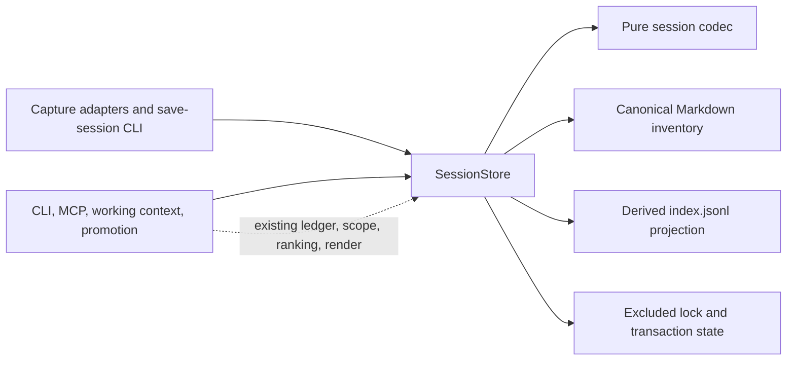
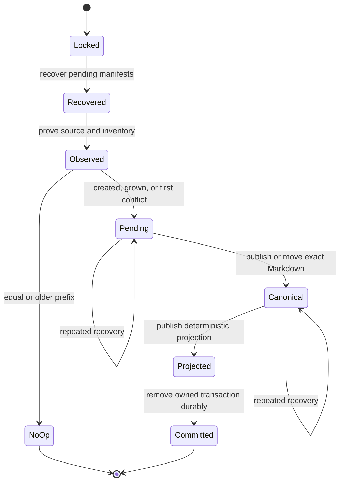
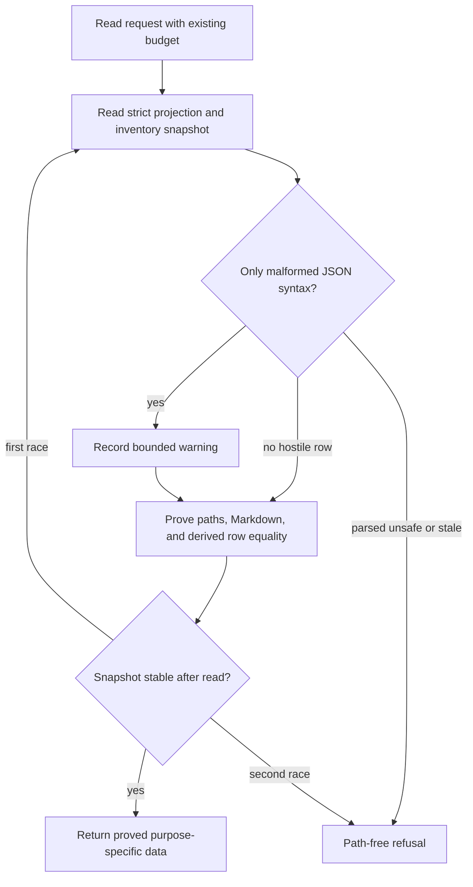

# SessionStore Consumer Foundation - Plan

## Goal Capsule

- **Objective:** Make one local SessionStore authoritative for session capture, reconciliation, proved metadata/body reads, and exact recoverable deletion while session Markdown remains canonical user memory and `memory/sessions/index.jsonl` remains a rebuildable projection.
- **Authority:** The delegated brief, ADR 0003, the approved `docs/session-store/design.md`, and Wayfinder issue 016 own behavior. This plan owns test-first sequencing, integration, review, and proof.
- **Execution profile:** Deep, security-sensitive Node.js filesystem work delivered through fresh TDD, independent architecture/spec/standards/adversarial review, simplification, one exact commit, a ready PR, CI, and exact-commit iMac validation.
- **Stop conditions:** Stop if correctness requires a database, vector store, hosted service, new canonical log, new MCP tool, silent conflict deletion, implicit repair on reads, or a broader replication claim.
- **Landing:** Start from exact `origin/main` `c86d1f94ff88df7ac27580dace80817edd91b65e`, push one reviewed branch, open a ready PR, request iMac validation at the exact commit, wait for CI, and do not merge.

---

## Product Contract

### Summary

Replace fragmented session filesystem ownership with one deep SessionStore interface. It serializes same-source observation through durable publication, preserves divergent versions, journals every mutation boundary, proves every projection row against canonical Markdown, reports drift without deleting evidence, and deletes only one exact proved-owned session. Existing project scoping, working-context bounds, CLI/MCP search behavior, and the three-tool read-only MCP surface remain intact.

### Problem Frame

Current capture adapters read sources before the core index lock, and `sessions.mjs` decides same-source updates from a derived index snapshot. A stale writer can overwrite a longer transcript, a divergent version can be discarded, and a crash can leave Markdown and the projection disagreeing. Search, working context, and promotion trust projection metadata through different paths. Delete removes the row before proving the target file. The result is no single place that can prove capture success, read safety, reconciliation truth, or destructive ownership.

### Actors

- A1. **DotAIOS user:** Imports or saves a session, lists/searches memory, explicitly reconciles projection drift, promotes a fact, or deletes one exact session.
- A2. **Capture adapters:** Discover manual, prepared-summary, paste, and Claude Code sources, but delegate source observation and publication to SessionStore.
- A3. **SessionStore:** Owns codec, canonical inventory, stable projection reads, serialization, immutable transaction manifests, recovery, reconciliation, and delete proof.
- A4. **Read consumers:** CLI search, MCP search, working context, and promotion retain their own ranking, project resolution, rendering, and bounded output contracts while consuming only proved store results.
- A5. **Local filesystem:** Holds canonical session Markdown, derived projection bytes, and excluded operational lock/transaction state.

### Requirements

**Authority and interface**

- R1. Session Markdown under `memory/sessions/<date>/` is canonical user memory; `memory/sessions/index.jsonl` is completely rebuildable and never decides canonical ownership.
- R2. One frozen SessionStore interface owns `capture`, `reconcile`, `search`, and `delete`; every session writer and every consumer of projection metadata crosses it.
- R3. No database, vector store, hosted service, or additional canonical log is introduced; locks, manifests, staged files, and delete trash are operational evidence excluded from mirror content.

**Capture, continuity, and publication**

- R4. A sourced capture holds one recoverable store-wide cross-process lock from before exact-path or bounded-adapter-root source observation through its durable outcome. Source bytes are strict UTF-8, bounded, handle-read, and stable across path and handle identity checks.
- R5. With one existing same-source record, equality or an older candidate prefix is an idempotent byte no-op, a strict longer continuation grows the stable session ID, and a non-prefix candidate is published as a distinct conflict record. With two or more existing members, capture returns `reconciliation_required` without mutation.
- R6. Growth preserves session ID, captured time, agent, source type, source identity, project slug, and project ID; it recomputes only transcript-derived title, turns, body, and content hash.
- R7. Before mutation, the projection must equal the deterministic canonical projection. Missing projection is accepted only for an empty inventory; other drift requires explicit reconciliation.
- R8. Every mutation uses one immutable owner-bound transaction manifest published before canonical change. File and relevant parent directory syncs establish each boundary. Recovery infers progress from recorded hashes and identities, completes forward, is repeatable, and returns no success before durable cleanup.
- R9. New IDs and relative paths are collision-free against full IDs, six-character filename prefixes, canonical inventory, and the filesystem. Transaction-owned creation and cleanup of missing root/date directories never removes a pre-existing or nonempty directory.
- R10. Manual file import authorizes one exact selected source; the Claude policy derives and re-proves its bounded transcript root; unknown policies refuse. SessionStore assigns source type, source identity, and every new random session ID, and never accepts a caller-declared sourced-adapter identity. Prepared summaries and paste captures use their own namespace and cannot name manual or Claude identities. Backfill cutoff evaluation and parsing happen on the same bytes observed under the mutation lock.
- R11. Prepared schema-1 Markdown for save-session enters through a bounded stdin CLI path and the same capture transaction. A capture draft may omit `session_id`; canonical stored Markdown requires the ID assigned by SessionStore. The skill never writes canonical Markdown or the projection directly.

**Reconciliation and conflict visibility**

- R12. Report-only reconciliation is deterministic and creates no artifacts. It reports orphan Markdown; stale, syntax-malformed, or unsafe rows; invalid Markdown; duplicate IDs and paths; duplicate or conflicting sources; missing projection state; and pending, poisoned, or unsafe operational state with counts and safe relative identifiers.
- R13. Reconcile apply takes the mutation lock, refuses unproved canonical evidence, journal-rebuilds only the full projection, preserves all Markdown bytes, and returns `rebuilt` or `rebuilt_with_conflicts` without choosing evidence.
- R14. Catalog, metadata, body, and exact reads expose all proved conflict members with derived conflict metadata. Working context and compact digest omit every multi-member source group and charge one bounded `conflicts_omitted` count to the existing visible budget; a scoped projection counts only conflicts admitted by the selected project scope. Exact user-authorized deletion is the resolution path.

**Read safety and compatibility**

- R15. Catalog, metadata, body, exact, working-context, and compact-digest purposes each prove one stable projection-plus-complete-inventory snapshot using the caller's existing request-scoped EvidenceReader or contained-read ledger, retries one active growth/delete publication window within that same budget, and then refuses through the existing path-free envelope. A missing projection is a valid empty snapshot only with an empty canonical inventory; otherwise it is drift.
- R16. Projection text is strict UTF-8. Read-only consumers compatibly ignore only syntactically invalid JSON lines and return a bounded warning count; reconciliation reports those lines. Any parsed unsafe, duplicate, stale, or metadata-mismatched row refuses with a bounded path-free hint to run report-only reconciliation.
- R17. Every parsed row path is relative, normalized, within `memory/sessions`, and resolves through real ancestors to one regular single-link stable file. Every consumed row semantically equals the deterministic row derived from proved Markdown and the complete inventory before its metadata can filter, rank, scope, or render.
- R18. CLI/MCP session search remains bounded, read-only, path-free, and ranking-compatible. Read paths create no root, lock, journal, quarantine, or repair artifact.
- R19. Working context retains PR 61 project slug/stable-ID behavior, aggregate 512-file/16-MiB source accounting, session limits, ordering, and visible-character budget. MCP retains exactly `read_working_context`, `search_aios`, and `resolve_skill`.
- R20. Promotion accepts the current full ID, unique prefix of at least four characters, or validated indexed relative path from one stable proved catalog snapshot, rejects ambiguity, and re-proves the selected content before apply.

**Exact deletion and hostile filesystem behavior**

- R21. Delete requires one exact unambiguous session ID, one matching projection row, and one byte-stable canonical Markdown file. Missing, stale, replaced, duplicate, linked, hardlinked, special, or outside targets refuse rather than succeed.
- R22. Delete moves only the recorded canonical node into owned transaction trash, proves the moved identity before projection publication, and recovers forward. If a final swap moves a foreign node, exclusive hard-link-back restoration cannot overwrite a concurrent replacement; unsupported restoration poison-preserves bytes without deleting them.
- R23. Absolute paths, traversal, backslash aliases, NULs, linked ancestors, symlinks, hardlinks, FIFOs, sockets, invalid UTF-8, source replacement, projection replacement, and ancestor swaps leave outside-canary bytes untouched and restore or poison-preserve every namespace entry after the operation or mandatory recovery. The supported portable claim is observation-boundary detection and byte-identical final trees, not zero transient namespace movement against a malicious same-user kernel race.

**Outcomes, proof, and release**

- R24. `created`, `grown`, and `idempotent` are committed success outcomes. `conflict_preserved`, `reconciliation_required`, contention, poison, and refusal never print or emit save success. The host hook may exit zero for host compatibility but emits a bounded diagnostic and no success metric.
- R25. Same-source 2, 16, and 32 writer matrices, separate processes, SIGKILL or injected failure at every unpublished and published boundary, repeated recovery, and mutation-versus-read races prove no lost or duplicate turns, mixed snapshots, unrelated mutation, or false success. Their acquisition deadline is sized for all serialized test transactions; an ordinary production deadline refusal is an explicit non-success outcome, never a reported saved turn.
- R26. Architecture, sessions, security, save-session, and Wayfinder issue 016 documentation match shipped behavior. Issue 017 remains open and receives only the operational-artifact exclusion dependency, not a closure claim.
- R27. Focused, syntax, check, full test, smoke, pack, diff, independent review, CI, and exact-commit iMac validation gates all pass before merge consideration. The PR is ready but not merged.
- R28. Capture and reconcile mutation inventories prove stable root, directory-entry, and file identities before publication. Growth first moves and proves the prior canonical node into transaction ownership before installing the longer version; any proof-to-move/install swap restores or poison-preserves every byte.
- R29. Operational roots, ancestors, locks, manifests, stages, trash, and cleanup targets are no-follow, same-owner, mode-restricted, type/link-count/identity-proved artifacts. At most one published transaction may exist; multiple, forked, or duplicate-target manifests poison mutation. Cleanup first detaches an exact target into a unique private name, re-proves it, and deletes only proved owned children. Portable Node path deletion is covered by R23's observation-boundary model; native inode-relative unlink is not claimed.
- R30. Canonical frontmatter uses a closed scalar schema with key, type, format, length, cardinality, body, and turn-count bounds. Frontmatter bytes, anchors/aliases, and nesting are bounded before or in parser configuration; duplicate keys, aliases, tags, nested values, control characters, and prototype-like keys refuse before row derivation.
- R31. Deadline and side-effect ownership is ordered: store acquisition/recovery ends before CLI timeout, CLI timeout ends before installed hook timeout, adapters never retry an indeterminate mutation, and sync can start only after canonical/projection durability and transaction cleanup.
- R32. Upgrade is non-mutating by default. It drains and reinstalls managed hooks, runs report-only reconciliation as a compatibility/bounds preflight, exposes poison through bounded read-only diagnostics, never auto-clears poison, and documents that noncooperating old binaries are unsupported external writers whose drift is detected rather than silently normalized. Interactive status and reconciliation name the exact apply/remediation command for drift; over-bound inventories keep report-only reconciliation and exact proved deletion available so a user can archive or delete back below the canonical-file limit.

### Key Flows

- F1. **Serialized sourced capture:** Adapter submits one authorized path and parser; SessionStore locks, recovers, observes stable bytes, inventories canonical sessions, applies the prefix table, publishes an immutable transaction, and returns an explicit outcome. Covers R4-R10, R24-R25.
- F2. **Conflict and reconciliation:** A divergent same-source candidate becomes separate canonical evidence. Report-only reconciliation detects it, apply may rebuild the projection without choosing evidence, and later capture remains blocked until exact deletion leaves one branch. Covers R5, R12-R14, R21-R22.
- F3. **Stable read:** A caller supplies its existing read ledger; SessionStore proves one inventory/projection snapshot and row equality, then returns purpose-specific data while the caller retains ranking, scoping, and rendering. Covers R15-R20.
- F4. **Recoverable exact delete:** SessionStore proves unique ownership, publishes the manifest, moves and re-proves the target, publishes the projection, and cleans up; recovery repeats the exact operation after crashes. Covers R8, R21-R23, R25.
- F5. **Consumer migration:** Manual, prepared-summary, paste, Claude hook/backfill, list/search, working context, promotion, and MCP use SessionStore without widening agent mutation authority. Covers R2, R10-R11, R18-R20, R24, R26.

### Acceptance Examples

- AE1. **Concurrent continuation converges.** Given 2, 16, or 32 processes submit successively longer versions of one transcript, when all operations and recovery complete, then one canonical branch contains every turn exactly once, only committed growth is reported as saved, and projection bytes match canonical bytes. Covers R4-R9, R24-R25.
- AE2. **Divergence preserves evidence.** Given two non-prefix versions of one source, when they race, then both Markdown files remain canonical, capture reports `conflict_preserved`, startup omits both with one bounded count, search can show both, and no later capture mutates the group until exact deletion resolves it. Covers R5, R12-R14, R24.
- AE3. **Crash converges without collateral mutation.** Given a failure or SIGKILL before the bootstrap manifest, during staging, or after every capture/reconcile/delete publication boundary, when a new process repeats recovery, then it reaches the exact before or recorded after state, repeats byte-identically, preserves unrelated tree hashes, and never invents success. Covers R8-R9, R21-R25.
- AE4. **Hostile paths fail closed.** Given traversal, absolute, forged metadata, symlink, linked ancestor, hardlink, FIFO, socket, replacement, or final delete swap fixtures plus outside canaries, when every operation and any mandatory recovery finish, then unsafe operations refuse, canary bytes and unrelated final-tree bytes remain unchanged, and reads create no artifacts. Covers R16-R18, R21-R23.
- AE5. **Consumer contracts remain stable.** Given PR 61 project fixtures, malformed-line compatibility, conflict groups, and tight budgets, when CLI, working context, promotion, and MCP run, then scoping/ranking/bounds remain stable, outputs contain no machine paths, and MCP lists exactly three tools. Covers R14-R20, R26.
- AE6. **Save-session and backfill cross the seam.** Given a curated `turns: 0` summary or a Claude transcript at the 30-day boundary, when the skill or backfill runs, then source validation and cutoff use SessionStore under lock, outcome counters are accurate, and neither caller writes the projection. Covers R10-R11, R24.
- AE7. **Upgrade and operational state fail visibly.** Given a legacy drifted or over-bound tree, an older managed hook, poison, hostile operational ancestors, multiple pending manifests, or an unrelated 513th canonical artifact, when activation and every consumer run, then install/startup/read never auto-mutates canonical Markdown, projection, or recovery state, managed hook configuration is drained and replaced before capture, unsafe mutation is blocked, reads return bounded path-free diagnostics, and an old/new overlap cannot produce new-store false success. Covers R28-R32.

### Success Criteria

- Same-source lost turns, duplicated turns, false save successes, and unresolved projection drift are zero in the required contention and crash matrices.
- Outside-canary and unrelated-tree mutations are zero in every supported observation-boundary adversarial capture, read, reconcile, and delete fixture.
- Read-created lock, journal, quarantine, repair, or root artifacts are zero.
- PR 61 scoping, current ranking and promotion selectors, working-context budgets, and the three-tool MCP list remain regression-green.
- One exact commit passes all local gates, independent reviews, CI, and iMac validation before merge consideration.
- Pre-upgrade trees remain byte-identical through report-only preflight, and every legacy drift or over-bound category has a bounded diagnostic and explicit recovery path.

### Scope Boundaries

**Deferred to Follow-Up Work**

- Issue 017's complete replication classification, transport manifest, remote publish protocol, and multi-replica conflict proof.
- A future explicit retag operation for project attribution changes.
- Native `openat`/`renameat2` style primitives if DotAIOS later adds a platform-specific filesystem layer.

**Outside this product's identity**

- Databases, vector stores, hosted memory, remote mutation, new canonical logs, semantic session merge, automatic evidence deletion, and additional MCP tools.
- Silent repair or quarantine on read paths.

---

## Planning Contract

### Key Technical Decisions

- KTD1. **Use one deep store-wide coordinator.** `session-store.mjs` owns the four public operations and one recoverable lock from sourced observation through publication. Per-source plus projection locks were rejected because their ordering and pre-observation window can lose continuations. (session-settled: user-directed, chosen over fragmented storage owners; governs R2, R4-R8.)
- KTD2. **Keep format logic pure and filesystem proof centralized.** A private codec parses/renders schema-1 Markdown and derives deterministic rows; SessionStore alone inventories and proves artifacts. Compatibility wrappers in `sessions.mjs` delegate rather than retain storage authority.
- KTD3. **Publish one immutable transaction directory.** Compute bytes/hashes, create an owner-bound private directory, bootstrap its immutable manifest, stage and sync content, atomically publish the whole directory into pending state, infer progress from targets, and clean only proved owned artifacts. Phase-field rewrites were rejected because torn journal updates create another recovery ambiguity.
- KTD4. **Make projection reads snapshot-based and caller-budgeted.** Every purpose validates the complete projection against one stable canonical inventory using the caller's existing ledger. Syntax-malformed JSON lines remain the only compatibility warning; parsed hostile metadata fails the whole request.
- KTD5. **Treat conflicts as canonical branches, not a chosen winner.** Conflict status is derived from same-source canonical groups, search exposes each branch, startup omits the whole group, and only exact user deletion resolves it. (session-settled: user-directed, chosen over last-writer-wins; governs R5, R12-R14.)
- KTD6. **Use forward-only recovery.** A crash after canonical publication completes the recorded after-state; rollback never erases newly durable user memory. Foreign target state poisons mutation and is preserved.
- KTD7. **Use post-move identity proof for portable delete.** Node's path-based rename is followed by identity/hash proof before projection publication; an unexpected regular node is restored only with exclusive `link`, which cannot overwrite, otherwise it remains poison-preserved. Native filesystem dependencies are not added.
- KTD8. **Preserve caller ownership above the store.** Search ranking, working-context selection and rendering, project resolution, promotion grammar, and MCP envelopes stay in their current modules. SessionStore returns proved inputs and charges the same request-scoped budget.
- KTD9. **Keep agent action parity intentionally read-only.** CLI and the local save-session skill may invoke mutations; MCP remains exactly three bounded read-only tools. (session-settled: user-directed, chosen over adding remote write tools; governs R18-R20.)
- KTD10. **Connect but do not close replication.** `.dotaios/session-store/` is excluded from mirror staging now because it is operational evidence; broader artifact classification and replicated publication stay owned by open issue 017. (session-settled: user-directed, chosen over expanding this slice; governs R3 and R26.)
- KTD11. **Use fresh TDD and one reviewed landing commit.** Each unit begins from a failing public-boundary test, settled code is simplified, independent standards/spec/adversarial reviews run before exact staging, and the final SHA is the sole local/CI/iMac evidence coordinate.
- KTD12. **Make replacement and cleanup preserve observed bytes.** Growth moves and proves the old canonical node before installing its continuation; transaction cleanup detaches and proves one exact owned subtree before deletion. This extends delete's restore-or-poison rule to every path-based destructive boundary.
- KTD13. **Treat activation as a writer-protocol migration.** Report-only reconciliation must pass legacy compatibility and bounds preflight before managed hooks are drained. Hook replacement is one cutover that preserves the prior hook if installation fails; new-store activation refuses unsafe state. An already-running old binary remains a documented noncooperating writer outside the protocol and cannot be treated as successful new-store evidence.
- KTD14. **Separate continuity identity from authorization.** The normalized real source path plus transcript format groups continuations across authorized adapters; the closed policy proves who may observe that path but never splits or widens the continuity namespace.

### High-Level Technical Design

The diagrams are directional architecture, not implementation code.

### System-Wide Impact

- **Canonical memory:** Existing schema-1 Markdown remains readable and authoritative; conflict state is derived, not a second user-memory record.
- **CLI and adapters:** Capture outcomes become explicit; file import, paste, prepared summary, Claude hook/backfill, list, reconcile, and delete share one core boundary.
- **Read consumers:** Search, startup context, digest, promotion, and MCP reject forged/stale rows but retain current limits, ranking, project semantics, and path-free errors.
- **Operational state:** `.dotaios/session-store/` adds private mode-restricted locks and transactions that mirror sync must exclude.
- **Operational safety:** Every operational ancestor and node is proved no-follow, same-owner, type/link-count/identity-safe, and mode `0700` or `0600` independent of umask. Transaction-created canonical directories and files and the projection use `0700`/`0600` independent of umask. Manifests contain hashes and safe relative identifiers, never source paths or session bodies; errors and metrics are bounded and path/content-free.
- **Availability:** Complete-inventory proof couples every metadata consumer to whole-inventory health and bounds. Report-only reconciliation is the activation preflight, and poison becomes a visible store-wide state through read-only reconcile/status diagnostics rather than an auto-repaired condition.
- **Writer migration:** Activation drains and reinstalls managed capture hooks before new writes. Mixed legacy/new mutation is unsupported; stable mutation snapshots and post-move proof make detected overlap fail closed, while noncooperating old binaries remain an explicit external-writer limitation.
- **Side-effect ordering:** A mutation returns only after canonical/projection durability and owned cleanup. Only then may the CLI dispatch sync; bootstrap, incremental staging, and mirror paths share the operational exclusion.
- **Packaging:** New core runtime modules must be present in the package without adding runtime dependencies; test workers and fault fixtures remain repository-only and are excluded from packed contents.
- **Documentation:** ADR 0003 stays authoritative; architecture/sessions/security/save-session and Wayfinder 016 are updated, while 017 remains open.

### Risks and Dependencies

- **Portable path mutations:** Node does not expose a portable no-replace rename or inode-relative unlink. KTD7 narrows deletion to proved pre/post observations and exclusive link-back restoration, with poison preservation for unsupported states.
- **Transient displacement:** A noncooperating same-user writer can force a path-based move to displace foreign bytes until mandatory recovery. The supported guarantee is byte-identical restoration or poison preservation after recovery, not zero transient namespace movement; a swap plus SIGKILL plus occupied restore-path fixture proves the final tree and canaries.
- **Growth and cleanup races:** Canonical replacement and recursive cleanup have the same proof-to-mutation window as delete. KTD12 requires move-and-prove growth, detach-and-prove cleanup, swaps at every boundary, and preservation of both original and foreign bytes.
- **Operational pre-planting:** A linked, special, hardlinked, permissive, substituted, PID-reused, or ancestor-swapped lock/manifest/stage/trash path can redirect writes. R29 makes these first-wave red tests before transaction code and permits cleanup only for nonce-and-identity-proved targets.
- **Projection target:** `index.jsonl` itself, not only its rows, is untrusted. Reads and publications prove its ancestors, regular single-link node, and stable handle/path identity against symlink, hardlink, FIFO, socket, replacement, and ancestor-swap fixtures.
- **Canonical parser:** YAML aliases, tags, duplicate keys, nested values, huge scalars/counts, controls, and prototype-like keys can create ambiguity or denial of service. R30 closes the schema before any inventory or row derivation.
- **Directory durability:** Directory sync support varies. Unsupported required sync must fail closed and be covered by platform-specific tests rather than silently weakening the claim.
- **Strict canonical parsing:** Hand-edited legacy Markdown may be unparseable. Reconcile reports it and apply refuses; the slice does not normalize user evidence.
- **Read failure coupling:** One unrelated malformed, unproved, or 513th canonical artifact can block every metadata consumer. Activation runs non-mutating report-only preflight, refuses unsafe or over-bound inventories with a path-free diagnostic, and tests the blast radius across CLI, MCP, working context, and promotion.
- **Deadlines:** The store acquisition/recovery deadline is shorter than the CLI deadline, which is shorter than the installed hook deadline. Retries are bounded and jittered; adapters never retry an indeterminate mutation, and killed waiters publish neither success nor partial state.
- **Poison outage:** One ambiguous transaction can block all writers. Poison is intentionally never auto-reclaimed; read-only diagnostics and a documented evidence-preserving runbook must prove lock, manifest, canonical, and projection ownership before any human cleanup, while ordinary capture/delete cannot clear it.
- **Legacy writers:** Managed hooks are replaced at activation, but an already-running older binary can still bypass the protocol. The release documents this unsupported window, tests old/new overlap, and never treats post-overlap state as healthy without stable proof and reconciliation.
- **Sensitive residue:** Staged canonical bytes and delete trash use `0600` below `0700` directories, survive only as proved recovery evidence, never enter pack/mirror/log output, and are removed only by swap-safe owned cleanup.
- **Review and host evidence:** The ready PR is not mergeable evidence until the exact commit passes CI and the external iMac validation request.

### Assumptions

- The canonical inventory ceiling is 512 Markdown files and 16 MiB total, with a 1 MiB per-file ceiling. The 10,000-entry limit applies only to generic directory enumeration and is not a second session-inventory ceiling.
- Canonical session memory and `.dotaios/session-store/` operational state reside on one filesystem. Cross-device rename/link failure refuses without copy-and-unlink fallback.
- `FileHandle.sync()` plus supported parent-directory sync is the durability contract; power-loss guarantees beyond supported Node/platform behavior are not claimed.
- The same-user local filesystem principal is the trust boundary. Noncooperating concurrent writers are detected at observation boundaries and cause refusal or poison preservation.
- Existing `yaml` support is sufficient for strict frontmatter parsing; no new dependency is needed.

### Sources and Research

- `docs/session-store/design.md`
- `docs/adr/0003-keep-canonical-memory-separate-from-derived-views.md`
- `docs/foundation-program/wayfinder/issues/016-make-session-store-authoritative.md`
- `docs/foundation-program/wayfinder/issues/017-align-replication-with-memory-authority.md`
- `packages/core/src/sessions.mjs`
- `packages/core/src/contained-read.mjs`
- `packages/core/src/evidence-reader.mjs`
- `packages/core/src/operation-lock.mjs`
- `packages/core/src/search.mjs`
- `packages/core/src/working-context.mjs`
- `packages/core/src/promotion.mjs`
- `packages/cli/src/commands/capture.mjs`
- `packages/cli/src/adapters/claude-code.mjs`
- `skills/save-session/SKILL.md`
- [Node.js file system documentation](https://nodejs.org/api/fs.html)

---

## Implementation Units

### U1. Establish the codec, canonical inventory, and stable read contract

- **Covers:** R1-R3, R12, R14-R20, R30, R32.
- **Depends on:** None.
- **Files:** `packages/core/src/session-codec.mjs`, `packages/core/src/session-store.mjs`, `packages/core/src/sessions.mjs`, `tests/core/session-codec.test.mjs`, `tests/core/session-store.test.mjs`, `tests/core/sessions.test.mjs`.
- **Approach:** Start with failing codec and public SessionStore search/reconcile-report tests. Move rendering, strict schema parsing, deterministic row derivation, bounded canonical inventory, strict projection parsing, row equality, conflict derivation, and stable-snapshot retry behind the new factory. Keep existing pure exports or delegating compatibility wrappers only where callers still require them.
- **Execution note:** Fresh TDD. Do not preserve implementation details from `writeSession`; characterize only public compatibility that the accepted design keeps.
- **Test scenarios:**
  - Happy path: schema-1 Markdown with project slug/ID round-trips deterministically; every enumerated read purpose returns proved rows/body/exact results under caller budgets.
  - Compatibility: a syntax-malformed JSON line followed by a valid proved row remains searchable without filesystem writes and returns one bounded warning.
  - Security: closed frontmatter rejects duplicate keys, aliases, tags, nested/prototype-like values, controls, huge scalars/turn counts, and invalid field formats before derivation; projection/root symlink, hardlink, FIFO, socket, replacement, and ancestor swaps refuse with no canary mutation.
  - Concurrency: publication between projection and inventory observations yields one bounded retry, then either one stable snapshot or the existing safe refusal.
  - Conflict: catalog/search/exact return every derived member; working-context purpose reports the omission count without selecting a branch.
  - Preflight: representative legacy drift and an unrelated 513th artifact return deterministic report findings with safe relative identifiers but no absolute machine paths; consumer diagnostics remain path-free and no tree byte is mutated.

### U2. Implement journaled capture, contention, and crash recovery

- **Covers:** R4-R11, R24-R25, R28-R31.
- **Depends on:** U1.
- **Files:** `packages/core/src/session-store.mjs`, `packages/core/src/session-codec.mjs`, `packages/core/src/operation-lock.mjs`, `tests/core/session-store.test.mjs`, `tests/core/session-store-process.test.mjs`, `tests/fixtures/session-store-writer.mjs`, `tests/fixtures/session-store-crash.mjs`.
- **Approach:** Add the strict store-wide owner lock, closed source policies, same-lock source parsing and cutoff, complete prefix table, collision-free target reservation, immutable private/pending transaction state, file and directory sync boundaries, forward recovery, and explicit capture outcomes. Reuse existing strict owned-state/process identity primitives rather than creating a peer lock model.
- **Execution note:** Keep the highest public writer/crash matrix red while building smaller state transitions underneath it.
- **Test scenarios:**
  - Prefix table: zero/one/many member groups produce created, idempotent older/equal, grown, conflict-preserved, or reconciliation-required exactly.
  - Attribution: growth preserves stable identity and original project slug/ID while recomputing transcript-derived fields.
  - Contention: 2, 16, and 32 in-process and child-process same-source writers preserve all turns once; unrelated-source writers do not corrupt projection bytes.
  - Crash: SIGKILL or injected failure before/torn bootstrap manifest, during staging, after pending publication, after canonical publication, after projection publication, and during cleanup converges under repeated recovery.
  - Paths: full-ID and six-character-prefix collisions, first root/date-directory creation, source symlink/hardlink/special/replacement, and unknown policy refuse without unrelated mutation.
  - Authorization: manual-exact and Claude-root captures of the same proved transcript share one continuity group; prepared-summary/paste cannot declare a sourced-adapter identity.
  - Operational state: hostile `.dotaios` ancestors, locks, manifests, stages, trash, stale-owner substitution/PID reuse, multiple or forked pending manifests, and cleanup swaps preserve canaries and poison safely.
  - Growth: root/date insertion, removal, replacement, and proof-to-move/install swaps cannot commit a mixed inventory or destroy either original or foreign bytes.
  - Privacy and deadlines: restrictive permissions override umask; manifests/errors/metrics omit paths/content; ordered store/CLI/hook timeouts never create adapter retries or false success.

### U3. Add deterministic reconciliation and recoverable exact deletion

- **Covers:** R8, R12-R14, R21-R25, R28-R29.
- **Depends on:** U1-U2.
- **Files:** `packages/core/src/session-store.mjs`, `tests/core/session-store.test.mjs`, `tests/core/session-store-process.test.mjs`, `tests/fixtures/session-store-crash.mjs`.
- **Approach:** Implement report-only reconciliation, journaled projection rebuild, exact proved-owned delete, post-move identity proof, exclusive link-back restoration, and recovery from every boundary. Reconciliation never edits Markdown; delete operates only from one exact proved ID.
- **Execution note:** TDD against exact before/after tree hashes and outside canaries. Treat any unproved cleanup as a failure, not test-fixture convenience.
- **Test scenarios:**
  - Reports: empty/missing roots, orphan Markdown, stale/malformed rows, duplicate ID/path, equal duplicate source, divergent source, and malformed canonical evidence return deterministic structured output with no artifacts.
  - Apply: clean and conflict-bearing inventories rebuild byte-deterministically; malformed/unproved canonical evidence blocks apply; repeated apply is idempotent and preserves every Markdown byte.
  - Delete: exact unique ID succeeds; missing, duplicate, stale, replaced, linked, hardlinked, special, path-escaping, or metadata-mismatched targets refuse.
  - Final race: a swap followed by SIGKILL immediately after rename and an occupied restoration path restores after mandatory recovery without overwrite, or poison-preserves unsupported bytes.
  - Crash: delete and reconcile SIGKILL at each publication/cleanup boundary forward-complete without false success or unrelated tree mutation.

### U4. Route capture CLI, Claude adapters, and save-session through SessionStore

- **Covers:** R2, R4, R10-R13, R24-R26, R31-R32.
- **Depends on:** U1-U3.
- **Files:** `packages/cli/src/commands/capture.mjs`, the list/reconcile/delete command router modules, `packages/cli/src/adapters/claude-code.mjs`, `packages/cli/src/adapters/manual.mjs`, `packages/cli/src/lib/sync-hook.mjs`, `skills/save-session/SKILL.md`, `tests/cli/capture.test.mjs`, list/reconcile/delete CLI tests, `tests/cli/sync_hook.test.mjs`, `tests/core/sessions.test.mjs`.
- **Approach:** Replace pre-read/direct-write paths with SessionStore calls. Add prepared-summary stdin and reconcile commands, map outcomes to truthful exit/metric text, make list intrinsically read-only, move Claude cutoff into locked observation, and ensure hook timeout exceeds lock timeout. Update save-session to call only the prepared-summary CLI.
- **Execution note:** Begin with spawned CLI and skill-contract failures, then keep helper tests subordinate to public output and exit semantics.
- **Test scenarios:**
  - File/paste/prepared summary: strict UTF-8, `turns: 0`, arbitrary body sections, project fields, idempotence, conflict, refusal, and no false `Saved` or metric.
  - Claude hook/backfill: `--all`, 30-day boundary, empty/no-message/malformed/replaced sources, accurate per-outcome counters, bounded diagnostics, and host-compatible hook exit.
  - List/reconcile/delete: report-only commands write nothing; apply/delete call the store; contention, poison, and conflict produce non-success interactive exits.
  - Skill contract: `skills/save-session/SKILL.md` contains no direct Markdown/index write instructions and fails visibly when the CLI refuses.
  - Sync hook: read-only list/report do not trigger sync; applied canonical mutation dispatches sync only after durable cleanup; pauses at every publication boundary cannot launch sync or stage operational state.
  - Upgrade: report-only preflight passes before cutover; managed legacy hooks are drained/reinstalled without losing the prior hook on install failure; old/new overlap produces no new-store false success and leaves bounded reconcile diagnostics with the exact remediation command.

### U5. Route search, working context, promotion, and MCP through proved reads

- **Covers:** R2, R14-R20, R24-R26, R32.
- **Depends on:** U1-U4.
- **Files:** `packages/core/src/search.mjs`, `packages/core/src/working-context.mjs`, `packages/core/src/promotion.mjs`, `packages/mcp/src/server.mjs`, `tests/core/working-context.test.mjs`, `tests/core/working-context-envelope.test.mjs`, `tests/core/promotion_preview.test.mjs`, `tests/cli/memory_promotion.test.mjs`, `tests/cli/search-safety.test.mjs`, `tests/mcp/server.test.mjs`.
- **Approach:** Replace direct projection reads with purpose-specific SessionStore calls while retaining current ranking, project resolution, ordering, visible/source budgets, promotion selectors, preview/apply identity recheck, and MCP schemas/errors. Add conflict omission to context within the existing budget.
- **Execution note:** Characterize preserved public behavior first. New safety failures should use existing bounded envelopes rather than leaking store internals.
- **Test scenarios:**
  - Search parity: CLI and MCP match valid metadata/body rows, ignore syntax-malformed lines compatibly, reject parsed hostile rows, return no machine path, and create no artifacts.
  - Working context: slug/stable-ID/unscoped PR 61 cases, 512-file/16-MiB aggregate budget, tight visible budget, stable ordering, and `conflicts_omitted` remain bounded.
  - Promotion: full ID, unique prefix, validated relative path, ambiguity, conflict member, growth/delete between preview and apply, and forged index metadata are exact and safe.
  - Read races: concurrent capture/reconcile/delete against every caller, including paused growth and delete move windows, returns a stable snapshot or bounded refusal, never mixed metadata/body; one unrelated malformed or 513th artifact yields the documented global-health diagnostic and recovery command.
  - MCP: tools/list remains exactly the three existing read-only tools and no mutation schema or alias appears.

### U6. Align mirror policy, architecture truth, issue tracking, and release proof

- **Covers:** R3, R26-R27, R31-R32.
- **Depends on:** U1-U5.
- **Files:** `packages/cli/src/sync/mirror-content-policy.mjs`, `tests/cli/sync_git.test.mjs`, `docs/architecture.md`, `docs/sessions.md`, `docs/security.md`, `docs/adr/0003-keep-canonical-memory-separate-from-derived-views.md`, `docs/foundation-program/wayfinder/issues/016-make-session-store-authoritative.md`, `docs/foundation-program/wayfinder/issues/017-align-replication-with-memory-authority.md`, `docs/foundation-program/wayfinder/map.md`, `CHANGELOG.md`, `docs/session-store/design.md`.
- **Approach:** Exclude `.dotaios/session-store/` operational artifacts from mirror staging, document actual shipped guarantees and limits, mark issue 016 implemented by the PR, and leave issue 017 open with only its dependency updated. Run simplification and independent standards/spec/adversarial reviews, apply valid fixes, stage exact files, and execute the complete local/PR evidence protocol.
- **Execution note:** Documentation must describe only behavior proved at the exact commit. Do not use issue 016 wording to imply replication completion.
- **Test scenarios:**
  - Mirror policy rejects pending/private transaction, lock, staged, and trash paths without widening other exclusions.
  - Docs consistently name Markdown canonical, index derived, reads non-mutating, delete exact/recoverable, and MCP exactly three tools.
  - Wayfinder marks 016 with the PR/evidence coordinate while 017 remains open and unclaimed.
  - Packed contents include the new runtime modules and updated skill/docs but no test-only fault artifact, operational residue, source path, or session body.
  - Poison/status and upgrade documentation provides a bounded evidence-preserving runbook without an automatic clear path, names retained delete bytes and the local-only scope of deletion, and covers drift/unparseable/over-bound recovery.

---

## Verification Contract

### Focused proof

- Run codec, SessionStore, process/SIGKILL, existing sessions, capture CLI, working-context, promotion, search-safety, sync-hook/policy, and MCP tests after their owning units.
- The required contention matrix is 2, 16, and 32 writers in-process and cross-process.
- The fault matrix covers every unpublished and published capture, reconcile, and delete boundary, including torn bootstrap manifest, root/date creation, and final cleanup.
- Every adversarial fixture records before/after tree hashes, outside-canary bytes, unrelated bytes, operation result, and repeated-recovery result.

### Full local gates

1. `npm run syntax-check`
2. `npm run check`
3. `npm test`
4. `npm run smoke`
5. `npm run pack:check`
6. `git diff --check`
7. Exact changed-file inspection and `git status --short`

### Independent review gates

- Architecture review of `docs/session-store/design.md` must remain approved after flow-derived corrections.
- Standards review checks repository conventions, ESM/Node 20 compatibility, dependency discipline, package contents, and exact public contracts.
- Spec review traces R1-R32, F1-F5, and AE1-AE7 through implementation and tests.
- Adversarial review targets concurrency, crash phases, path swaps, forged metadata, delete ownership, read-only no-write proof, and evidence preservation.
- Code review reports actionable findings by P0-P3. Apply valid P0-P2 fixes, rerun affected focused tests, then rerun the full local gates. Any accepted P3 is recorded explicitly.

### PR and host proof

- Stage only reviewed files by explicit path and create one value-communicating commit.
- Push the `codex/` branch and open a non-draft ready PR; do not merge.
- Request iMac validation against the exact pushed commit, requiring the same focused and full gates plus platform-specific FIFO/socket/directory-sync results.
- Wait for all required CI checks and the exact-commit iMac receipt. If either changes the commit, repeat local review/gates and request fresh exact-commit validation.

---

## Definition of Done

- R1-R32 and AE1-AE7 are implemented and traced to passing tests.
- No direct session writer or projection-metadata consumer remains outside SessionStore, except pure codec helpers and delegating compatibility exports.
- Required contention, crash, adversarial, stable-read, CLI, working-context, promotion, MCP, mirror, and package tests pass without skipped required evidence.
- Existing project scoping, working-context bounds, search compatibility, promotion selectors, and exact three-tool MCP surface remain green.
- Architecture, sessions, security, save-session, ADR, changelog, and Wayfinder truth match the implementation; issue 017 is still open.
- Independent reviews have no unresolved P0-P2. Any P3 is reported in the PR evidence.
- One exact SHA passes focused and full local gates, required CI, and requested iMac validation.
- The ready PR is open and unmerged, and the final handoff reports the SHA, PR URL, evidence, P0-P3, and remaining replication work.
