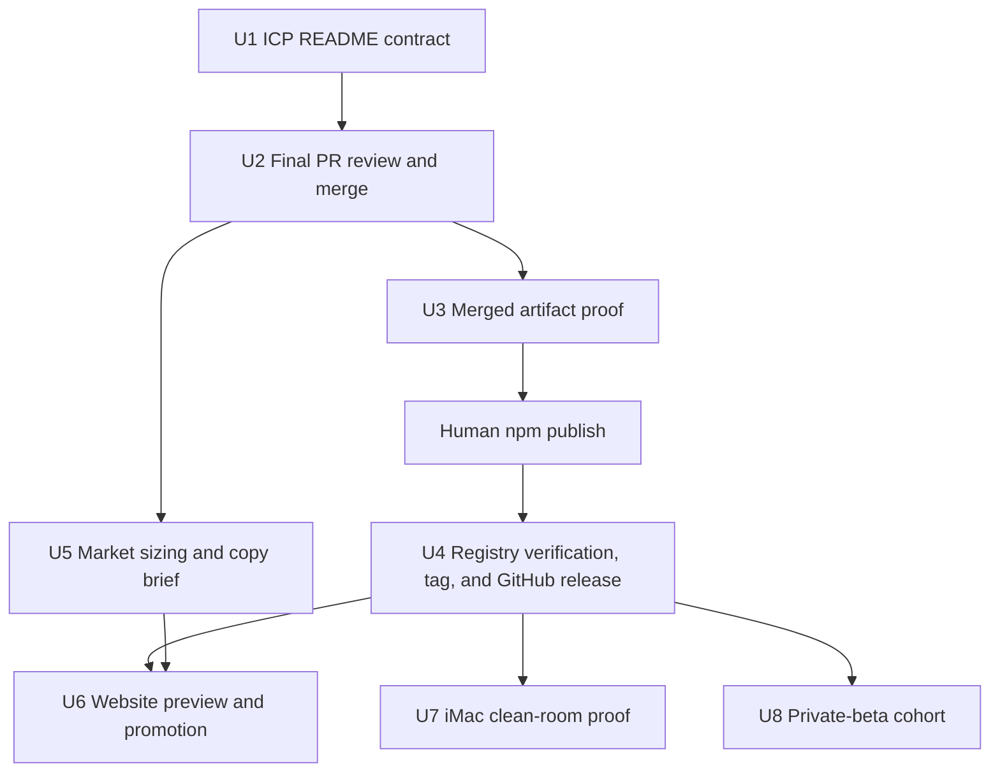

# Private Beta Release and ICP Launch - Plan

## Goal Capsule

Ship DotAIOS 2.0.3 as an honest private-beta product for an independent consultant or freelancer who already moves between AI tools but does not want to configure memory infrastructure.
The release must make the one-folder continuity loop clear, land PR #81, publish one exact verified npm artifact, align the separate Vercel website, and prove onboarding on the iMac without touching the existing business AIOS.

- **Authority:** repository safety contracts and verified product behavior outrank marketing copy; the user's explicit release scope outranks adjacent platform work; the final merged `main` commit and npm registry receipt outrank pre-merge artifacts.
- **Stop conditions:** stop before merge if the exact final PR head is not green; stop before npm publication if the merged checkout is dirty or the packed artifact fails; stop before tag creation if npm does not report the merged commit as `gitHead`; stop the iMac trial if isolation from the existing account is not proved.
- **Execution profile:** one public-repository lane, one human npm publication checkpoint, one post-publication tag/release lane, one private market lane, one separate website lane, and one isolated-device validation lane.
- **Tail ownership:** `ce-work` owns implementation, review, commits, CI, PR landing, release preparation, market and website artifacts, and the iMac test prompt. The user owns npm authentication and the final `npm publish` command. Production website deployment waits for copy approval.

---

## Product Contract

### Summary

The release will present DotAIOS as one readable folder that lets a nontechnical independent professional stop retelling each AI who they are, what they are doing, and what was decided.
The product remains a local continuity system, not a hosted memory service, password vault, vector database, or promise that every AI tool can read local files.

### Problem Frame

The product foundation is substantially complete, but the public release surface still reads partly like developer documentation and the release does not yet exist on npm or GitHub.
The final work is therefore not another architecture cycle.
It is a controlled delivery cycle that makes the customer outcome legible, proves the exact artifact, and prevents launch operations from damaging the existing real-world dogfood installation.

### Key Decisions

- **One local folder is the product authority** (session-settled: user-directed — chosen over hosted or vendor-owned memory: the user wants portable continuity across whichever agents they choose). Governs R1, R2, R3, R4.
- **The first buyer is an independent consultant or freelancer who avoids configuration** (session-settled: user-directed — chosen over developers and enterprise memory teams: the product must solve tool-switching for a nonexpert). Governs R1, R5, R11, R12.
- **The primary onboarding path is one pasted request into a capable local agent** (session-settled: user-approved — chosen over terminal-first onboarding: the assistant can handle Node and package mechanics while the person retains consent). Governs R2, R5, R6.
- **The existing iMac AIOS is preserved** (session-settled: user-directed — chosen over cleaning the current account: it contains the user's mother's business context). Governs R13, R14, R15.

### Requirements

#### Product story and onboarding

- R1. The README leads with the ICP problem, the one-folder outcome, and the five-action continuity loop before adapter, MCP, package, or operator details.
- R2. The README offers one release-pinned assistant request that checks for Node 20 or newer and, when it is missing, explains the documented host-supported installation and asks before performing it. The request previews changes, asks only meaningful consent questions, runs setup, verifies the result, and shows the one AIOS folder. An unconditional automatic-Node-install claim remains prohibited until a Node-absent VM or host produces evidence.
- R3. Public copy states that the AIOS folder is canonical and that agent instructions, hooks, search, MCP, and any later index are bounded or derived views rather than additional memory authorities.
- R4. Public copy keeps Shared, This project, and Off understandable and honest: Project requires an explicitly registered project; DotAIOS enforces Off on every operation that receives the mode, but Off cannot undo host instructions already preloaded and the host may retain its own history. Gemini preserves the first-message mode through its native hook. Codex and Claude Code are instruction-mediated in this release, so their bridge must forward Off on every DotAIOS call and show the receipt; public copy may not describe that as an independently enforced host session lock.
- R5. Trust-critical provenance, exact-version setup, update, removal, security, consent, and support instructions remain available and continue to satisfy the repository's public-contract tests.

#### Release and distribution

- R6. PR #81 is merged only after the ICP README change is committed, pushed, reviewed, and green on the exact final head for Node 20, Node 22, and CodeRabbit.
- R7. The final release artifact is created from the ordinary clean `main` checkout after the squash merge, never from the feature worktree or an earlier tarball.
- R8. A release-candidate package is installed into an empty prefix and exercised from its packed bytes with isolated home, cache, and configuration before publication. The existing packaged-workspace test gains the missing version, CLI-load, and setup-dry-run assertions on PR #81, but remains a packaged-file characterization because it borrows the development checkout's dependencies. Source-only tests plus a file listing are insufficient.
- R9. The user publishes npm 2.0.3 from the ordinary clean merged checkout to `https://registry.npmjs.org/` with `--tag latest`. Registry verification must show version 2.0.3, `latest: 2.0.3`, the merged squash commit as `gitHead`, exact publisher `filippo-costa`, absent install lifecycle scripts, and working behavior from the registry-downloaded tarball. npm `dist.integrity` must equal the release candidate's retained SHA-512 SRI.
- R10. The annotated `v2.0.3` tag and GitHub release are created only after npm verification, because the tag-triggered freshness workflow expects npm to already serve 2.0.3.

#### Market, website, and device proof

- R11. A private market-sizing report declares geography and period, separates sourced facts from assumptions, models broad TAM, a serviceable-market upper-bound proxy, and a 12-month customer-count SOM for the €35 one-time Consultant Pack. The high-income-independent calculation may be used only as an upper-bound proxy; occupation, AI adoption, multi-tool switching, and purchase eligibility remain separate sourced or explicitly ranged inputs. The report names the dominant uncertainty.
- R12. The `dotaios-web` website receives an ICP-aligned copy update in its separate repository. Its home-page order is repeated-context problem, one-folder outcome, primary pinned Foundation install, five-action continuity loop, privacy and ownership proof, then the distinct Consultant Pack. The pinned Foundation install remains the primary CTA; any approved request-access action is secondary and never presented as checkout. Tests and preview deployment must cover both locales, responsive layouts, accessibility, and every commercial availability state. Production deployment waits for human copy review and a live 2.0.3 release.
- R13. The iMac onboarding trial runs from a separate macOS user or another account-level boundary proven to exclude the existing account's AIOS, `.dotaios`, agent instructions, credentials, and skill links; a `HOME` override inside the existing account is insufficient. The trial never deletes or rewrites the existing installation and uses only the public 2.0.3 artifact.
- R14. The iMac proof creates a harmless registered project, tests Shared, This project, and Off, and records configured, invoked, and produced evidence separately for Codex and Claude Code.
- R15. If Node is already available system-wide on the iMac, the receipt states that the missing-Node path was not tested; that path requires a VM or another host rather than destructive mutation of the iMac.
- R16. After release, five nontechnical ICP participants run the private-beta workflow. The cohort records setup completion and time, first useful cross-host save/retrieval, seven-day return use, privacy failures, and willingness to pay before the product is described as validated beyond the private beta.
- R17. One immutable private release receipt records the merge SHA, candidate SRI, npm metadata and exact comparison, registry tarball probe, npm publisher and dist-tag, tag SHA, GitHub release URL, commands, timestamps, and any incident disposition under `dotaios-product/reports/receipts/releases/`.

### Key Flows

- F1. A visitor recognizes the repeated-context problem, sees one owned folder as the remedy, pastes the pinned request, previews, consents, and receives a verified installation.
- F2. The maintainer lands the final PR head, verifies merged `main`, exercises the packed artifact, pauses for human npm publication, verifies registry provenance, then creates the matching tag and GitHub release.
- F3. The marketing owner reviews the market model and copy, applies the approved copy to the separate website, validates a preview, and promotes it only after the release exists.
- F4. A fresh iMac user installs from npm in an isolated account, saves once in one host, retrieves from another with provenance, verifies Project isolation, and verifies Off without touching the pre-existing business installation.

### Acceptance Examples

- AE1. The first screen of the README explains who DotAIOS is for and what changes in plain language, contains no MCP or package-manager tutorial, and leads to one pinned assistant request.
- AE2. The final PR head is green, squash-merges, and the tag, npm `gitHead`, and GitHub release all resolve to the same `main` commit.
- AE3. An empty-prefix install from the pre-publish release candidate, with isolated home/cache/config, reports 2.0.3, completes setup dry-run, loads the CLI, and changes no real user state. After publication, npm `dist.integrity` equals the candidate's SHA-512 SRI and the same isolated probe passes against the registry tarball.
- AE4. The npm publication checkpoint prints exact copyable commands without embedding credentials or OTP values; publication waits for the user to authenticate and confirm.
- AE5. The market report labels population facts, adoption assumptions, conversion assumptions, prices, formulas, and ranges separately so a reader can replace any assumption.
- AE6. The website preview uses the same ICP, one-folder promise, install prompt, privacy limits, and release status as README without importing commercial source into the public core repository.
- AE7. The iMac's original account and AIOS produce identical pre/post inventories while the isolated account completes the release workflow. Gemini demonstrates a hook-preserved Off session; Codex and Claude demonstrate explicit Off on every DotAIOS operation and visible receipts without claiming native session enforcement.
- AE8. The private-beta cohort completes the install/personalize, cross-host continuity, Project isolation, and Off workflows without a privacy leak. The report publishes observed completion, return, and willingness-to-pay data even when the commercial hypothesis fails.
- AE9. If any post-publication check fails, no tag or GitHub release is created. The failed publication is captured in the private receipt, 2.0.3 is deprecated with a precise warning, and work moves to a 2.0.4 hotfix; unpublish is considered only against npm policy and demonstrated impact.

### Success Criteria

- A nondeveloper can explain DotAIOS after reading the README opening without learning Node, MCP, indexing, or agent configuration.
- The released npm package, Git tag, GitHub release, and merged commit form one verifiable provenance chain.
- No step broadens host, platform, privacy, or automatic-memory claims beyond produced evidence.
- The iMac trial preserves the existing business context and produces honest host-specific receipts.
- Product validation remains explicitly incomplete until the post-release ICP cohort reports its observed activation, return, privacy, and willingness-to-pay results.

### Scope Boundaries

**In scope:** README and product-language cleanup; public-contract tests; PR #81 landing; exact artifact verification; human npm handoff; tag and GitHub release; private market sizing; separate website copy/tests/preview; isolated iMac onboarding.

**Deferred until evidence exists:** production website promotion before copy review; broad Claude or Gemini support claims without produced receipts; missing-Node proof when Node is already system-wide; paid checkout or entitlement delivery. A monitored manual request-access path may support the private beta without implying checkout or entitlement automation.

**Not in scope:** hosted memory, account infrastructure, vector or graph retrieval, browser automatic access to local files, a password manager, team multiwriter state, deleting the existing iMac AIOS, or moving commercial website source into the public repository.

---

## Planning Contract

### Key Technical Decisions

- KTD1. **Preserve the tested README trust floor while changing its information architecture.** Rewrite the opening and section order, then retain or link the exact pinned install, provenance, update, removal, and security contracts owned by existing tests. Governs R1-R5.
- KTD2. **Treat customer-facing copy as executable behavior.** Add public-contract assertions for ICP-first ordering, the first-buyer description, the technical-detail boundary, and qualified Off language before editing production copy. Governs R1, R4, R5.
- KTD3. **Publish from the ordinary merged checkout and bind the publication to the candidate.** The release checklist, candidate pack, packaged-workspace test, and human `npm publish` run from the checkout whose `.git` is a real directory so npm can derive the squash commit for `gitHead`. Two local packs from the same clean snapshot produce the same archive hash; post-publication verification therefore requires npm `dist.integrity` to equal the candidate's SHA-512 SRI and executes the registry tarball under a clean home. Governs R7-R9.
- KTD4. **Publish npm before the tag.** Verify npm first, then create the annotated tag and GitHub release at the squash commit so `release-freshness.yml` observes an already-current registry. Governs R9, R10.
- KTD5. **Keep the commercial lane separate.** Market artifacts remain private; website source changes only in `dotaios-web`; the public core repository contains neither the storefront nor paid-offer market assumptions. Governs R11, R12.
- KTD6. **Use account-level isolation for the iMac proof.** A fresh macOS user is the preferred clean room because changing `HOME` inside the existing account does not isolate native agent configuration, credentials, or system-wide Node. Governs R13-R15.

### Sequencing

### Risks and Dependencies

- npm authentication, 2FA, and account authority are human-owned and may pause U4.
- All npm identity, publication, download, and verification commands pin `https://registry.npmjs.org/`; tokens and OTP values never appear in prompts or copyable command arguments.
- A README edit changes packed bytes; every pre-edit tarball and receipt becomes historical.
- Merging the release copy starts a bounded maintenance window in which the pinned `v2.0.3` links do not exist yet. No launch promotion occurs until the npm package, tag, GitHub release, and pinned README/INSTALL links all resolve.
- The website has several stale local copies; only the `filocosta46/dotaios-web` repository linked to Vercel project `dotaios` is authoritative.
- A new macOS account may still see system-wide Node; that does not prove the missing-Node flow.
- The isolated account will not inherit per-user Codex or Claude Code authentication. The run pauses for separate human login and never copies credentials from the existing account.
- Vercel preview and promotion use the already-linked project. The user owns production promotion and credentials; the release agent never requests or prints a Vercel token.
- Codex and Claude Code need separate produced evidence; configuration or invocation alone is not support proof.

---

## Implementation Units

### U1. Rewrite the public product story

- **Goal:** Make the README sell the ICP outcome before explaining the machinery while preserving the tested trust contract.
- **Requirements:** R1-R5
- **Target repo:** `dotaios`
- **Files:** `README.md`; `tests/core/public-contract.test.mjs`; `packages/core/src/bridges.mjs`; `packages/cli/src/adapters/gemini.mjs`; related focused tests if wording contracts require them.
- **Approach:** Add failing product-contract assertions for ICP-first section order and qualified privacy copy. Rewrite the README opening around the repeated-context problem, one-folder outcome, five-action loop, and three choices. Move operator material behind a technical-reference boundary without removing the exact trust-critical commands. Replace “session memory” with “memory access for this session” where it teaches the wrong domain model.
- **Test scenarios:** The README names the independent consultant/freelancer; customer outcome precedes technical detail; the first action remains one pinned assistant request; consent and Node claims remain honest; the Off statement names its host-preload limit; all existing onboarding and update contracts pass.
- **Verification:** `node --test tests/core/public-contract.test.mjs tests/cli/onboarding_agent_safety.test.mjs tests/core/bridges.test.mjs tests/cli/gemini-memory-hook.test.mjs`; `npm run syntax-check`; `git diff --check`.

### U2. Verify and land PR #81

- **Goal:** Land the complete privacy-mode and ICP-release diff through the repository's normal review path.
- **Requirements:** R6
- **Target repo:** `dotaios`
- **Files:** all files changed by PR #81; `tests/cli/init_packaged_workspace.test.mjs`; no new scope after the packaged-artifact assertions except review fixes.
- **Approach:** Extend the existing packed-workspace test test-first with the missing version, CLI-load, and setup-dry-run assertions; do not create a second package probe abstraction and do not mislabel this dependency-borrowing test as the standalone install gate. Run the full local verification matrix, review the new delta, commit and push U1 plus the gate, then wait for Node 20, Node 22, and CodeRabbit on that exact head. Resolve only concrete release-scope findings. Squash-merge only when the head is clean and current.
- **Test scenarios:** The packed candidate runs from a temporary home; focused contracts pass; full suite has zero failures; smoke, syntax, CLI import, and pack dry-run pass; PR review backlog is zero; GitHub reports mergeable and clean.
- **Verification:** `npm test`; `npm run smoke`; `npm run syntax-check`; `npm run check`; `npm pack --dry-run`; `git diff --check`; GitHub PR checks and review state.

### U3. Prove the merged release artifact

- **Goal:** Produce and exercise the exact bytes the user will publish.
- **Requirements:** R7, R8, R17
- **Target repo:** `dotaios`
- **Files:** release-candidate archive generated outside the tracked tree; immutable private receipt at `dotaios-product/reports/receipts/releases/dotaios-2.0.3.md`; no reused pre-merge tarball and no post-merge source edit.
- **Approach:** Fast-forward the ordinary `main` checkout, record the squash SHA, run the release checklist and the already-merged packaged-workspace characterization, create one fresh candidate package, retain its SHA-512 SRI, install it into an empty prefix, and run version, CLI-load, and setup-dry-run probes with isolated home, npm cache, and configuration. Start the immutable private receipt before publication and append every authoritative result rather than relying on temporary terminal output.
- **Test scenarios:** Dirty tree refuses; wrong branch/version/changelog refuses; tarball reports 2.0.3; temporary-home setup preview succeeds without creating real user state; package inventory contains the reviewed README and runtime files; install lifecycle scripts remain absent.
- **Verification:** `npm run release:check`; packaged-workspace test and release-candidate execution from a temporary directory and home; candidate SHA-512 SRI; `git status --short --branch`.

### U4. Complete npm, tag, and GitHub release

- **Goal:** Close the release provenance chain without asking the agent to handle human credentials.
- **Requirements:** R9, R10, R17
- **Target repo:** `dotaios`
- **Files:** release notes and external npm/GitHub state; source changes only if verification finds a defect.
- **Approach:** Present exact commands that pin `https://registry.npmjs.org/` for effective-registry inspection, `npm whoami`, publication with `--tag latest`, download, and verification. Require the pre-publish identity to be `filippo-costa`. Authentication stays interactive; no token or OTP enters a command argument. After publication, require `dist.integrity` to equal the candidate SHA-512 SRI, `dist-tags.latest` to equal 2.0.3, the publisher to match exactly, and the registry tarball to pass the isolated install probe. If any check fails, do not tag: append the incident to the receipt, deprecate 2.0.3 with an exact warning, open a 2.0.4 hotfix, and consider unpublish only when npm policy and impact justify it. Only after all checks pass, create an annotated `v2.0.3` tag at the squash SHA, push it, create the GitHub release, verify the pinned README and INSTALL URLs, and wait for the tag-triggered freshness workflow.
- **Test scenarios:** npm initially returns E404 for 2.0.3; pre-publish identity is exactly `filippo-costa`; after publication it reports the expected version, `latest` dist-tag, `gitHead`, integrity, publisher, and scripts; the registry package matches and passes the candidate probe; the failure branch deprecates rather than tags; the successful tag and release target the same SHA; pinned documentation links resolve; release-freshness passes.
- **Verification:** `npm view dotaios@2.0.3 version dist.integrity dist.tarball gitHead _npmUser.name scripts --json`; `npm view dotaios dist-tags --json`; isolated registry-tarball execution; `git rev-parse v2.0.3^{}`; `gh release view v2.0.3`; pinned documentation HTTP checks; GitHub Actions result; completed immutable private receipt.

### U5. Build the private market-sizing and copy brief

- **Goal:** Bound the commercial opportunity and give the website lane a source-backed ICP brief.
- **Requirements:** R11
- **Target workspace:** `dotaios-product`
- **Files:** `research/private-beta-market-sizing.md` or the selected build-report artifact; supporting calculation artifact; `release/website-copy-brief.md`.
- **Approach:** Use current primary sources for U.S. independents and AI adoption. Model English-language U.S. independents as the broad ceiling and high-income independents only as a serviceable upper-bound proxy. Apply occupation, AI adoption, multi-tool switching, and purchase-eligibility inputs separately, using primary evidence where available and explicit ranges where it is not. Model explicit 12-month customer scenarios as SOM. Keep price at €35 one-time and label every inferred adoption or conversion rate.
- **Test scenarios:** Arithmetic reconciles; all sourced facts have links and dates; assumptions are replaceable inputs; revenue never exceeds the population ceiling; the report distinguishes market size from the immediate launch cohort.
- **Verification:** Recompute formulas independently; run the build-report validation contract; verify citations and assumption labels.

### U6. Align and preview the Vercel website

- **Goal:** Make the commercial website tell the same customer story as the released core.
- **Requirements:** R12
- **Target repo:** `dotaios-web`
- **Files:** `website/src/content.js`; `website/tests/content.test.mjs`; release registry/manifest only when release availability changes; styles or components only if copy cannot fit the existing hierarchy.
- **Approach:** Update English and authored Italian copy from the approved brief. Order the page as: repeated-context problem, one-folder outcome, primary pinned Foundation install action, five-action continuity explanation, privacy and ownership proof, then the distinct €35 Consultant Pack. Replace the mutable install prompt with the release-pinned assistant handoff. Keep Foundation as the primary home-page CTA. When a monitored intake destination is approved, offer one secondary manual private-beta request-access action without implying checkout. Create a preview from the linked Vercel project, record its source commit and URL, and hand production promotion to the user only after the exact preview, copy, and live release are approved; never pass Vercel tokens or environment values through an agent prompt or command argument.

  | Release state | Visible commercial action | Destination | Status and fallback | Analytics invariant |
  |---|---|---|---|---|
  | Loading | Disabled `Checking availability…` | None | Explain that Foundation remains available; retain the pinned install action | Availability check only |
  | Load error | `Try again` | Reload the availability check | Say availability could not be confirmed; never imply purchase is open | Error and retry, no purchase event |
  | Closed, no approved intake | No commercial CTA | None | Say the Consultant Pack is not currently available; direct visitors to Foundation | Closed-state view only |
  | Closed, approved manual intake | `Request private-beta access` | Approved monitored intake destination | Say this is a request, not a purchase or guaranteed acceptance; Foundation remains available | Request-start event, never purchase-start |
  | Checkout available | `Get the Consultant Pack` | Approved checkout | Show price and purchase status; Foundation stays visibly distinct | Purchase-start only after verified availability |

- **Test scenarios:** ICP problem and outcome are visible above the fold; install prompt matches 2.0.3; no universal-agent or hosted-memory claim; Foundation and paid pack remain distinct; every availability state renders the specified CTA, status, fallback, and analytics event; an approved manual-intake path works or production promotion stays blocked; both locales are complete. At 360px, 768px, and desktop widths, English and Italian preserve heading/CTA order, readable text reflow, mobile navigation, keyboard focus, reduced-motion behavior, copy success/fallback feedback, and every purchase or request-access state.
- **Verification:** `npm run check` from `website`; linked project and organization receipt; Vercel preview URL, source commit, security-header review, English/Italian screenshots at 360px, 768px, and desktop, plus a recorded keyboard and accessibility receipt; production domain smoke after human promotion.

### U7. Run the isolated iMac onboarding proof

- **Goal:** Validate the public release as a fresh user without risking the existing business installation.
- **Requirements:** R13-R15
- **Target workspace:** `dotaios-product`
- **Files:** `release/imac-clean-room-runbook.md`; `release/imac-onboarding-prompt.md`; an evidence receipt that contains no private memory content.
- **Approach:** Inventory the existing account read-only. Account creation, GUI login, client authentication, logout, and removal are human-only actions. Before any test mutation, the human logs into the isolated account and the receipt proves username, UID, HOME ownership, and working directory; a Tailscale shell that lands in the original account is rejected. Quiesce the original account's AI clients, then capture a bounded no-follow manifest of approved configuration roots that records types, modes, ownership, sizes, and hashes without private content or followed link targets. In the isolated account, verify each client binary, install it through its documented channel if absent, then pause for the user to authenticate Codex and Claude Code independently; never copy credentials, `.npmrc`, `.codex`, `.claude`, API keys, npm tokens, or Tailscale state from the existing account or place them in prompts/evidence. Run only the public pinned prompt and create a disposable project for Project mode. Capture configured/invoked/produced tiers plus the Shared→save→cross-host retrieve→Project flow. For Off, prove Gemini's native hook separately and require explicit Off plus a visible receipt on every Codex and Claude DotAIOS operation. Compare the protected pre/post manifests of the original account.
- **Test scenarios:** Original AIOS and configuration hashes/counts do not change; missing or unauthenticated clients stop with an unproved receipt; setup opens one new folder; one save returns one result in the second host; Project mode returns no personal or other-project memory; explicit Off operations touch no canonical AIOS while unqualified Codex/Claude calls are not misreported as session-enforced; missing-Node status is reported honestly.
- **Verification:** pre/post inventory comparison; `doctor`; host receipts bound to 2.0.3 and the iMac environment; no private business content in the shared evidence artifact.

### U8. Measure private-beta customer value

- **Goal:** Test whether the released product solves the stated ICP problem outside the founder's machines.
- **Requirements:** R16
- **Target workspace:** `dotaios-product`
- **Files:** `research/private-beta-cohort-scorecard.md`; consented, de-identified workflow receipts that contain no customer memory content.
- **Approach:** Recruit five independent consultants or freelancers who already switch between AI tools and are not selected for developer expertise. Record setup completion and time, one useful save/retrieval across supported hosts, Project and Off outcomes, seven-day repeat use, and the answer to a €35 willingness-to-pay question. Keep this unit post-release: it decides whether to expand the private beta, not whether 2.0.3 may be published.
- **Test scenarios:** Every participant receives the same public artifact and onboarding prompt; failures and drop-offs remain in the denominator; no participant secret or memory content enters the scorecard; a failed hypothesis produces a learning report rather than revised success criteria.
- **Verification:** five consented participant rows; completion and return calculations replay from the de-identified data; zero privacy leaks; a recorded expand, revise, or stop decision after the cohort.

---

## Verification Contract

| Gate | Applies to | Command or evidence | Pass condition |
|---|---|---|---|
| Public copy contracts | U1 | `node --test tests/core/public-contract.test.mjs tests/cli/onboarding_agent_safety.test.mjs tests/core/bridges.test.mjs tests/cli/gemini-memory-hook.test.mjs` | ICP order and every existing trust contract pass. |
| Full repository | U2 | `npm test && npm run smoke && npm run syntax-check && npm run check && npm pack --dry-run` | Zero failures on the final PR head. |
| PR authority | U2 | GitHub Node 20, Node 22, CodeRabbit, merge state, and unresolved review count | Exact final head is green, clean, mergeable, and has no unresolved actionable review. |
| Merged release | U3 | `npm run release:check` plus empty-prefix packed-artifact execution with isolated home/cache/config | Clean ordinary `main`; exact packed bytes run successfully without development dependencies. |
| npm provenance | U4 | `npm view` metadata, exact candidate SRI equality, dist-tag and publisher checks, and registry-tarball isolated-prefix execution | 2.0.3, `latest` tag, correct squash `gitHead`, exact publisher, exact integrity, no lifecycle scripts, working CLI. |
| Release receipt | U3-U4 | immutable private release receipt | Every candidate, registry, tag, release, and incident decision remains auditable after temporary files are removed. |
| Tag and release | U4 | Git/tag SHA, GitHub release metadata, release-freshness workflow | npm, tag, release, and merged commit agree; workflow passes. |
| Market model | U5 | source audit and independent arithmetic replay | Facts, assumptions, formulas, and uncertainty are explicit and reproducible. |
| Website | U6 | `npm run check`, preview review, responsive screenshots, accessibility receipt, production smoke | Both locales, all availability states, and core routes match the approved contract. |
| iMac isolation | U7 | pre/post inventory plus host-specific receipts | Existing account unchanged; public artifact completes the bounded continuity flow. |
| Private-beta learning | U8 | de-identified five-person cohort scorecard | Observed activation, seven-day return, privacy, and willingness-to-pay results are complete and reproducible. |

---

## Definition of Done

- U1 is done when the README is ICP-first, honest, and green against focused public contracts.
- U2 is done when PR #81 is squash-merged from a green exact head and the ordinary local `main` can fast-forward to the merge commit.
- U3 is done when one fresh merged-main release candidate has a retained SHA-512 SRI, executes successfully in an empty isolated prefix, and begins an immutable private release receipt.
- U4 is done when npm integrity equals the candidate SRI, exact publisher and latest dist-tag match, the registry tarball executes in isolation, npm, the annotated tag, the GitHub release, and the freshness workflow all agree on 2.0.3 and the squash commit, pinned documentation links resolve, and the immutable private receipt is complete. A failed post-publish verification instead completes only when the version is deprecated, the incident is recorded, and a 2.0.4 hotfix is opened.
- U5 is done when the market model can be recalculated from cited facts and labeled assumptions.
- U6 is done when the approved copy passes the separate website repository's checks and the reviewed production deployment is healthy.
- U7 is done when the iMac proves the release without modifying the existing business AIOS and records honest per-host evidence.
- U8 is done when five ICP participants produce a complete, de-identified activation, return, privacy, and willingness-to-pay scorecard and the next product decision is recorded.
- All abandoned experiments, obsolete tarballs, temporary release homes, and duplicate draft artifacts are removed or kept outside the shipped diff; the final working trees are clean.
