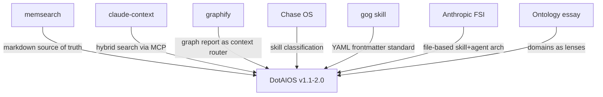

# DotAIOS — External Research Round 2 & Consolidated Roadmap

**Date**: 2026-05-07  
**Previous research**: [memory-system-evaluation.md](file:///Users/filo/.gemini/antigravity/brain/0e9a86ad-84ba-4c78-a9d4-ab06ab916102/artifacts/memory-system-evaluation.md) (memsearch, claude-context, Chase OS)

---

## New Sources Evaluated

### 1. `gog` CLI — Google Workspace Skill (OpenClaw format)

**What it is**: A SKILL.md file for the `gog` CLI — a single binary that wraps Gmail, Calendar, Drive, Contacts, Sheets, and Docs behind clean shell commands. Published in the OpenClaw skill format with YAML frontmatter.

#### What's interesting for DotAIOS

| Feature | Relevance |
|---------|-----------|
| **YAML frontmatter in SKILL.md** | This is becoming the standard skill metadata format. OpenClaw, Claude Code plugins, graphify — everyone uses frontmatter with `name`, `description`, `requires`, `install`. Our skills have zero frontmatter today. |
| **`requires.bins` field** | Declares external dependencies (needs `gog` binary). Smart — the skill self-describes what it needs to run. |
| **`install` field with multiple methods** | brew, npm, pip — the skill tells the agent *how* to install its dependencies. |
| **`gog` as the Gmail answer** | This is actually a cleaner path to Gmail integration than the `googleapis` npm approach we planned. One binary, OAuth built-in, works from any agent that can shell out. |

> [!IMPORTANT]
> **Immediate action**: Adopt YAML frontmatter for all DotAIOS skills. This makes skills machine-parseable and compatible with the emerging cross-agent skill ecosystem (OpenClaw, graphify, etc.)

**Proposed SKILL.md frontmatter for DotAIOS**:

```yaml
---
name: plan-today
description: Structure your day from work.md and priorities.md
version: 1.0.0
schedule_type: on-demand      # on-demand | daily | weekly | event-triggered
requires:
  context: [identity.md, work.md, priorities.md]
  connections: []
  bins: []
permissions:
  read: [context/*, memory/events.jsonl]
  write: []
---
```

---

### 2. Graphify — Knowledge Graph for Any Codebase (44.4k ⭐)

**What it is**: A skill that maps any folder — code, docs, PDFs, images, videos — into a knowledge graph you can query. Outputs `graph.json`, `GRAPH_REPORT.md`, and `graph.html`. Works in Claude Code, Codex, OpenCode, Cursor, Gemini CLI, Antigravity. 44.4k GitHub stars.

#### What's genuinely brilliant

| Feature | Analysis |
|---------|----------|
| **"Graph as context"** paradigm | Instead of loading files directly, the agent reads `GRAPH_REPORT.md` — a pre-computed summary of key concepts, surprising connections, and suggested questions. This is *exactly* the context-router idea from our previous analysis, but implemented as a knowledge graph. |
| **Three output tiers** | `GRAPH_REPORT.md` (summary) → `graph.json` (full queryable graph) → original files. Progressive retrieval without vector embeddings. |
| **Agent-universal via skill install** | `graphify install` writes per-agent config for Claude Code, Codex, Gemini, Cursor, etc. Same pattern DotAIOS should use. |
| **Hooks for auto-rebuild** | `graphify hook install` sets up git hooks so the graph stays fresh. No manual re-indexing. |
| **Confidence tags** | Every inferred relationship is tagged `EXTRACTED`, `INFERRED`, or `AMBIGUOUS`. The agent knows what's a fact vs a guess. |
| **God nodes + surprising connections** | Identifies the most-connected concepts and unexpected cross-file relationships. This would be powerful for an AIOS context — "your identity, priorities, and Project X are all connected through Onomondo." |
| **MCP server for structured queries** | `query_graph`, `get_node`, `get_neighbors`, `shortest_path` — the graph is available as MCP tools. |

#### What doesn't fit DotAIOS directly

| Issue | Why |
|-------|-----|
| **Python dependency** | `pip install graphifyy`. Same issue as memsearch. |
| **Designed for code repos** | AST parsing, tree-sitter, function-level chunking. Our content is markdown, not code. |
| **LLM API required for docs** | Code is parsed locally, but docs/PDFs need an LLM API call for extraction. |
| **Heavy output** | `graph.html` is a full interactive visualization. Overkill for personal memory. |

#### The key insight to adopt

> [!TIP]
> **The "graph report" pattern is the right context router for DotAIOS.** Instead of loading every file, generate a pre-computed `CONTEXT_REPORT.md` that summarizes the relationships between your identity, active projects, recent events, and vault knowledge. The agent reads this first and knows what to load on demand.
>
> This is dramatically simpler than vector embeddings and achieves 80% of the retrieval benefit. We can build it in Node.js with zero deps — just structured file reading + template rendering.

---

### 3. Anthropic `financial-services` — Plugin Architecture Reference (11.3k ⭐)

**What it is**: Anthropic's official repo of reference agents, skills, and data connectors for financial services. Most interesting for the *architecture*, not the content.

#### Architecture patterns worth studying

| Pattern | Detail |
|---------|--------|
| **Dual-deployment model** | Same skill works as a Claude Cowork plugin AND as a Managed Agent via API. "Same system prompt, same skills — you choose where it runs." |
| **Agent = system prompt + bundled skills** | Each agent is a folder: `agents/<slug>.md` (system prompt) + `skills/` (skill files). The agent is self-contained. |
| **Vertical plugins = reusable skill bundles** | Skills grouped by domain (investment-banking, equity-research, operations). Install a vertical to get all its skills. |
| **`.mcp.json` for data connectors** | MCP servers are declared in the plugin manifest. The plugin brings its own connections. |
| **Everything is file-based** | "Everything here is markdown and JSON, no build step." — This validates our philosophy. |
| **`scripts/sync-agent-skills.py`** | Skills live in verticals but get bundled into agents. A sync script propagates changes. This is a maintenance pattern we'll need when DotAIOS grows. |
| **Skills are slash commands** | `/comps`, `/dcf`, `/earnings` — each skill maps to a command the agent responds to. Exactly how our skills work (`/plan-today`, `/audit`). |

#### What this tells us about where the industry is going

Anthropic's own reference architecture confirms that the file-based, skill-as-markdown pattern is the standard. Their agents are:
- A markdown system prompt
- A set of SKILL.md files
- MCP connectors for external data
- YAML manifests for metadata

**This is almost exactly what DotAIOS already does.** The main gap: we don't have YAML frontmatter in skills, and we don't have MCP connectors.

---

### 4. Ashwin Gopalan — "Claude Made Agent Memory Real. But Semantics and Ontology Are Still Missing"

**What it is**: A strategic essay arguing that file-based memory (like Claude's Managed Agents) is necessary but not sufficient. Memory needs **semantics** (what something *is*) and **ontology** (what it *means from a perspective*).

#### The core argument, distilled

```
Storage  →  Semantics  →  Ontology
"a file"    "a rock"     "a chair" (hiker) / "raw material" (sculptor)
```

- **Storage**: Claude's memory stores mount files into agent containers. DotAIOS puts files in `~/.aios/`. Both are storage.
- **Semantics**: What type of thing is this? An event, a person, a company, a decision, a commitment?
- **Ontology**: What does this thing mean *to you right now*? "Call Ravi" means different things if Ravi is your investor, your doctor, or your co-founder.

#### How this maps to DotAIOS

| Ashwin's concept | DotAIOS equivalent | Gap |
|-----------------|--------------------|----|
| **Storage** | `~/.aios/` folder structure | ✅ Done |
| **Semantics** | `events.jsonl` has `type` field. `vault/org/` separates companies from people. | ⚠️ Partial — event types are unstructured strings, no schema |
| **Ontology** | `context/domains/` (make.md, sell.md, build.md) | ⚠️ Exists but not connected to memory routing |
| **"One substrate, many lenses"** | Agent reads same files but through different domain filters | ❌ Not implemented — all agents see the same flat view |

#### What to adopt

The **domains-as-lenses** concept is the most actionable idea:

Right now, `context/domains/make.md` exists but is only loaded "when declared in project frontmatter." It's passive. The ontology essay suggests domains should be **active filters** — when you're in "sell" mode, the agent should prioritize CRM data, outreach history, and pipeline events. When you're in "build" mode, it should prioritize project architecture, decisions, and technical notes.

**Concrete implementation**: Add a `domain` field to project README frontmatter. The context router uses it to weight which vault/memory slices to load.

```yaml
# projects/onomondo-app/README.md
---
domain: build
status: active
---
```

When the agent is working in this project, the context router loads:
- `context/domains/build.md` (engineering principles)
- `vault/org/companies/onomondo.md` (company context)
- Events tagged with `project: onomondo-app`

This is the "lens" — same memory substrate, different view based on the domain.

---

## Consolidated Findings — What the Ecosystem Is Telling Us

After analyzing **7 external systems** across two rounds:



### The industry is converging on these patterns:

1. **Files are the memory substrate** — markdown + JSONL, not databases. Every system agrees.
2. **YAML frontmatter in SKILL.md** — the universal skill metadata format (OpenClaw, graphify, Anthropic FSI all use it).
3. **MCP is the universal tool layer** — every agent supports it. This is how skills get *capabilities* beyond file reading.
4. **Pre-computed context summaries beat RAG for small collections** — graphify's `GRAPH_REPORT.md`, memsearch's progressive retrieval, our context router. At <1000 files, you don't need vector search — you need smart pre-filtering.
5. **Domains/ontology are the missing piece** — the same memory means different things in different contexts. Domains should be active routing filters, not passive reference docs.

---

## Updated Roadmap (Consolidated)

### v1.1 — "Make it livable" (NOW)

| Feature | Inspired by | Effort |
|---------|------------|--------|
| **YAML frontmatter for all skills** | OpenClaw `gog` skill, Anthropic FSI, graphify | ~1h |
| **`aios context` command** | (original v1.1 scope) | ~3h |
| **`aios context --refresh`** | Regenerate agent files from current context | ~1h |
| **Context router: `CONTEXT_SUMMARY.md`** | graphify's `GRAPH_REPORT.md` pattern | ~3h |
| **`aios upgrade` + `aios cleanup`** | (original v1.1 scope) | ~6h |
| **Unit tests with `node:test`** | (original v1.1 scope) | ~3h |

**Context router detail**: `aios context` generates a `CONTEXT_SUMMARY.md` that the agent files (`CLAUDE.md`, `AGENTS.md`) reference. It contains:
- Identity snapshot (name, role, current work)
- Active projects with domains
- Recent high-signal events (filtered, not raw)
- Key vault entities mentioned in active projects
- Suggested questions the agent can answer from memory

This gets **regenerated** on `aios context --refresh` or `aios upgrade`. The agent reads this first instead of scanning every file.

### v1.2 — "Make it searchable" (NEXT)

| Feature | Inspired by | Effort |
|---------|------------|--------|
| **`@dotaios/mcp` server** | claude-context, graphify MCP, Anthropic FSI connectors | ~8h |
| **`aios mcp install`** | graphify's `graphify install` pattern | ~3h |
| **Structured event schema** | Ontology essay (semantics layer) | ~2h |
| **Domain-aware routing** | Ontology essay (ontology layer) | ~3h |

**Structured event schema**:
```json
{
  "ts": "2026-05-07T20:00:00Z",
  "type": "ingest",
  "domain": "build",
  "project": "onomondo-app",
  "entity": "vault/org/companies/onomondo.md",
  "summary": "Ingested job description PDF"
}
```

Events get `domain`, `project`, and `entity` fields. The MCP server and context router can filter by these. This is the **semantics** layer the ontology essay describes.

### v2.0 — "Make it compound" (FUTURE)

| Feature | Inspired by | Effort |
|---------|------------|--------|
| **SQLite FTS5 search index** | claude-context concept, lighter implementation | ~6h |
| **`aios compact` with summarization** | memsearch's `compact` | ~4h |
| **Cross-session memory capture** | memsearch auto-capture hooks | ~6h |
| **`gog` integration as optional plugin** | `gog` CLI skill | ~4h |
| **Knowledge graph for vault** | graphify concept, simplified | ~8h |

---

## Open Questions for You

> [!IMPORTANT]
> **1. Context Summary vs Graph Report**: Should `CONTEXT_SUMMARY.md` be a simple structured template (current plan), or should we invest in a graphify-style relationship mapping between entities? The simple template is 3h of work. The relationship mapping is 10h+ but produces richer context.

> [!IMPORTANT]
> **2. `gog` CLI as the Gmail path**: The `gog` CLI (`brew install steipete/tap/gogcli`) is a single binary that handles Gmail, Calendar, Drive with built-in OAuth. This is dramatically simpler than building a `googleapis` npm plugin ourselves. Should we recommend `gog` as the official Google Workspace integration for DotAIOS, packaged as an optional skill/plugin? Or do we still want to build our own?

> [!IMPORTANT]
> **3. Skill frontmatter — adopt OpenClaw format exactly?** The `gog` SKILL.md uses the OpenClaw/Claude Code frontmatter standard (`name`, `description`, `requires`, `install`). We could adopt it verbatim for ecosystem compatibility, or define our own with additional fields (`schedule_type`, `permissions`, `domain`). The risk of our own format: fragmentation. The risk of their format: missing fields we need.

> [!IMPORTANT]  
> **4. MCP timeline**: The MCP server is the single highest-leverage feature for cross-agent compatibility. Should we bump it from v1.2 to v1.1 and defer some of the simpler CLI commands? The MCP server would make DotAIOS immediately useful in Codex, Gemini CLI, and Cursor — agents that can't read `CLAUDE.md`.
