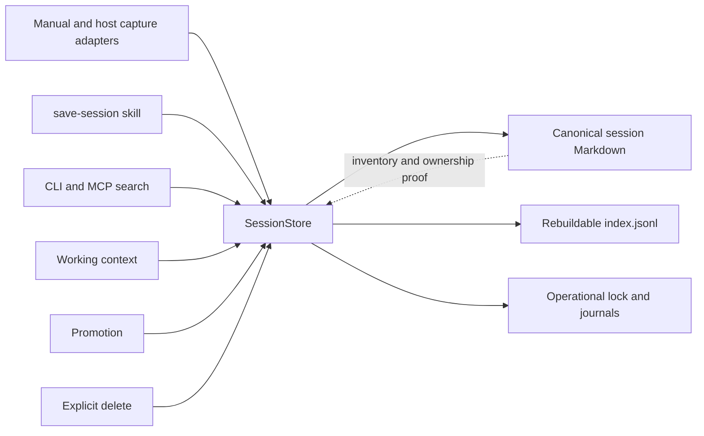

# SessionStore Consumer Foundation

> **Status:** Implemented candidate under exact-commit validation

## 1. Executive summary

Session capture and consumption currently share a file format but not one owner. Capture adapters observe sources before taking the index lock, several readers trust index metadata without proving the referenced Markdown, and deletion removes an index row before it proves ownership of the file. This can lose a growing transcript, publish a false success after a crash, or mutate an attacker-selected path. This change introduces one local SessionStore that owns capture, reconciliation, metadata search, and exact deletion. Session Markdown stays canonical user memory and `memory/sessions/index.jsonl` stays a rebuildable projection. The main cost is that every mutation takes one store-wide lock and performs durable journal writes, so capture latency increases in exchange for simple cross-process correctness.

## 2. Context and scope

Today `packages/core/src/sessions.mjs` writes Markdown before taking the index lock. Its same-source decision is made from an index snapshot outside that lock, every content change overwrites the prior session even when the turn sequences diverge, and deletion joins an index path to the AIOS root after removing the row. Claude Code import and hook paths parse a source before the core write begins. Working context and promotion read the projection directly. The save-session skill writes both artifacts itself.

This design changes that ownership boundary. All session writers and all consumers of session index metadata cross SessionStore. The store treats session Markdown as the only user-memory authority, treats the index as disposable, and keeps locks and recovery journals as operational evidence. It preserves project slug and durable project ID fields introduced by PR 61, the existing working-context budgets, and the exact three-tool read-only MCP surface.

This is the consumer foundation tracked by Wayfinder issue 016. It does not implement the replicated consumer publish protocol tracked by issue 017.

## 3. System context



The AIOS root is the trust boundary. Canonical sessions live below `memory/sessions/<date>/`. SessionStore operational state lives below `.dotaios/session-store/` and is excluded from mirror publication. The MCP server remains a read-only adapter with exactly `read_working_context`, `search_aios`, and `resolve_skill`. It receives bounded data from the same SessionStore read path as the CLI and cannot invoke capture, reconciliation apply, or deletion.

## 4. Proposed design

### How it works

For a Claude Code capture, the adapter passes an absolute source path, an adapter name, project scope, and a pure byte-to-turn parser to `SessionStore.capture`. The store takes its recoverable store-wide lock before observing the source. It recovers any owned incomplete transaction, opens the exact caller-authorized source without following the final component, proves its type, link count, authorization policy, identity, size, and stable bytes, then parses strict UTF-8. It inventories existing canonical Markdown and compares all records with the same source identity.

If the candidate equals or is an older prefix of the only existing version, capture returns `idempotent` without writing. If that one existing version is a strict prefix of the candidate, capture preserves that session ID and publishes the longer Markdown plus a rebuilt projection. If neither version is a prefix of the other, capture publishes the candidate as a separate conflict record and returns `conflict_preserved`. The response is not a normal capture success and tells the caller to reconcile the conflict. Once a source group has more than one canonical member, including duplicate equal members, later capture returns `reconciliation_required` without mutation until exact user-authorized deletion leaves one branch. New and growing publications write a durable transaction manifest before the first canonical boundary. Recovery can repeat the same transaction until the canonical file and projection reach the recorded after-state.

The comparison table is complete for each normalized source identity:

| Existing canonical members | Candidate relation | Outcome |
| --- | --- | --- |
| zero | any valid candidate | `created` |
| one | equal or candidate is a prefix | `idempotent` |
| one | existing is a strict prefix | `grown` with stable session ID |
| one | neither is a prefix | publish a second member and return `conflict_preserved` |
| two or more | any relation, including an equal duplicate or branch extension | `reconciliation_required`, no mutation |

Before any capture mutation, the current projection must exactly equal the deterministic projection of the canonical inventory. A missing projection is accepted only when the inventory is empty. Otherwise an orphan, stale, malformed, invalid-UTF-8, duplicate, or metadata-mismatched projection returns `reconciliation_required`; capture never repairs drift as a side effect.

`SessionStore.reconcile` always inventories canonical Markdown and compares it with the projection. Report mode is read-only and returns deterministic categories, counts, safe relative identifiers, and ordering for orphan Markdown, stale rows, syntax-malformed rows, duplicate IDs, duplicate paths, duplicate or conflicting sources, and pending, poisoned, or unsafe operational state. Apply mode takes the store lock and journal-rebuilds only the projection. It refuses if any canonical artifact cannot be completely proved, never deletes or rewrites canonical evidence, and returns either `rebuilt` or `rebuilt_with_conflicts` with unresolved counts. Empty and missing roots produce the same clean deterministic report without creating them.

`SessionStore.search` reads the projection through the caller's existing request-scoped read ledger. It proves one stable projection-plus-complete-inventory snapshot by comparing before and after identities for the sessions root, projection, directory entries, and consumed Markdown. If publication races the first observation, it retries once within the same budget, then refuses through the existing safe read envelope. It validates every parsed row, proves each referenced canonical file, derives the expected row from that Markdown and the complete validated inventory, and requires exact semantic equality before the row can affect metadata filtering, ranking, startup context, or promotion. Strict UTF-8 applies to the whole projection. For compatibility, read-only purposes ignore only lines that are syntactically invalid JSON and return a bounded warning count; reconciliation reports those lines. Any parsed unsafe, duplicate, stale, or metadata-mismatched row refuses the read. Search creates no repair, quarantine, lock, or journal artifacts. `SessionStore.delete` takes an exact session ID, requires one unambiguous index row and one byte-stable proved-owned canonical Markdown file whose ID and projection metadata agree, then journal-moves that exact file into the owned transaction directory, publishes the rebuilt index, and removes the transaction. Immediately after the path-based move, it proves that the moved node is the expected inode and bytes. If a final proof-to-rename swap moved a foreign node, restoration uses an exclusive hard-link-back protocol: create the original pathname as a second link to the moved node, which atomically fails if any node already occupies that path; prove both names identify the same node; sync the canonical parent; unlink only the transaction name; then sync both parents. This cannot overwrite a concurrent replacement. If link-back is unsupported or the original path is occupied, the store preserves the foreign node in the owned transaction and returns a poisoned recovery refusal rather than deleting or overwriting either node. Recovery completes only the exact recorded delete. A missing or changed file is refusal, not success.

### Components and responsibilities

`packages/core/src/session-store.mjs` owns the four-operation interface, store-wide serialization, recovery, canonical inventory, projection derivation, source-version comparison, publication journals, and exact deletion. It depends on the existing contained-read and strict owned-state primitives. It does not own transcript parsing, search ranking, working-context rendering, project selection, or replication.

`packages/core/src/session-codec.mjs` owns strict schema-1 Markdown rendering and parsing, turn normalization, content hashes, and projection row derivation. It does not perform filesystem I/O or choose capture outcomes.

Capture adapters own source discovery and their format-specific pure parser. They do not read the source used for a publication decision and do not write session artifacts.

Search, working context, and promotion own their existing query, ranking, project resolution, ordering, selection, rendering, and visible budgets. They do not read `index.jsonl` directly and cannot cause repair while reading. SessionStore accepts the caller's existing EvidenceReader ledger or contained-read budget object and charges all projection and Markdown reads to that same object, so routing through the store cannot create a second 16 MiB or 512-file allowance.

The CLI owns user-facing commands and exit behavior. Interactive commands exit nonzero for `conflict_preserved`, `reconciliation_required`, contention, poison, and refusal; a preserved conflict prints its session ID and reconciliation guidance without printing `Saved`. The nonblocking host hook keeps its host-compatible zero exit status, emits a bounded diagnostic for every non-success outcome, and records no success metric unless SessionStore returned `created`, `grown`, or `idempotent`. Backfill reports every outcome class separately. Its installed timeout exceeds the store's 10-second lock ceiling.

### Decisions

The store uses one recoverable store-wide lock instead of per-source locks plus an index lock. A single lock serializes source observation through durable publication and avoids lock-order bugs. It costs parallel throughput, but local session captures are small and infrequent, and the acceptance target values correctness over write concurrency.

Canonical inventory, not the current index, decides capture and delete ownership. Trusting the index would make a derived projection authoritative and let a stale or hostile row select a path. Inventory costs bounded directory scans during mutations and reconciliation.

Source continuity is exact turn-prefix continuity. Equality and an older candidate prefix are idempotent. An existing strict prefix grows in place. Non-prefix versions are preserved as distinct canonical sessions marked with the same conflict group. Hash-only or turn-count-only comparison was rejected because either can overwrite divergent evidence.

Recovery is forward-only. Every transaction records the intended after-state and enough hashes and identities to distinguish before, after, and foreign states. Rollback was rejected because a crash after canonical publication must not erase newly durable user memory. Recovery refuses any target that matches neither the recorded before-state nor after-state.

Reconciliation apply rebuilds only the projection. Automatically deleting or choosing between conflicting Markdown was rejected because reconciliation must not silently discard evidence.

Operational state uses `.dotaios/session-store/` and is excluded from mirror publication. Each transaction has one immutable manifest; recovery infers publication progress from target hashes instead of rewriting a phase field. A database, vector store, hosted service, and new append-only canonical log are rejected because they create a second authority and violate ADR 0003.

## 5. Invariants and requirements

### Invariants

- `INV-1`: Session Markdown below `memory/sessions/<date>/` is the only canonical session evidence.
- `INV-2`: `memory/sessions/index.jsonl` is completely derivable from valid canonical Markdown and never decides canonical ownership.
- `INV-3`: A sourced capture holds the store lock from before source observation until its durable result or refusal.
- `INV-4`: An equal candidate or older prefix is idempotent, a strict longer continuation is growth, and a non-prefix version is preserved as a conflict.
- `INV-5`: A successful mutation has one immutable durable manifest and a recoverable path from every published boundary to one exact after-state.
- `INV-6`: Within the portable observation-boundary threat model in section 6, repeating recovery is idempotent and never mutates bytes outside the owned canonical target, projection, and transaction paths.
- `INV-7`: The projection target and every index row path are relative, normalized, below their owned roots, and resolve through real non-linked ancestors to regular single-link files whose stable handle identities match their pathnames. Every consumed row exactly equals the deterministic row derived from its proved Markdown and validated inventory.
- `INV-8`: Read-only operations create no filesystem artifacts and do not quarantine, reconcile, or repair.
- `INV-9`: Reconciliation never deletes or rewrites canonical session evidence.
- `INV-10`: Delete removes only one exact, unambiguous, byte-stable session whose canonical Markdown and projection row agree.
- `INV-11`: Project slug and project ID retain PR 61 semantics through capture, search, working context, reconciliation, and deletion.
- `INV-12`: MCP exposes exactly three bounded read-only tools and no SessionStore mutation surface.
- `INV-13`: Operational journals, locks, staged files, and deletion trash are not user memory and are not mirror content.
- `INV-14`: Every read purpose observes one stable projection-plus-canonical snapshot or refuses after one bounded retry, and only syntax-malformed JSON lines may be ignored compatibly.
- `INV-15`: New canonical paths and directories are collision-free, transaction-owned, and recoverable; pre-existing directories are never removed by cleanup.

### Requirements

- The factory returns one frozen interface with `capture`, `reconcile`, `search`, and `delete` operations.
- Capture results use explicit outcomes: `created`, `grown`, `idempotent`, `conflict_preserved`, `reconciliation_required`, or `refused`.
- `created`, `grown`, and `idempotent` are committed success states. A conflict is preserved but still requires reconciliation. A recovery-required or refused result is never reported as success.
- Source, canonical, projection, and manifest text must be strict UTF-8. Malformed source JSONL, invalid UTF-8, oversize files, and unstable replacement fail closed.
- Mutation inventory is bounded to 10,000 directory entries, 512 canonical files, 16 MiB total canonical bytes, and 1 MiB per canonical Markdown file. A limit breach refuses mutation without partial publication.
- Read callers retain their current EvidenceReader budgets and public error envelopes.
- Lock acquisition uses bounded retry and abandoned-owner recovery. Acquisition plus prerequisite recovery must finish inside the store's 10-second mutation deadline; expired capture work returns a non-success contention refusal before a new capture begins.
- Journal recovery runs after lock acquisition and before a new mutation. Report-only reads never run recovery.

## 6. Interfaces and data

The core factory is:

```js
const store = createSessionStore({ aiosPath, filesystem, clock, faultInjector });

await store.capture({
  source: { path, parser, policy: "manual-exact" },
  project,
  projectId,
});

await store.reconcile({ apply: false });
await store.search({ query, agent, project, since, limit, reader, root, purpose });
await store.delete({ sessionId });
```

Manual capture may pass normalized turns directly instead of a source. Every sourced request delegates actual source reading to the store. The closed `policy` union is `manual-exact` or `claude-code-root`. `manual-exact` is accepted only by the interactive CLI file-import path and binds the request to that one resolved command argument. `claude-code-root` makes the store derive and re-prove the configured `~/.claude/projects` root, then requires the source below it. Hook payloads cannot supply or widen that root. Unknown policy or adapter values are refused. `filesystem`, `clock`, and `faultInjector` are dependency seams for tests and are not CLI configuration.

An unsourced capture may also provide one bounded prepared schema-1 Markdown document. The codec validates strict UTF-8, frontmatter, optional project fields, body, and declared turn count, including curated summaries with arbitrary Markdown sections and `turns: 0`, then SessionStore assigns both the random session ID and the `prepared` namespace before publishing through the normal transaction. Capture drafts may omit `session_id`; stored canonical Markdown still requires it. Direct paste capture receives the separate `paste` namespace. Neither path may claim manual-import or Claude source authority. A dedicated CLI stdin command exposes prepared capture for the save-session skill; the skill never writes Markdown or the projection directly and treats a non-success outcome as failure.

Claude backfill discovers transcript names only. It passes an optional `capturedAfter` cutoff to SessionStore, which evaluates the first valid message timestamp from the same stable bytes observed and parsed under the store lock. `--all` omits the predicate. Empty, no-message, malformed, boundary-timestamp, and replaced sources produce explicit outcome counters without a pre-lock read.

Schema-1 Markdown keeps its existing fields. Newly rendered turn-based records add `body_encoding: escaped-lines-v1`, which escapes standalone role-marker content and leading escape markers without changing the human-readable body returned to consumers. Untagged legacy schema-1 records remain readable, while invalid escape sequences refuse. `turns: 0` prepared summaries keep arbitrary bounded Markdown unchanged. Conflict state is not a new canonical fact. It is derived by grouping validated Markdown with the same normalized source identity.

Projection rows are derived from parsed Markdown and contain `session_id`, `agent`, `captured_at`, `source_type`, optional `source_path`, optional `project`, optional `project_id`, `turns`, nullable `title`, `path`, `content_hash`, and optional derived `conflict_group` and `conflict_of` fields. Rows are sorted by `captured_at`, then `session_id`, then `path`, so recovery and reconciliation produce byte-identical output. A consumer proves a row by deriving it again from the complete bounded canonical inventory, including its conflict fields, and requiring semantic equality.

Transaction manifests use format `dotaios-session-store-transaction/v1`, a random owner ID, operation kind, target relative paths, before and after hashes, canonical identity where applicable, and staged artifact names. Manifest fields are validated against a fixed schema and all referenced paths are resolved inside the transaction directory or exact store-owned targets. The manifest is immutable after publication; recovery infers progress from the recorded target hashes and identities.

`search` has six fixed purposes and returns only validated data:

- `catalog` returns proved rows for capture list.
- `metadata` returns proved rows that match metadata fields. The existing ranking layer remains responsible for ranking and output limits.
- `body` returns proved rows plus bounded Markdown body text charged to the caller's existing EvidenceReader ledger. Existing CLI and MCP error envelopes and path-free rendering remain authoritative.
- `exact` requires one session ID and returns either one proved row plus bounded Markdown or an unambiguous not-found or refusal result. Promotion uses this purpose and retains its existing project semantics.
- `working-context` and `compact-digest` omit conflicted source groups. Working context supplies its existing contained-read budget and remains responsible for PR 61 project resolution, stable ordering, session limits, and the visible-character budget.

Every purpose validates the complete bounded projection before filtering. A syntactically invalid JSON line is the sole compatible warning case. Any parsed unsafe, duplicate, stale, or metadata-mismatched row, or invalid UTF-8 in the projection, refuses the request; no purpose silently widens scope or skips hostile metadata.

`catalog`, `metadata`, `body`, and `exact` return all proved conflict members with derived conflict metadata. Working context and its compact digest omit every member of a source group with two or more canonical records and expose one bounded `conflicts_omitted` count charged to the existing visible-character budget. An unscoped projection counts all omitted branches; a project-scoped projection counts only conflicts whose proved attribution belongs in that scope, so another project's count is not leaked. Promotion first resolves its compatible selector, which may be a full ID, unique prefix of at least four characters, or validated indexed relative path, from one stable catalog snapshot. It rejects ambiguity, exact-reads the selected full ID from that same snapshot, and re-proves the content identity before apply. Exact promotion of one conflict member remains allowed.

### Naming and identity

New session IDs remain cryptographically random lowercase hex values and are chosen only by SessionStore; caller-supplied candidate IDs are ignored. Creation checks the entire canonical inventory and filesystem for both full-ID and six-character filename-prefix collisions and retries a bounded 16 times before refusal. The chosen relative path is recorded in the immutable manifest before any canonical directory is created. Owned creation of a missing sessions root or date directory is part of the transaction and recovery state; cleanup removes only an exact empty directory created by that transaction and never removes a pre-existing or nonempty directory. Growth keeps the prior session ID, capture timestamp, agent, source type, source identity, project slug, and project ID; it recomputes only turns, content hash, and title from the longer transcript. Retagging is not a capture side effect. A conflict gets a new session ID and a stable derived conflict group based on the exact source identity.

For host sources, the continuity identity is the canonical real path and transcript format observed under lock; the closed source policy is authorization metadata, not part of that key. A manual-exact and Claude-root capture of the same proved transcript therefore serialize into one source group without either policy gaining the other's authority. External source authorization is separate from canonical ownership: a manual file import authorizes only the exact caller-selected path, while the known Claude adapter authorizes only an exact discovered path below the store-derived and re-proved transcript root. The store may read that external path handle-bound but never mutates it and never derives canonical mutation authority from it. The stored `source_path` remains the absolute observed path for backward compatibility, but it is metadata only and is never joined to the AIOS root. If that pathname is replaced while it is being read, capture refuses. If the path later names different stable content, the prefix rule determines idempotence, growth, or conflict and preserves evidence accordingly.

## 7. Failure behavior and lifecycle

On startup there is no background recovery. The next mutating call acquires the lock and recovers all valid owned transactions in lexical order before doing new work. An invalid, linked, hardlinked, special, duplicate, oversized, or foreign published transaction artifact poisons mutation with a recovery refusal. Read-only calls continue to use only proved projection rows and do not touch the poison.

Transaction construction has bootstrap, unpublished-complete, and published states. Before filesystem work, the store computes the intended paths, bytes, and hashes in memory. It creates a nonce-named mode `0700` bootstrap directory, exclusively creates and syncs the immutable manifest and staged mode `0600` files, and syncs the directory. A crash before or during the manifest is recoverably classified only by the bootstrap nonce and closed construction grammar; unrelated manifestless `.private-*` residue remains poison. The complete bootstrap is identity-proved and renamed to its nonce-named private state. Pending publication pre-proves the destination absent, renames the complete private directory, then proves that the destination is the exact moved directory and namespace before treating it as recovery authority. Portable Node has no atomic no-replace directory rename, so this does not claim protection from a malicious same-user empty-directory insertion entirely inside the final absence-check-to-rename interval; cooperative writers are serialized by the store lock. The next lock holder cleans an unpublished directory only after its nonce, directory inode, strict manifest, closed bounded entry set, and every same-UID single-link mode `0600` regular child are re-proved. Cleanup first detaches each child to an unpredictable transaction-local tombstone and proves the moved hash and inode; a replacement is exclusively restored and poisons recovery before deletion. A malformed, linked, special, hardlinked, nested, oversized, wrong-owner, wrong-mode, or unknown artifact is preserved and poisons mutation rather than being guessed-owned cleanup. After pending publication the store never rewrites the manifest.

Capture publication boundaries are pending-directory publication, exact prior-canonical parking for growth, canonical after-image publication, exact prior-projection parking, projection after-image publication, cleanup detachment, and proved cleanup. Delete uses the same boundaries with exact canonical trash instead of an after-image; reconcile omits the canonical boundaries. Parked content is handle-tightened to mode `0600` while retaining its exact inode identity. Recovery determines progress solely from recorded before/after hashes and identities. The manifest and every staged file are synced before publication, and each affected parent is synced after a namespace change. A mutation returns success only after the pending transaction is durably removed and its parent is synced.

Recovery accepts only recorded before-state or recorded after-state at each boundary. It advances a before-state, accepts an exact after-state, and refuses a foreign state. Canonical publication is always completed forward. Delete recovery either completes the recorded projection removal after the exact canonical bytes are in owned transaction trash or observes the already completed after-state. It never treats a missing canonical target without the matching owned trash and journal as success.

The lock has a strict owner record. A live owner is never stolen. A dead owner may be moved only after its record, type, link count, permissions, and process liveness are validated. Lock release verifies the same owner. SIGTERM follows the same exception path as other failures; SIGKILL relies on the journal. No shutdown handler claims success on behalf of an incomplete operation.

There is no live config reload for SessionStore. Enabling a managed adapter first requires a clean read-only reconciliation and operational-state report. Hook installation validates the settings container shapes, drains every legacy or duplicate managed hook while preserving foreign hooks, stages and syncs one sibling settings file, revalidates the exact prior settings identity and bytes, atomically replaces it once, verifies the published identity and bytes, and syncs the parent. Failure before the rename preserves the prior hook bytes. Once rename has committed, a non-definitive observation or parent-sync fault returns a bounded `installed_durability_indeterminate` success warning instead of falsely reporting failure while the replacement is live; a proved unsafe or mismatched publication still refuses. Disabling changes only whether future captures are submitted. An in-flight capture completes under the lock using the project and parser supplied at submission.

## 8. Security, privacy, and operations

Source files, session Markdown, projections, and operational manifests are untrusted local input. Canonical, projection, and operational targets must remain below their separately proved AIOS-owned roots. External capture sources follow the closed exact-path or bounded adapter-root authorization described in section 6 and confer read authority only. The store rejects NUL bytes, absolute index paths, empty paths, dot segments, traversal, backslash aliases, unknown source policies, linked ancestors, final symlinks, non-regular nodes, files with a link count other than one, unstable handle/path identity, and canonical or operational paths outside their owned roots. It opens a file handle, compares pre-read handle and pathname snapshots, reads bounded bytes, then compares post-read snapshots. A canonical delete target is re-proved immediately before its path-based move and the moved node is proved again before any projection publication. A mismatch triggers exclusive no-replace link-back restoration or poison-preservation, never deletion or overwrite of the moved bytes.

The store never logs turn content, raw source bytes, or complete user paths in normal success metrics. Errors expose stable codes and a relative canonical path only when safe. Operational journals contain hashes and relative owned paths, not turn bodies. Staged canonical content or delete trash can temporarily contain session content, is mode `0600`, and exists only under a mode `0700` owned transaction directory.

The store uses one lock, at most 16 MiB plus one candidate session in memory, and at most one staged projection plus one staged canonical file per transaction. Hitting an entry, file, byte, filename, ID-collision, journal, or lock-time budget returns a refusal without partial publication.

Node's documented `FileHandle.sync()`, `lstat()`, `O_NOFOLLOW`, and `rename()` behavior underpins the implementation, but the design also verifies path identity before and after handle-bound reads because a rename can overwrite an existing pathname. See [Node.js file system documentation](https://nodejs.org/api/fs.html).

## 9. Acceptance criteria

- `AC-1`: 2, 16, and 32 same-source writers in one process and separate processes converge without lost or duplicate turns, and only one writer reports each committed growth. The same aggregate working-context ledger bounds remain in force after routing through SessionStore.
- `AC-2`: SIGKILL or injected failure before bootstrap-manifest creation, during a torn manifest write, during unpublished staging, and after every capture, reconcile, and delete publication boundary, including final cleanup, leaves either the exact before-state or a published transaction that repeated recovery converges to the exact after-state without false success. Strict cleanup of an owner-bound unpublished directory restores the before-state; any unsafe unpublished child is preserved and causes an explicit poison refusal.
- `AC-3`: Equal and older-prefix captures are byte-identical no-ops, strict longer continuations preserve identity, and non-prefix versions remain as distinct canonical conflict records. Any later candidate against multiple equal or divergent members returns `reconciliation_required` without mutation.
- `AC-4`: Reconcile reports orphan Markdown, stale, malformed, or unsafe index rows, invalid Markdown, duplicate IDs or paths, duplicate or conflicting sources, a missing projection, and pending, poisoned, or unsafe operational state. Apply rebuilds only the projection and leaves all canonical evidence byte-identical.
- `AC-5`: At supported observation boundaries, malformed source JSONL, invalid UTF-8, traversal, absolute paths, forged projection metadata, unknown source policies, linked ancestors, final symlinks, ancestor swaps, hardlinks, FIFOs, sockets, replaced sources, and ambiguous delete targets are refused while outside canaries and unrelated bytes remain unchanged. A regular-node swap injected at the final delete proof-to-rename boundary restores the foreign node exactly through exclusive link-back without overwriting a concurrent path; unsupported nodes are poison-preserved without deletion. This criterion does not claim inode-relative unlink against a malicious same-user swap completed entirely inside the final proof-to-path-mutation interval.
- `AC-6`: Repeated recovery is byte-idempotent within that same observation-boundary model. Before and after tree hashes prove no unrelated mutation for every supported adversarial fixture.
- `AC-7`: Existing CLI and MCP session searches remain bounded, read-only, and path-free. Metadata-only matches prove the Markdown target first, and no read creates quarantine, repair, lock, or journal files.
- `AC-8`: PR 61 project scoping, working-context visible and source budgets, and the exact three-tool MCP surface remain covered by regression tests.
- `AC-9`: Explicit delete succeeds only for one exact proved-owned session and remains recoverable across every publication phase.
- `AC-10`: Architecture, session, security, and Wayfinder issue 016 documentation describe shipped behavior. Issue 017 remains open and is not described as closed.
- `AC-11`: Focused tests, syntax check, check, full test, smoke, pack check, and diff check pass at one exact commit locally, in CI, and in the requested iMac validation receipt before merge consideration.
- `AC-12`: Mutation-versus-read races at the SessionStore seam for all six read purposes return one stable snapshot or the existing bounded refusal, never a mixed snapshot. Working context, promotion, CLI, and MCP retain separate static-drift, bounded, path-free, and read-only caller regressions; this slice does not claim an additional concurrent-mutation injection at every caller wrapper.
- `AC-13`: Save-session publishes prepared schema-1 summaries only through SessionStore, and Claude backfill applies its 30-day cutoff only to bytes observed under the mutation lock.

## 10. Test approach

Tests start at the public SessionStore interface and public CLI or MCP callers. Pure codec tests cover schema parsing, stable rendering, turn-prefix comparison, conflict metadata, and deterministic projection rows for `INV-1`, `INV-2`, and `INV-4`.

State-machine tests inject a failure after each durable boundary, reopen a new store instance, repeat recovery, and compare exact tree hashes. Separate child-process fixtures use real filesystem contention and SIGKILL for 2, 16, and 32 writers. Direct race fixtures change canonical evidence after projection observation begins for all six SessionStore read purposes and require a bounded refusal rather than a mixed snapshot. These prove `INV-3`, `INV-5`, `INV-6`, `AC-1`, `AC-2`, `AC-3`, `AC-6`, and `AC-12`.

Adversarial filesystem fixtures install outside canaries, traversal rows, absolute rows, forged metadata pointing at a valid session, symlinked parents and files, hardlinks, FIFOs, Unix sockets, replacements during read, a final proof-to-rename delete swap, duplicate IDs and paths, invalid UTF-8, and malformed JSONL. External-source fixtures distinguish exact manual imports and bounded Claude transcript roots from canonical in-root targets. They test capture, report-only reconciliation, apply reconciliation, metadata-only search, aggregate-budget working context, promotion, and delete. Exact before and after hashes prove `INV-7`, `INV-8`, `INV-9`, `INV-10`, `AC-4`, `AC-5`, `AC-7`, and `AC-9`.

Regression tests invoke the CLI and MCP protocols rather than only helpers. They assert project slug and ID behavior, growth attribution stability, visible budgets including `conflicts_omitted`, source budgets, path-free output, malformed-line compatibility, static projection-drift refusal, promotion full-ID/prefix/path compatibility, no read-created artifacts, and the exact tool list. Prepared-summary and backfill tests cover strict UTF-8, `turns: 0`, arbitrary body sections, project fields, cutoff boundaries, source replacement, empty/no-message input, and outcome counters. These prove `INV-11`, `INV-12`, `INV-14`, `AC-7`, `AC-8`, and `AC-13`.

Collision and lifecycle tests force equal six-character ID prefixes and crash around first sessions-root and date-directory creation, proving `INV-15`. Mirror-policy tests reject session-store operational paths from staging, proving `INV-13`. Documentation assertions and the full repository gates prove `AC-10` and the local part of `AC-11`; CI and the exact-commit iMac receipt prove the remaining part.

## 11. Risks and tradeoffs

- A single lock can delay captures behind a large inventory. Bounded inventory and the 10-second contention limit make the failure explicit; a later optimization may add a safe cache without changing the interface.
- Durable directory sync behaves differently across supported operating systems. The implementation treats unsupported directory sync errors according to a tested platform policy and never silently downgrades file sync.
- Existing hand-written session Markdown may not round-trip through the strict schema. Report mode surfaces it; apply refuses to rewrite it. A later explicit migration can normalize evidence with user review.
- All members of an unresolved source group with two or more canonical records are omitted from startup context to avoid selecting one version as authoritative. Reconciliation and CLI capture output make the conflict visible, and search can return each proved record. Exact user-authorized deletion of unwanted members is the resolution path; after one member remains, startup selection and growth resume.
- The save-session skill cannot import core code directly. Its generated instructions must call the local `dotaios` CLI SessionStore entry point instead of writing files itself.

## 12. Open questions

- None block task breakdown. The product authority, conflict rule, recovery direction, reconciliation non-deletion rule, read-only MCP boundary, and replication exclusion are fixed by the delegated brief and ADR 0003.

## 13. Out of scope

- Replication, transport manifests, remote conflict resolution, and closure of Wayfinder issue 017.
- A database, vector index, hosted service, or new canonical event log.
- Automatic deletion or semantic merging of conflicting session evidence.
- New MCP tools or any remote mutation surface.
- Search-ranking, working-context layout, or project-catalog redesign beyond routing session metadata through SessionStore.
